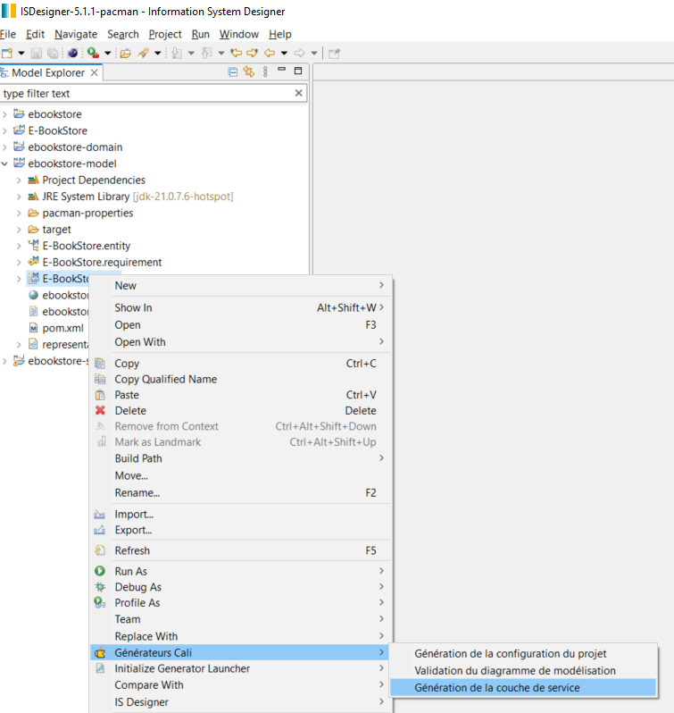

# Tutoriel sur l'installation et l'utilisation de Pacman dans IS Designer

## Installer ISD 

- Télécharger la dernière version depuis https://github.com/ObeoNetwork/InformationSystem/releases

- Dézipper

- Lancer le produit is-designer.exe

## Installer l'intégration de Maven pour Eclipse

- Ouvrir le menu `Help` et cliquer sur `Install new software`

- Dans `Work with` selectioner l'update site `Eclipse-...`

- Filtrer le contenu pour sélectionner `m2e-wtp - Maven Integration for WTP`

- Cliquer sur `Next` puis cliquer sur `Next` à nouveau

- Accepter `The terms of the license agreements`, et cliquer sur `Finish`

- Sur le "dialogue de valisation de licences" cliquer sur `Select All` puis sur `Trust Selected`

- Attendre la fin de l'installation (voir la barre de status) accepter le redémarrage

## Installer Pacman back dans ISD

- Télécharger la dernière version (archive zip) depuis https://github.com/spi4j/pacman-back/releases

- Ouvrir le menu `Help` et cliquer sur `Install new software`

- Cliquer sur `Add`, sélectionner `Archive` puis selectionner le zip téléchargé ci-dessus et cliquer sur `Add`

- Cocher `PacMan - Développement (Cali)` et décocher `Contact all update sites during install to find required software`

  

- Cliquer sur `Next`

- Cliquer sur `Finish`

- Sur le "dialogue de validation de licences" cliquer sur `Select All` puis sur `Trust Selected`

  

- Attendre la fin de l'installation (voir la barre de status) puis accepter le redémarrage

## Créer un projet Cali

- Ouvrir le menu `File` > `New` > `Project...`

- Chercher et sélectionner `Project Cali` sous la catégorie IS Designer

- Cliquer sur `Next` 

- Compléter la partie `Identification` (nom : `ebookstore`, Package : `fr.ebookstore` et auteur: `Obeo`)

  

- Cliquer sur `Finish`

## Rappatrier le modèle d'exemple E-BookSore dans le workspace 

- Dans le projet ebookstore-model, supprimer les ressources soa, requirement et entity

- Ouvrir le menu `File` > `New` > `Example...`

- Filtrer le contenu pour sélectionner `E-BookStore` (sous la catégorie `IS Designer`)

  

- Cliquer sur `Finish`

- Copier les ressources soa, requirement et entity depuis le projet E-BookStore vers le projet ebookstore-model

  

## Générer le code de la couche de persistance

- Faire un clic droit sur la ressource `Entity` puis sélectionner `Générateur Cali` > `Génération de la couche de persistance`

  

## Tester le serveur de l'application E-BookStore

- Clic droit sur la ressource `Entity` puis sélectioner `Générateur Cali` > `Génération des scripts SQL`

  

- Clic droit sur `src/test/java` dans le projet ebookstore-server

- Puis `Run As` > `JUnit Test`

## Générer le code de la couche de service

- Faire un clic droit sur la ressource `Soa` puis sélectionner `Générateur Cali` > `Génération de la couche de service`

  

## Exécuter le serveur de l'application E-BookStore

- Clic droit sur le fichier EbookstoreBootstrap.java dans le projet e-bookstore-server, src/main/java, fr.ebookstore 

- `Run As` > `Java Application`

  

- Attendre qu'une ligne similaire à celle ci dessous apparaisse dans la console :

`2025-06-25 17:18:52 - fr.ebookstore.EbookstoreBootstrap - Started EbookstoreBootstrap in 12.924 seconds (process running for 13.853)`

  

- Avec un navigateur web, appeler les services suivants : 

  	http://localhost:8080/actuator/health
	
 	http://localhost:8080/actuator/info
	
 	http://localhost/swagger-ui
	
	http://localhost/api-docs

## Arrêter le serveur de l'application E-BookStore

- Dans la perspective debug, faire un clic droit sur le serveur dans l'onglet debug

  

- Cliquer sur `Terminate and Remove`

  

- Retournez dans la perspective modeling

  

Félicitaions, vous avez réussi à installer pacman sur IS Designer, et génére du code ainsi qu'un servicce qui fonctionne à partir du model d'ebookstore.

> [!TIP]
> ## Pour aller plus loin
> - https://spi4j.github.io/pacman-back/

