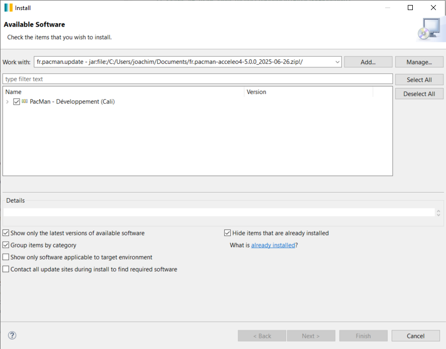
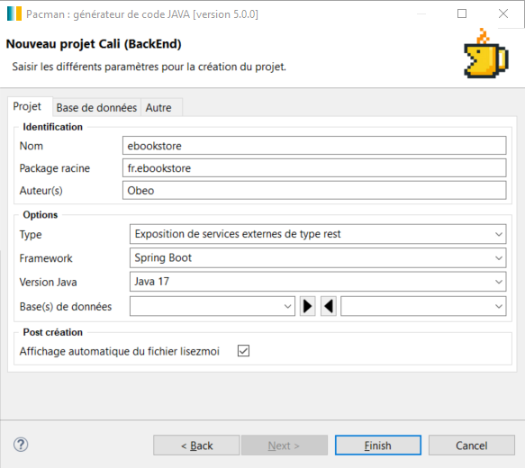
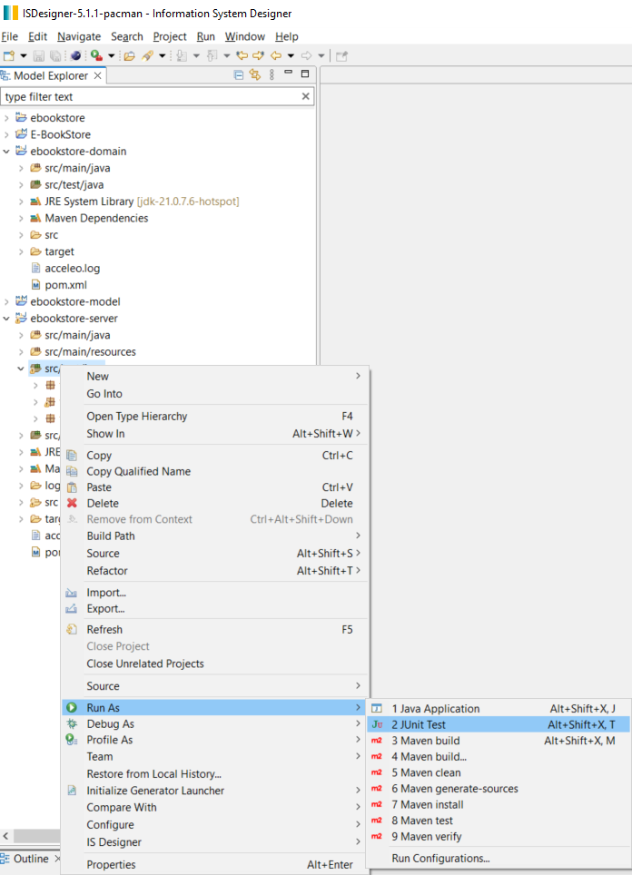
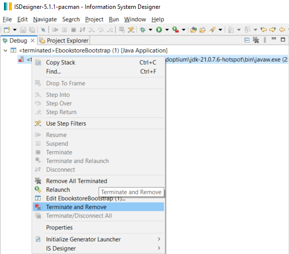

# Tutoriel sur l'installation et l'utilisation de Pacman dans IS Designer


## Installer ISD 

- Télécharger la dernière version depuis https://github.com/ObeoNetwork/InformationSystem/releases

- Dézipper

- Lancer le produit is-designer.exe

## Installer l'intégration de Maven pour Eclipse

- Ouvrir le menu `Help` et cliquer sur `Install new software`

- Dans `Work with` selectioner l'update site `Eclipse-...`

- Filtrer le contenu pour sélectionner `m2e-wtp - Maven Integration for WTP`

- Cliquer sur `Next` puis cliquer sur `Next` à nouveau

- Accepter `The terms of the license agreements`, et cliquer sur `Finish`

- Sur le "dialogue de validation de licences" cliquer sur `Select All` puis sur `Trust Selected`

- Attendre la fin de l'installation (voir la barre de status) accepter le redémarrage

## Installer Pacman back dans ISD

- Télécharger la dernière version (archive zip) depuis https://github.com/spi4j/pacman-back/releases

- Ouvrir le menu `Help` et cliquer sur `Install new software`

- Cliquer sur `Add`, sélectionner `Archive` puis sélectionner le zip téléchargé ci-dessus et cliquer sur `Add`


- Cocher `PacMan - Développement (Cali)` et décocher `Contact all update sites during install to find required software`

  

- Cliquer sur `Next`

- Cliquer sur `Finish`

- Sur le "dialogue de validation de licences" cliquer sur `Select All` puis sur `Trust Selected`

  

- Attendre la fin de l'installation (voir la barre de status) puis accepter le redémarrage

## Créer un projet Cali

- Ouvrir le menu `File` > `New` > `Project...`

- Chercher et sélectionner `Project Cali` sous la catégorie IS Designer

- Cliquer sur `Next` 

- Compléter la partie `Identification` (nom : `ebookstore`, Package : `fr.ebookstore` et auteur: `Obeo`)

  

- Cliquer sur `Finish`

## Rapatrier le modèle d'exemple E-BookSore dans le workspace 

- Dans le projet ebookstore-model, supprimer les ressources soa, requirement et entity

- Ouvrir le menu `File` > `New` > `Example...`


- Filtrer le contenu pour sélectionner `E-BookStore` (sous la catégorie `IS Designer`)

  

- Cliquer sur `Finish`


- Copier les ressources soa, requirement et entity depuis le projet E-BookStore vers le projet ebookstore-model

  

## Générer le code de la couche de persistance

- Faire un clic droit sur la ressource `Entity` puis sélectionner `Générateur Cali` > `Génération de la couche de persistance`

  

## Tester le serveur de l'application E-BookStore

- Clic droit sur la ressource `Entity` puis sélectionner `Générateur Cali` > `Génération des scripts SQL`

  

- Clic droit sur `src/test/java` dans le projet ebookstore-server

- Puis `Run As` > `JUnit Test`

## Générer le code de la couche de service

- Faire un clic droit sur la ressource `Soa` puis sélectionner `Générateur Cali` > `Génération de la couche de service`

  

## Exécuter le serveur de l'application E-BookStore

- Clic droit sur le fichier EbookstoreBootstrap.java dans le projet `e-bookstore-server`, `src/main/java`, `fr.ebookstore` 

- `Run As` > `Java Application`

  

- Attendre qu'une ligne similaire à celle ci dessous apparaisse dans la console :

`2025-06-25 17:18:52 - fr.ebookstore.EbookstoreBootstrap - Started EbookstoreBootstrap in 12.924 seconds (process running for 13.853)`

  

- Avec un navigateur web, appeler les services suivants : 

  	http://localhost:8080/actuator/health
	
 	http://localhost:8080/actuator/info
	
 	http://localhost/swagger-ui
	
	http://localhost/api-docs

- La page affichée à l'adresse `http://localhost/swagger-ui` présente la liste des services disponibles :

  

## Arrêter le serveur de l'application E-BookStore

- Dans la perspective debug, faire un clic droit sur le serveur dans l'onglet debug

  

- Cliquer sur `Terminate and Remove`

  

- Retournez dans la perspective modeling

  

Félicitations, vous avez réussi à installer Pacman sur IS Designer, à générer le code d'un serveur applicatif à partir du model d'exemple E-BookStore, et à tester ce serveur !

> [!NOTE]
> # Pour aller plus loin, écrire et lire un livre sur le serveur
>
> ## Implémenter la méthode getBook 
>
>
> - Dans le fichier `BookServiceJpaProviderImpl.java`
> 
> - Dans le projet `e-bookstore-server`,`src/main/java`,`fr.ebookstore.infra.adaptateurs.bookstore`
>
> - Dans la méthode `getBook_invoke(Long)`
>
> - Entre `// Start of user code e8eb49981e778ca44d1a019d366f69a0` et `// End of user code`
>
> - Remplacer la ligne de code : `throw new EbookstoreNotImplementedException("La méthode 'getBook' n'a pas été implémentée");`
>
> - Par : `return bookRepository.findById(bookId);`
>
>   
>
> ## Implémenter la méthode createBook 
>
>
> - Dans le fichier `BookServiceJpaProviderImpl.java`
> 
> - Dans le projet `e-bookstore-server`,`src/main/java`,`fr.ebookstore.infra.adaptateurs.bookstore`
>
> - Dans la méthode `createBook_invoke(BookDtoImpl)`
>
> - Entre `// Start of user code e8eb49981e778ca44d1a019d366f69a0` et `// End of user code`
>
> - Remplacer la ligne de code : `throw new EbookstoreNotImplementedException("La méthode 'createBook' n'a pas été implémentée");`
>
> - Par :       
>   
>   		BookEntityImpl entity = BookMapper.toEntity(book);
>
>    		return bookRepository.save(entity);
>
>   
>
> ## Tester les Implémentations
>
> - Redémarrer le serveur ( voir la méthode si dessus dans la catégorie "Exécuter le serveur de l'application E-BookStore" )
>
> - Avec un navigateur web, appeler le service suivant : http://localhost/swagger-ui
>
> - Dans la catégorie `POST`, cliquer sur `Try it out`
>
> - Dans la structure Data, donner un titre, un prix, un nom d'image et un type, a votre image
> - Ex :
>
> ```
>{
>   "title": "One-Book",
>   "price": 10,
>   "image": "Blue",
>   "type": "Science-Fiction"
> }
>```
> - Cliquer sur `Execute`
>
> - Vous devriez avoir une réponse semblable à celle ci
>
>   
>
> - Dans la catégorie `Get/v1/ebookstore/book/{id}`, Cliquer sur `Try it out`
>
> - Dans l'identifiant du livre, écrire le numéro qui à été attribuer a votre livre dans les reponses de la catégorie `POST`
>  
> - Si dans les réponses de la catégorie `GET` vous obtenez les informations correspondant au livre que vous venez de crée alors vous avez réussi !
>
>    
>
>  - Vous pouvez éteindre le serveur ( voir la méthode si dessus, dans la catégorie `Arrêter le serveur de l'application E-BookStore` )


> [!TIP]
> # Pour aller encore plus loin !
> - https://spi4j.github.io/pacman-back/

