# 🛠️ Documentation Technique<br>Pacman Générateur de Code Java Backend 

📅 Historique des mises à jour

- 20/05/2025 : Initialisation du document.
- 04/06/2025 : Ajouts : Coffre fort, Héritage, Relations, Règles de gestion, Transactions.
- 01/09/2025 : Modifications : Validation, Installation, Introduction, Structure générale du sommaire.
- 01/09/2025 : Ajouts : Création d'un projet client, Génération d'un projet client.
- 24/11/2025 : Ajouts : Création d'un projet client React, Génération d'un projet client React.
---

## 🚀 Introduction
---
Cette documentation décrit le fonctionnement du plugin Eclipse **Pacman**, nouvelle version **V5**, dont l'objectif est de générer automatiquement du code Java à partir de différentes modélisations graphiques sous ISD (Information System Designer). 

Elle apporte l'ensemble des informations nécessaires sur la modélisation et la génération  : 

- d'une application de type **backend** afin de mettre à disposition un ou plusieurs services REST pour une application de type **frontend**.  

- d'une application de type **backend<->frontend** afin de mettre à disposition du **backend** une librairie permettant d'appeler un fournisseur de services externes et de chainer les appels. Il est ainsi possible d'avoir un **backend** qui va lui-même appeler des services externes et retourner l'ensemble des informations éventuellement complétées par les informations issues directement du  **backend**. 
  
  Dans le cadre de ce document l'api utilisée sera l'api "*TheTVDB*" qui permet d'interroger une base de données contenant des films et séries télévisées (https://www.thetvdb.com/).

Elle est destinée aux développeurs souhaitant comprendre et utiliser l'ensemble des générateurs. 

Il est à noter que cette documentation ne rentre pas dans les détails de la modélisation de l'application, aspect dont les bases sont censées être déjà connues et maîtrisées par les developpeurs qui vont utiliser cette version du plugin  **pacman**. Se reporter aux différents documents ad hoc pour plus d'informations sur ce sujet.

❗ Les nommages des différentes classes est ici donné avec la configuration par défaut du fichier de nommage qui est généré avec un nouveau projet. Il sont donc susceptibles d'évoluer en fonction des règles précisées par les développeurs de l'application cible.

❗ De nombreux exemples de code Java sont donnés dans le cadre de ce document, afin de ne pas rendre le code trop verbeux et trop long à lire, ces exemples ont pour la plupart, été expurgés de la majorité des commentaires de type Javadoc.

## 🧩 Plugin et architecture hexagonale
---
### Plugin Pacman
Pacman V5 est un un générateur de code basé sur  : 

* **Spring Boot** : framework Java open-source conçu pour simplifier le développement d'applications Spring. Il permet de créer des applications prêtes à l’emploi avec un minimum de configuration, grâce à une approche "opinionated" (préconfigurée). Il intègre un serveur embarqué (comme Tomcat) et gère automatiquement les dépendances via Spring Boot Starters. C’est un choix courant pour développer des API REST et, de manière plus générale, des microservices en Java.

* **l'architecture hexagonale** : style d’architecture logicielle qui vise à isoler le cœur métier (la logique d'application) des détails techniques (comme les bases de données, les APIs, les interfaces utilisateur). Le cœur communique avec l’extérieur via des "ports" (interfaces), que des "adapters" implémentent. Cela facilite les tests, la maintenance et l’évolution, tout en favorisant une forte séparation des responsabilités.

### Architecture hexagonale
Si le framework SpringBoot ne nécessite pas d'explication particulière dans le cadre de ce document (les développeurs qui vont utiliser les générateurs Pacman sont censés être familier avec cette technologie) , un rappel plus approfondi est toutefois primordial concernant l'architecture hexagonale et ses diverses implications dans l'utilisation des générateurs.

Comme précité, l'objectif principal de l'architecture hexagonale est de séparer complètement la couche métier et les différentes couches techniques qui permettent d'utiliser ce métier. 

Pour simplifier à ce niveau du document, la couche métier est généralement appelée "domaine" et les autres couches sont intégrées dans ce que l'on appelle "l'infrastructure".  Il est surtout utile de retenir (comme vu plus haut) qu'il s'agit d'une architecture de type "*port - adapters*", au niveau Java, les "*ports*" seront donc des interfaces (au sens premier du terme) qui vont permettre aux différents couches de communiquer entre elles. Les implémentations quant à elles, seront des "*adapters*" qui implémenteront ces interfaces.

Dans le cadre de **Pacman** cette architecture a été choisie car elle apporte (entre autres), deux avantages particulièrement intéressants : 

* Grâce à cette isolation, le cœur de l’application (le domaine) n’a aucune connaissance directe de l’implémentation des interfaces techniques (comme les bases de données, les API externes ou les frameworks). Cela autorise, par exemple, à placer le code métier et le code d’infrastructure dans deux dépôts Git distincts. Ainsi, le dépôt contenant la logique métier peut être partagé ou ouvert sans exposer les détails sensibles ou propriétaires liés à l’infrastructure, ce qui renforçe la sécurité, la confidentialité et la portabilité du domaine métier.

* En encapsulant les dépendances techniques derrière des interfaces (*ports*), toute implémentation spécifique (*adaptateur*) peut être modifiée, remplacée ou mise à jour de manière transparente pour la logique métier. Ainsi, il est possible de migrer d’un framework web, d’un ORM ou d’un système de messagerie vers un autre sans réécrire ou altérer le code métier. Cette indépendance garantit une meilleure pérennité du cœur fonctionnel de l’application et réduit les coûts liés aux évolutions technologiques.

❗  Il est à noter toutefois, un inconvient majeur de cette architecture. Dans le cadre de services de type CRUD (ou plus généralement pour des services qui ne font que manipuler des informations en base de données), la couche métier sert uniquement de "passe-plat" entre les couches d'appel et les couches de persistance et n'apporte pas nécessairement de plus-value.

Voici un bref schéma récapitulatif de cette architecture (en rapport avec l'état actuel des générateurs de pacman) : 

<div align="center">
  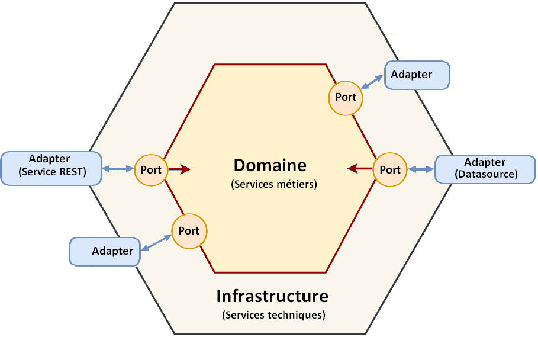
</div>

### Pacman et l'hexagonal

La manière dont Pacman gère et structure un projet en fonction de l'architecture hexagonale est la suivante (diffère très peu du standard). Il convient en premier lieu de noter que, en architecture hexagonale, le vocabulaire varie selon les auteurs et les contextes, d'où l'importance (de manière générale) de bien définir les termes dès le départ d'un projet pour assurer une compréhension commune et éviter toute ambiguïté dans l’architecture. 

Les ports entrants (*inbound ports*) représentent les points d'entrée vers le cœur métier : ce sont généralement des interfaces définies dans le domaine que les adaptateurs entrants (par exemple, un contrôleur REST ou une interface utilisateur) appellent. Les ports sortants (*outbound ports*), eux, sont les interfaces que le domaine utilise pour solliciter des services externes (comme une base de données ou un service distant). Leurs implémentations sont fournies par des adaptateurs sortants. 

Certains parlent aussi d'API pour désigner les ports (*inbound*), et de SPI (Service Provider Interface) pour désigner les ports *outbound*. Les "*use cases*" ou cas d’usage incarnent la logique applicative et sont souvent mis en œuvre via des services métier appelés par les ports entrants. Le terme "*features*" peut quant à lui désigner un regroupement fonctionnel de use cases, surtout dans des approches modulaires ou orientées produit. Cependant, bien que la terminologie puisse varier, l’objectif reste toujours le même : séparer clairement les responsabilités.

Pour Pacman lors de l'initialisation d'un projet, le générateur va toujours créer quatre projets distincts qui sont respectivement : 

 - ***[Nom du projet]*** : capsule pour l'ensemble des trois autres projets. Pacman étant un générateur qui produit des projets de type "Maven", ce projet contient donc le fichier de configuration parent (pom.xml) qui gère l'ensemble des ressources disponibles (librairies, plugins, etc...) et de manière générale le cycle de vie du projet pendant sa phase de développement. 

- ***[Nom du projet]-model*** : contient les différents fichiers de modélisation de l'application ainsi que les fichiers de configuration pour les options de génération de l'application. Ce projet ne contient (et ne doit contenir) aucun code. 

- ***[Nom du projet]-domain*** : comme précité, contient l'ensemble des services métier. Ce projet ne contient aucune référence à un quelconque framework ou code technique. Il embarque toutes les ressources nécessaires pour pouvoir fonctionner (au niveau métier) en totale autonomie, ce qui englobe  les classes métier, les éventuelles exceptions métier, les classes de test, les classes pour les règles d'exigences, etc... En termes de vocabulaire, il est à juste noter que si, au niveau métier, on manipule des objets de transfert (DTO), au niveau des packages, on parlera toujours plutôt d'entités afin d'être raccord avec l'infrastructure.

- ***[Nom du projet]-server*** : le projet dit "d'infrastructure" qui contient l'ensemble du code d'exécution pour que l'utilisateur externe puisse intéragir avec le code métier. Vu la verbosité inhérente à ce type d'architecture et au nombre élevé de classes et/ou d'interfaces qu'elle entraine, il a été décidé de "couper" la notion générale d'infrastructure en deux afin de mieux structurer la répartition du code (packages). On parlera donc "d'application" pour toute la partie "*inbounds*" et "d'infrastructure" uniquement pour la partie "*outbounds*". Par ailleurs, on délaisse la notion de "*use case*", trop proche d'UML, et on parlera donc de "*features*" pour les services métier ainsi que de "*providers*" pour les services techniques (accès à la couche de persistance).


## 🛠️ Installation
---
### Prérequis
- Version Information System Designer  :  5.1.1+
- JDK : 17+

### Etapes

1 - Téléchargement du plugin  

- Le plugin (sous forme de fichier au format .zip) est téléchargeable à partir de l'URI suivante : https://github.com/spi4j/pacman-back...
- Charger le plugin et le stocker dans un répertoire de votre choix sur le disque. 

1b - Compilation des sources (développement)

Il est aussi possible de récupérer l'ensemble des sources et de les compiler (JDK 17 au minimum et Maven 3.9.9) afin d'obtenir l'update site. Les étapes sont les suivantes : 

- Créer un répertoire sur le disque local
- Lancer la commande : ```git clone https://github.com/spi4j/pacman-back.git```
- Se positionner dans le répertoire ```cd pacman-back```
- Lancer la commande : ```mvn clean install -P integration```
- Récupérer le zip de l'update site dans le répertoire ***target*** du projet ***fr.pacman.update***

2 - Installation dans Eclipse  

- Ouvrir Information System Designer et aller dans le menu "*/Help/Install New Software...*".
- Cliquer sur le bouton "*Add*".
- Cliquer sur le bouton "*Archive*".
- Rechercher et sélectionner l'archive **Pacman** (format .zip) préalablement chargée sur le disque.

<div align="center">
  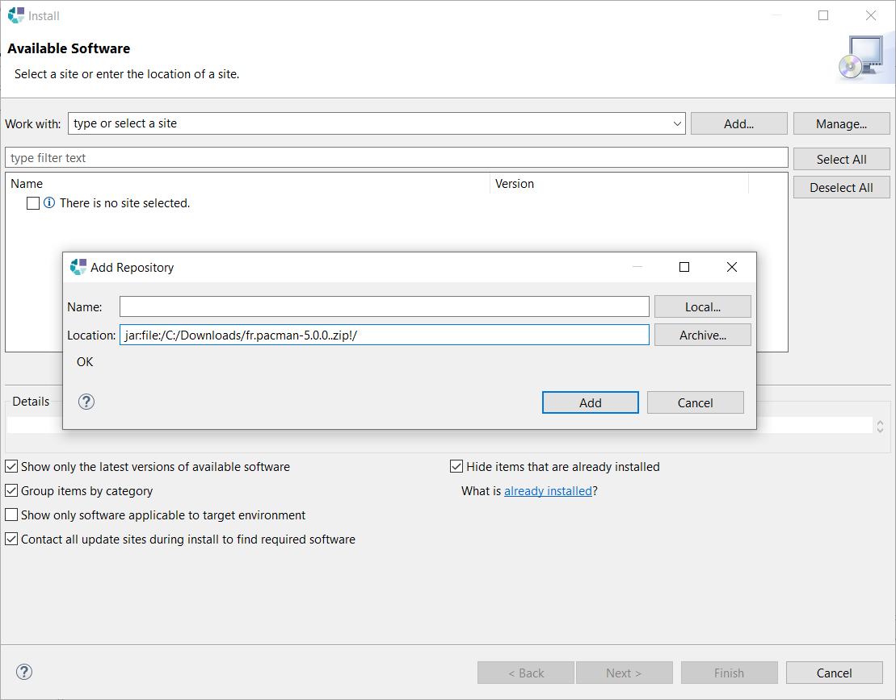
</div>

- Cliquer sur le bouton "*Add*".
- Cliquer sur le bouton "Select All".
- Décocher la case "*Contact all updates sites during install to find required software*".

<div align="center">
  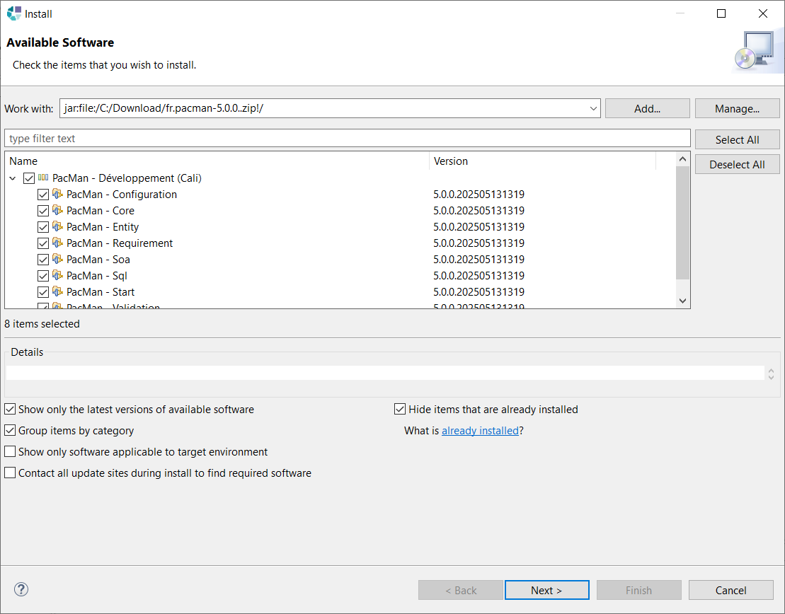
</div>

- Cliquer sur le bouton "*Next*".
- Vérifier la bonne prise en compte de l'ensemble des plugins qui vont être installés.

<div align="center">
  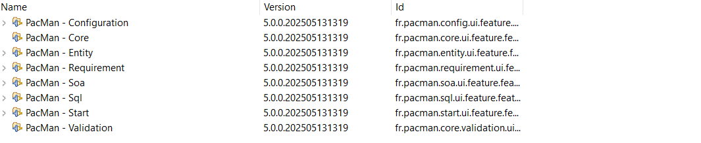
</div>

- Cliquer sur le bouton "*Finish*"
- **Pacman** n'étant pas signé, cliquer sur le bouton "Select All".

<div align="center">
  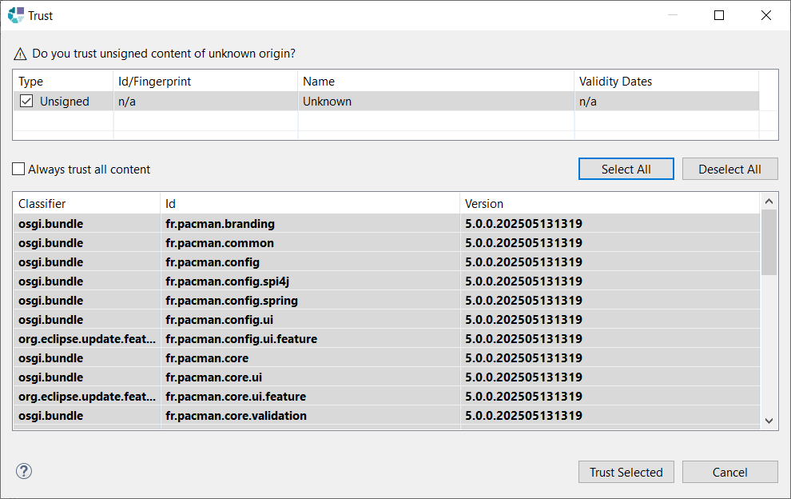
</div>

- Cliquer sur le bouton "*True Selected*".

<div align="center">
  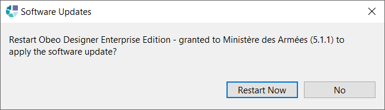
</div>

- Valider la demande de redémarrage pour ISD en cliquant sur le bouton "*Restart Now*".


3 - Vérification de l'installation  
 
- Aller dans le menu "*/Help/About Obeo Designer Entreprise Edition....*".
- Vérifier la présence de l'icône **Pacman** au niveau de la fenêtre avec la liste des plugins installés. (icône non contractuelle)

<div align="center">
  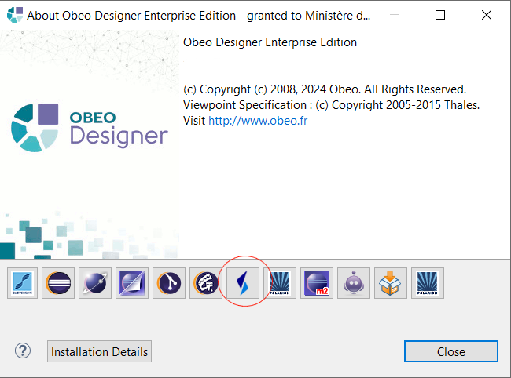
</div>

- Il est aussi possible d'aller voir plus loin en cliquant sur le bouton "*Installation Details*" et en vérifiant la liste des plugins au niveau du premier onglet "*Installed Software*".

<div align="center">
  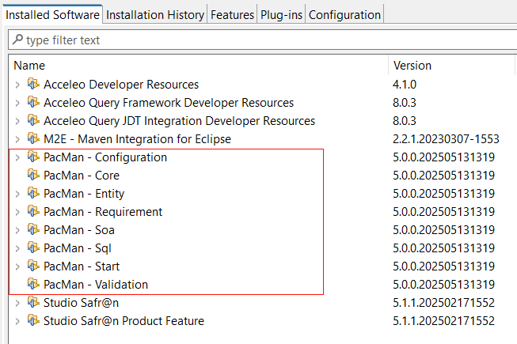
</div>

## ☕ Création du projet  
 ---
Une fois ISD activé, se positionner sur la perspective "*Modeling*", située en haut à gauche de l'IDE.   


Puis, se positionner (comme tout autre création de projet) sur la vue "*Model Explorer*" et effectuer un click droit "*New/Project...*" ou se positionner dans le menu "*File/New/Project...*" en haut de l'IDE. 

<div align="center">
  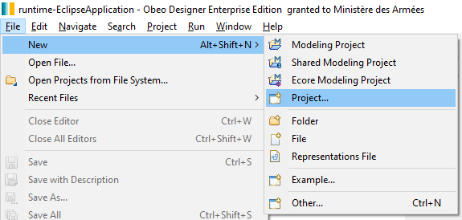
</div>

Naviguer dans l'arborescence jusqu'au répertoire "*IS Designer*" et sélectionner "*Projet Cali*". Une fenêtre de création d'un nouvel applicatif de type "Pacman" apparait alors afin de saisir les diverses informations structurantes pour la génération du projet. 

### Wizard de création

Trois onglets sont disponibles : 

➤ **Projet** : Saisir le nom désiré pour le projet, ainsi que l'auteur ou l'organisme, par défaut le package racine est automatiquement créé en fonction du nom préalabalement saisi. Il est toutefois possible de le modifier manuellement en le saisissant directement dans le champ prévu à cet effet. Au niveau des options la version actuelle de **Pacman** ne permet de créer que des projets de services REST avec le framework SpringBoot. Le champ Framework" ne contient pour l'instant qu'une seule valeur, à l'heure de l'écriture de ce document. Enfin sélectionner la (ou les) bases de données à l'aide des deux listes déroulantes et des deux boutons pour faire passer la sélection de l'une à l'autre des listes.

❗ La base H2 est toujours embarquée par défaut, ne serait-ce que pour les tests unitaires.

<div align="center">
  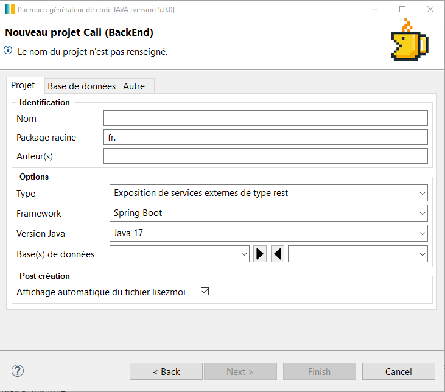
</div>

➤ **Base de données** : Comme son nom l'indique, cet onglet permet de saisir l'ensemble des informations spécifiques aux bases de données (hormis la sélection des bases qui a été effectuée au niveau de l'onglet précédent). Si les tables on besoin d'un préfixe au niveau des scripts SQL (ex : "*TBL\_*" ou "*MATABLE\_*", etc...) le saisir au niveau du champ prévu à cet effet, de même pour la création d'un schéma. Il est par ailleurs possible de saisir une liste de champs supplémentaires qui seront automatiquement ajoutés à toutes les tables (donc à toutes les entités modélisées). 

Trois types de champ sont prédéfinis (il suffit juste de les sélectionner, la ligne n'est pas saisissable par la suite) : 

- *Xtopsup* : ajoute un indicateur de suppression logique (automatiquement géré par Spring Data).
- *Xdmaj* : ajoute une date de dernière modification (automatiquement gérée par Spring Data).
- *Xuuid* : ajoute un identifiant universel (en plus de la clé primaire), géré par Pacman.
 
Par ailleurs, il est possible de rajouter autants de champs supplémentaires que désirés, en sélectionnant le type, puis en renseignant les différentes rubriques.

<div align="center">
  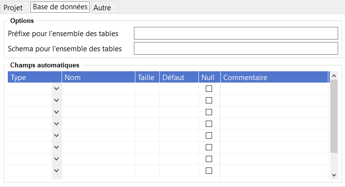
</div>

Exemple avec les trois champs prédéfinis (pour annuler une sélection, sélectionner la ligne blanche en première position dans la liste déroulante) : 

<div align="center">
  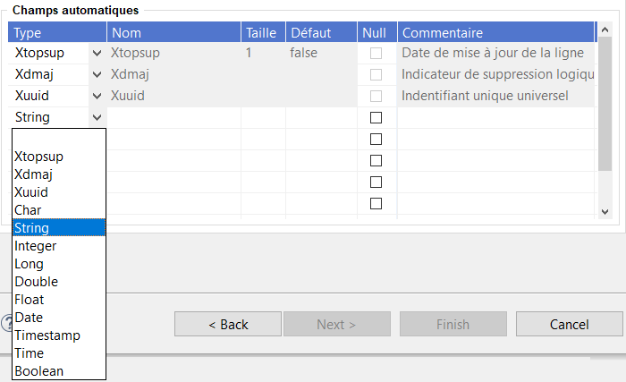
</div>

❗ Ces champs sont uniquement destinés à la couche de persistance, ils sont donc remontés uniquement au niveau des objets métier pour des éventuels traitements associés à la valeur des ces attributs, mais ne passent jamais la couche métier et ne sont donc jamais transmis au niveau des services REST. Un seul champ fait exception à cette règle, le champ *Xuuid*.

➤ **Autre** : 

Il s'agit ici de l'ensemble des autres options qui permettent de prendre les décisions structurantes pour la création du squelette de l'application. Au niveau de la version actuelle de **Pacman** et comme vu précédemment, toute la sous-rubrique "*Autre*" est désactivée car ces options ne concernent pas le framework SpringBoot. La rubrique "*Règles de gestion*" quant à elle, permet de saisir (si besoin) un préfixe pour le nom de l'ensemble des règles qui vont être modélisées (par exemple "*REQ\_XXXXXXX*" ou "*REGLE\_GES\_XXXXX*")

<div align="center">
  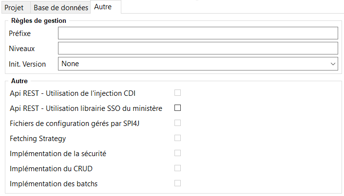
</div>

❗ Bien noter que le contrôle de la saisie est effectué en temps réel et que le bouton "*Finish*" ne sera pas activé tant que la saisie utilisateur n'aura pas passé l'ensemble des contrôles de cohérence. Il est donc important de toujours vérifier le message informatif en haut du formulaire afin de vérifier ce qui manque ou n'est pas conforme au niveau de la saisie.

Une fois la validation du formulaire effectuée en cliquant sur le bouton "*Finish*",  des vues vont être automatiquement activées (si certaines ne le sont pas déjà) au niveau de l'IDE. 
Il s'agit des vues suivantes : 

- **Properties** : La vue de saisie des propriétés par rapports aux modélisations.
- **Problems** : La vue concernant l'ensemble des problèmes sur l'application.
- **Progress** : La vue affichant la progression des tâches.
- **ErrorLog** : La vue concernant les erreurs et informations sur les générations.
- **JUnit** : La vue concernant les tests unitaires.
- **Récapitulatif pour le projet** : Si la case "*Affichage automatique du fichier lisezmoi*" a été cochée au niveau du formulaire de création du projet, vue affichant le récapitulatif HTML pour la création du projet.
- **Rapport de validation** : La vue qui permet de visualiser et corriger les différentes erreurs de validation (si présentes).

❗ Selon l'état de l'IDE (juste ouvert, développeur ayant déjà travaillé dessus, etc...), il se peut que la création initiale du projet prenne un peu de temps, l'IDE ayant besoin de charger de nombreuses ressources pour travailler. Suivre les différentes étapes de la création à l'aide de la vue de progression des tâches qui est automatiquement mise en avant. 

### Cas projet fournisseur

Rien de particulier à ajouter pour ce chapître, il s'agit de la configuration par défaut pour le wizard de création.

### Cas projet client (SpringBoot) 

Pour une demande de projet de type "**appel de services externes**" (création d'une librairie Java pour appeler un fournisseur services externes à partir d'un fichier Swagger), sélectionner la valeur "*Appel de services externes de type Rest*" au niveau de la rubrique "*Type*" sur le premier panneau du wizard de création. 

<div align="center">
  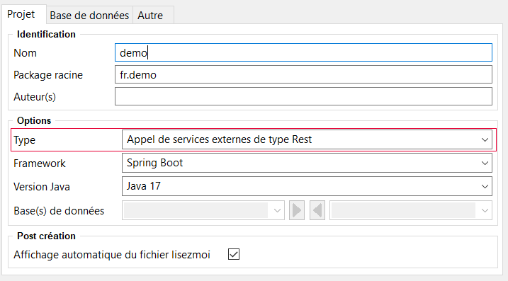
</div>

❗ La sélection de cette valeur entraine la désactivation automatique de la rubrique concernant le choix des bases de données ainsi que des deux onglets "**Base de données**" et "**Autres**". En effet ce type de projet va juste créer l'ensemble des objets et des services qui permettent d'interroger le fournisseur, son rôle n'est en aucun cas de communiquer avec une quelconque base de données.  


### Cas projet client (React)

Pour une demande de projet de type "**appel de services externes**" (création d'une librairie React pour appeler un fournisseur services externes à partir d'une modélisation ), sélectionner la valeur "*Appel de services externes de type Rest*" au niveau de la rubrique "*Type*" sur le premier panneau du wizard de création. 

Puis sélectionner la valeur "*React*" au niveau de la rubrique "*Framework*" sur le premier panneau du wizard de création. 

<div align="center">
  
</div>

❗ La sélection de cette valeur entraine la désactivation automatique de la rubrique concernant le choix des bases de données ainsi que des deux onglets "**Base de données**", "**Autres**" et de plus, la boîte de sélection de la version Java est aussi désactivée puisqu'il ne s'agit pas ici d'un projet Java. Comme vu précédemment, ce type de projet va juste créer l'ensemble des objets et des services qui permettent d'interroger le fournisseur, son rôle n'est en aucun cas de communiquer avec une quelconque base de données.  

<div align="center">
  
</div>

❗ Il faut bien distinguer ici la différence entre la création d'un client React et celle d'un client SpringBoot (en dehors de la question du language). Le client SpringBoot est pour l'instant créé afin d'appeler une librairie d'un fournisseur externe, on part donc un fichier Swagger pour obtenir la modalisation. Le client React quant à lui est utilisé pour appeler une librairie interne (au sens ou le backend a été précédemment créé avec **Pacman**). 

En effet, pour des raisons internes purement techniques liées à l'outil de modélisation, il n’est pas possible de s’appuyer uniquement sur un fichier Swagger. Pour garantir une génération cohérente, stable et capable de détecter précisément les évolutions entre deux versions de la librairie fournisseur, Pacman doit s’appuyer directement sur le fichier de modélisation. C’est ce modèle qui constitue la source de vérité et qui permet d’identifier correctement les deltas structuraux (nouvelles entités, changements de types, suppressions, renommages, etc.) indispensables à une génération fiable du client.

## 📝 Fichiers Générés

Par la suite dans ce document le projet d'exemple sera appelé simplement "demo" (qu'il s'agisse d'un projet de type **fournisseur** de services ou consommateur (**client**) de services). 

❗ Dans tous les fichiers et classes générées, il est possible de trouver des balises de type "*user code*". Ces balises ressemblent à ceci : 
```java
// Start of user code 56bcd4f8dd30c88089557e348b4165dc

// End of user code
```
Ces balises ont été positionnées à des endroits considérés comme stratégiques par le développeur du générateur, elles permettent par la suite de positionner du code personnalisé par le développeur de l'application cible sans que celui-ci soit par la suite, écrasé lors des prochaines demandes de génération. 

❗ Toutes les classes de haut niveau sont générées avec le nom de l'application en préfixe, cela permet de mieux les distinguer des autres classes issues de la modélisation utilisateur.

### 📁 Cas projet fournisseur 

Il est créé avec les options suivantes : 

- Base de données H2 uniquement.
- "*TBL_*" comme préfixe pour l'ensemble des tables dans les scripts SQL.
- "*SCH*" comme schéma pour la datasource.
- "*REQ_*" comme préfixe pour l'ensemble des règles de gestion.
- "*Xtopsup*, *Xdmaj* et *Xuuid*" sélectionnés en tant que champs automatiques.

Comme vu précédemment, la structure créée est donc la suivante : 

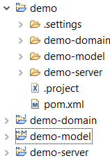
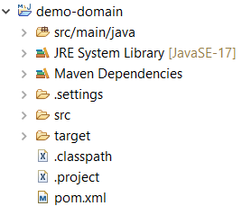
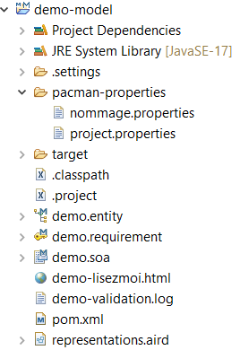
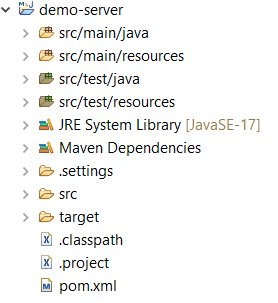

➤ Le projet "***demo***" comme précité n'a que pour seul et unique but de servir de projet parent pour l'ensemble des autres projets Maven. Il a donc uniquement un fichier *pom.xml* auquel se réfèrent tous les autres *pom.xml* des projets fils. Il s'agit ici d'une structure tout à fait classique pour un projet multi-modules Maven. Le fichier "pom.xml" ne demande pas d'explications particulières, il se contente juste de gérer les versions des différentes dépendances qui sont utilisées dans les autres modules. Il servira par ailleurs pour le packaging et le déploiement de l'application.

➤ Le projet "***demo-domain***" qui porte l'ensemble de la couche métier contient par défaut toutes les classes de haut niveau pour son bon fonctionnement. 

Il s'agit : 

  - Des classes d'exception métier au niveau du package *[package racine].domain.exceptions* Si besoin, placer ici toutes les nouvelles exceptions fonctionnelles dont la couche métier a besoin dans le cadre de l'application.
  - Des classes pour le fonctionnement des futures règles de gestion au niveau du package *[package racine].domain.services.requirements*
  - Des différentes annotations dont à besoin la couche métier pour pouvoir converser avec l'infrastructure. En effet, ne pas oublier que la couche métier doit être totalement indépendante de toute technique. Il est donc impossible d'utiliser directement des annotations de type Spring au niveau de ce projet sous peine de créer une dépendance avec l'infrastructure. Il est donc nécessaire de créer des annotations spécifiques à l'application générée, ces annotations sont par la suite prises en compte par le framework Spring au niveau de la couche d'infrastructure.
  
    Ces annotations sont les suivantes : 

    - ***AdapterService*** : identifie auprès de Spring les classes qui vont servir d'adaptateur (implémentation) pour les différents services.
    - ***DomainService***:  identifie auprès de Spring les classes qui font partie du domaine (couche métier).
    - ***Requirement*** :  identifie les règles de gestion pour les générateurs **Pacman**.
    - ***StubService*** :  identifie auprès de Spring les classes qui servent de bouchon pour les tests unitaires.
    - ***Transactionnal*** : identifie auprès de Spring les méthodes (ou classes) qui doivent être jouées en mode transactionnel pour la couche de persistance.

Au niveau du fichier "*pom.xml*" il est encore une fois à rappeler que la couche métier ne doit contenir aucune dépendance avec toute couche technique, ce qui s'applique aux classes générées s'applique par conséquent aussi au dépendances présentes au niveau de ce fichier. Avec le plugin "*maven enforcer*", il est possible de définir les dépendances authorisées et celles qui seront exclues afin d'éviter qu'un développeur ajoute (et utilise) une dépendance qui a une adhérance à une quelconque couche technique.  Certes cette solution n'exclue pas que le développeur paramètre différement le plugin (puisqu'il a lui aussi accès en modification au fichier maven), mais elle protège toutefois des erreurs d'inadvertance.
    
Ce plugin est paramétré par défaut avec le code suivant : 
    
```xml
<configuration>
   <rules>
      <bannedDependencies>
          <excludes>
             <exclude>*</exclude>                              
          </excludes>
          <includes>
             <!-- Placer ici les librairies authorisées. -->
             <!-- Pour l'instant uniquement librairies de test. -->
             <include>*:*:*:*:test</include>
             <include>org.junit.jupiter:junit-jupiter</include>
             <include>org.assertj:assertj-core</include>
             <include>org.slf4j:slf4j-api</include>
          </includes>
      </bannedDependencies>
  </rules>
</configuration>
```
  
On va donc inclure toutes les librairies de test et de log pour l 'instant (attention sl4j est une surcouche donc elle ne présuppose pas de l'implémentation technique qui est derrière), tous le reste est exclu. Pour les librairies de test, pareillement, le fait d'utiliser JUnit ne permet pas de connaitre quel est le framework utilisé par la suite pour le développement de l'application.  On retrouve donc uniquement les dépendances suivantes : 
  
```xml
<dependency>
   <groupId>org.slf4j</groupId>
   <artifactId>slf4j-api</artifactId>
</dependency>
<dependency>
   <groupId>org.junit.jupiter</groupId>
   <artifactId>junit-jupiter</artifactId>
</dependency>
<dependency>
   <groupId>org.assertj</groupId>
   <artifactId>assertj-core</artifactId>
</dependency>
```
  
➤ Le projet "***demo-model***" qui contient la couche de modélisation avec principalement trois fichiers : 

- ***[nom du projet].entity*** : le fichier de modélisation pour la couche de persitance.
- ***[nom du projet].soa*** : le fichier de modélisation pour l'ensemble des services.
- ***[nom du projet].requirement*** : le fichier de modélisation pour les règles de gestion.
  
Au niveau du répertoire ***/pacman-properties*** deux fichiers de paramètrage sont présents, il s'agit de la liste des options de configuration pour les générateurs **Pacman**. Le premier fichier ***nommage.properties*** permet de gérer la norme de nommage pour l'ensemble des classes qui vont être générées. Par défaut il s'agit d'un nommage de type "SUN". Il est possible de modifier cette convention de nommage en fonction des désidératas du développeur. Par exemple pour modifier le nom d'un paramètre entrant dans une méthode, il est possible de faire la modification suivante : 
  
```properties
  # Le nom d'un parametre IN classic
  parameterMethodClassicIn = [CamelCase.LowerFirst/]
```
```properties
  # Le nom d'un parametre IN classic
  parameterMethodClassicIn = in_[CamelCase.LowerFirst/]
```
Le fichier ***project.properties*** quant à lui, contient toutes les autres options structurantes pour les générateurs. Ce fichier a été initialisé en partie à l'aide du formulaire de création de projet. Il est par la suite toujours possible de modifier les propriétés. Une des propriétés plus particulièrement peut être utile si des problématiques de génération sont rencontrées et pour vérifier si ces problématiques sont liées directement aux générateur : 
  
```properties
  # Flag indiquant si la generation pour le projet fonctionne en mode debug (non par defaut)
  project.debug.enabled = false
```
Le fait de passer la propriété à la valeur "*true*" permet de ne pas lancer les opérations de post traitement que sont (entre autres) l'organisation automatique des imports et le formattage du code généré.
  
❗ Tout changement au niveau de ces fichiers est immédiatement pris en compte lors de la prochaine demande de génération.
  
Un fichier ***[nom de l'application]-validation.log*** vide est créé par défaut. Chaque demande de génération passe automatiquement par une pré-validation de la modélisation. Toutes les erreurs de modélisation rencontrées sont écrites dans ce fichier consultable à tout moment (si une erreur de modélisation est rencontrée, la génération est stoppée avec un message d'avertissement). 

➤ Le projet "***demo-server***" qui contient l'ensemble de l'infrastructure (dans le cas de **Pacman**, couche infrastructure divisée en "infrastructure" et "application"). Comme pour le domaine, un certain nombre de classes de haut niveau sont générées dès la création du projet. On peut d'entrée voir le distinguo entre la couche "infrastructure" et la couche "application" avec les deux packages ***[package racine].infra*** et ***[package racine].app*** Pour rappel, la couche d'infrastructure contiendra l'ensemble des classes liées à la couche de persistance alors que la couche applicative contiendra l'ensemble des classes pour les services REST.

• ***[package racine]*** : contient la classe principale de démarrage pour l'application ***[nom de l'application]Bootsrap.java***

•️ ***[package racine].app*** : package racine pour la couche applicative, contient (principalement) par défaut les classes de haut niveau pour le bon fonctionnement des services REST. Il s'agit des classes pour la gestion centralisée des exceptions et de la configuration de la sécurité.

• ***[package racine].app.exceptions*** : contient les exceptions de la couche applicative. Si besoin d'exceptions supplémentaires, les positionner à ce niveau.

• ***[package racine].app.adapters.controllers*** : package racine pour l'ensemble des service REST, contient par défaut le service pour l'api de santé de l'application.

• ***[package racine].infra*** : package racine pour la couche de persistance, contient par défaut les classes de haut niveau pour la gestion du transactionnel au niveau de la couche de persistance.

• ***/src/main/resources*** : contient le fichier de configuration SpringBoot pour l'application.

• ***/src/test/resources*** : contient le fichier de configuration SpringBoot pour les tests unitaires de l'application.

• ***[package racine] (niveau tests)*** : contient des classes utilitaires de haut niveau pour la gestion des tests unitaires JUnit.

Par défaut, relativement peu de code au niveau du fichier Maven (*pom.xml*), juste retenir que le projet à une dépendance vers la couche domaine (***[nom de l'application]-domain***) et que la classe de démarrage de l'application est enregistrée pour le futur packaging et déploiement de l'application :
  
```xml
<plugin>
   <groupId>org.springframework.boot</groupId>
   <artifactId>spring-boot-maven-plugin</artifactId>
   <executions>
      <execution>
        <goals>
           <goal>repackage</goal>
        </goals>
      </execution>
    </executions>
    <configuration>
        <mainClass>fr.demo.DemoBootstrap</mainClass>
    </configuration>
 </plugin>
```
### 📁 Cas projet client (SpringBoot)

La structure créée est la suivante : 


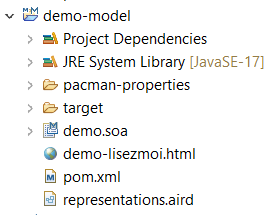


➤ Le projet "***demo***" (comme dans le cas d'un projet de type fournisseur) n'a que pour seul et unique but de servir de projet parent pour l'ensemble des autres projets Maven. Il a donc uniquement un fichier *pom.xml* auquel se réfèrent tous les autres *pom.xml* des projets fils.

➤ Le projet "***demo-domain***" qui porte l'ensemble des objets de transfert (DTO) métier ne contient aucune classe par défaut puisque l'ensemble des objets métier sont créés uniquement via les générateurs à partir du fichier de modélisation SOA. 

➤ Le projet "***demo-model***" qui contient la couche de modélisation avec cette fois ,uniquement un fichier  ***[nom du projet].soa***, en l'occurence le fichier de modélisation pour l'ensemble des services.
  
Au niveau du répertoire ***/pacman-properties*** les deux fichiers de paramètrage sont toujours présents. 

➤ Le projet "***demo-server***" qui contient l'ensemble des classes de haut niveau qui sont nécessaires pour l'écriture, le fonctionnement et les test des différents services client. Par défaut un seul package est généré : 

•️ ***[package racine].app*** : package racine pour la couche applicative, contient par défaut les classes de haut niveau pour le bon fonctionnement des appels REST. Il s'agit des classes pour la gestion centralisée des exceptions et de la configuration de la sécurité. Ces classes étant peu nombreuses il est ici possible de les lister : 

 - ***[Nom de l'application]WebClientConfigImpl*** : Classe de configuration pour le client. Elle permet  notamment de gérer l'écriture des logs lorsque la librairie est en phase de test. 
 
 - ***[Nom de l'application]WebClientHelper*** : Classe "principale" de la librairie, elle contient l'ensemble des couches techniques qui permettent d'écrire de manière "simple et lisible" les différents services d'appel qui seront modélisés au niveau du fichier "**.soa**".
 
 - ***[Nom de l'application]WebClientUtil*** : Classe utilitaire permettant de transformer simplement des tableaux associatifs (Maps) de type "*String, Object*" en tables de type "*String, String*"

• ***/src/main/resources*** : contient le fichier de configuration SpringBoot pour l'application.

Par défaut, relativement peu de code au niveau du fichier Maven (*pom.xml*), juste retenir que le projet à une dépendance vers la couche domaine (***[nom de l'application]-domain***).

❗ Il est à noter que la notion de "circuit-breaker" n'est pas prise en compte au niveau du projet de type "**client**". En effet, l'objectif de ce type de projet étant de simplement fournir une librairie qui va premettre d'interroger un fournisseur et non pas d'en préciser les modalités d'appel. C'est donc au niveau du projet qui va encapsuler cette librairie d'implémenter ou non cette notion.

### 📁 Cas projet client (React)

La structure créée est la suivante : 

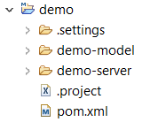
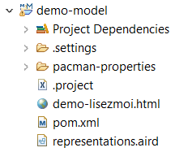
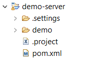

➤ Le projet "***demo***" (comme dans le cas d'un projet de type fournisseur) n'a que pour seul et unique but de servir de projet parent pour l'ensemble des autres projets Maven. Il a donc uniquement un fichier *pom.xml* auquel se réfèrent tous les autres *pom.xml* des projets fils.

➤ Le projet "***demo-model***" qui contient la couche de modélisation. Par défaut, le projet ne contient (au niveau des fichiers de modélisation) que le fichier de stockage des représentations ***representation.aird***, puisque le projet est destiné à récupérer la modélisation à partir d'un projet fournisseur.
  
Au niveau du répertoire ***/pacman-properties*** les deux fichiers de paramètrage sont toujours présents.  

❗ Il est très important ici de noter que l'ensemble des projets générés sont des projets de type Maven. Cela est du à la structure même des générateurs **Pacman** qui à la base, sont des générateurs pour des projets de type Java. Cependant, à l'inverse des précédents projets vu précédemment, il est à préciser que les projets ici créés ne sont pas des projets avec la nature Java. 

De même, si les fichiers de propriétés sont créés à la base pour des projets Java, il est encore une fois à préciser que seules, ici, quelques propriétés sont utilisés pour la génération des projets. Il ne faut donc pas s'étonner de la présence de certaines propriétés liées exclusivement à Java. Ces fichiers doivent obligatoirement être conservés pour le bon fonctionnement des générateurs.

➤ Le projet "***demo-server***" dans lequel par défaut, un seul répertoire est créé, il s'agit du répertoire avec le nom du projet (équivalent du "*/src/main/java*"). Ce répertoire sert de base (racine) pour l'ensemble de la génération, il va contenir l'ensemble des fichiers de configuration générés à la création du projet ainsi que l'ensemble des sources pour les objets métier et les différents services.

## 📝 Fichiers de configuration
---
### 📁 Cas projet fournisseur

#### application.properties

Le fichier permet de configurer le framework SpringBoot. Il contient un ensemble de propriété par défaut, il est possible d'en rajouter et évidemment de les modifier à loisir. Il a été divisé en plusieurs sections qui sont respectivement : 

- Le paramétrage de l'api de santé.
- Le paramétrage pour la description open api des services REST (Swagger-ui).
- Le paramétrage de la sécurité pour la liste des URIs à ne pas sécuriser.
- Le paramétrage du serveur HTTP.
- Le paramétrage de la couche de log.
- La paramétrage pour le coffre fort.
- Le paramétrage des profils Spring.
- Le paramétrage du cache pour Spring.
- Le paramétrage du framework pour le circuit-breaker.
- Le paramétrage de la (ou des) datasource(s).

Il n'est pas pour objectif dans le cadre de ce document, de développer chaque paramètre dont certains sont par ailleurs suffisamment explicites mais plutôt de préciser certaines options qui ont été prises pour le paramétrage par défaut qui a été généré.

#### Api de santé

❗ Bien noter que par défaut, l'api de santé ne permet d'exposer que le "***/health***" et le "***/info***", par ailleurs on décide d'exclure explicitement mappings et headdump à l'aide des paramètres suivants (bien faire attention à l'exposition de ces points de terminaison): 

```properties
# Activation des points de terminaison pour l'api de sante, par defaut, seuls '/health' et '/info' sont actifs.
management.endpoints.web.exposure.include=health,info
# Securite si demande d'activation de l'ensemble des points de terminaison.
management.endpoints.web.exposure.exclude=mappings,heapdump
``` 
Par défaut, l'api de santé a été paramétrée pour être consultable sur l'URL suivante : ***http://localhost:8080/actuator/health/***

Cette URL donne uniquement le résultat suivant qui est le mode "par défaut" de l'actuator de SpringBoot : 

```json
{"status":"UP"}
``` 
Pour une application générée par **Pacman**, il a été rajouté un point de terminaison personnalisé pour l 'application (si désiré par les développeurs), il permet de surcharger le "***/health***" existant et d'ajouter toutes les informations supplémentaires. Ce point de terminaison est activable en jouant sur les valeurs des propriétés suivantes : 

```properties
management.endpoint.health.show-details=always
management.health.demo_health.enabled=true
``` 
Après redémarrage du serveur, l'affichage devient alors (sur la même URL) : 

```json
{"status":"UNKNOWN","components":{"demoHealthImpl":{"status":"UNKNOWN","details":{"version":"0.0.0","latency":"0ms"}}}}
``` 
Cette affichage est rendu par la classe spécifique de l'application ***[nom de l'application]HealthImpl*** située au niveau du package ***[package racine].app.adapters.controllers***. Modifier cette classe pour ajouter les données nécessaires.

Pareillement, pour ajouter des informations au niveau de l'URL "***/info***" compléter cette fois le fichier de configuration au niveau de la rubrique (rubrique Configuration du point de terminaison /info et si besoin, se reporter à la documentation générale de l'actuator pour plus de précisions) : 

```properties
# Configuration du point  de terminaison /info, definir ici les informations necessaires.
management.info.env.enabled=true
app.cusomInfo=Une information de type custom...
info.app.cusomInfo=${app.cusomInfo}
info.app.java-version=${java.version}
info.app.java-vendor=${java.vendor}
info.app.excluded-actuator-enpoints=${management.endpoints.web.exposure.exclude}
``` 
 ❗ Il est à noter que tous les caractères accentués ont été supprimés des lignes de commentaires, ceci est volontaire car malgré toutes les demandes de forçage en UTF-8, il est toujours possible selon le paramétrage des plateformes que le fichier reste codé en ISO-8859-1. Comme il n'a pas été (pour l'instant) jugé utile de passer le fichier en *yaml* (car moins lisible), cette solution est celle qui a semblé être la moins coûteuse. Libre au développeurs de l'application cible de convertir le fichier ***.properties*** en fichier ***.yaml*** si désiré.

#### Open Api

OpenAPI est une spécification standardisée pour décrire, documenter et consommer des API RESTful. Elle permet de définir de manière structurée les endpoints, les méthodes HTTP, les paramètres d'entrée, les réponses, et les modèles de données associés. OpenAPI facilite l'interopérabilité entre services, la génération automatique de documentation interactive, ainsi que le développement et les tests d'API en offrant un format lisible par machine (généralement en JSON ou YAML).

Il est ici possible (entre autres), de définir l'URI pour l'interface de visualisation et d'interrogation de l'API développée. Le fichier JSON généré sera par défaut sous "***/api-docs***".

```properties
# Documentation JSON ex: http://localhost:8080/v1/api-docs
springdoc.api-docs.path=/api-docs
# Documentation Swagger (ihm) ex: http://localhost:8080/swagger-ui.html
springdoc.swagger-ui.path=/swagger-ui
# Definition de l'ordre d'affichage des operations (endpoints) <alpha|method>
springdoc.swagger-ui.operations-sorter=method
# Definition de l'ordre d'affichage des tags <alpha|fonction de tri JS personnalisee>
springdoc.swagger-ui.tags-sorter=alpha
```
#### URIs

❗ Il est particulièrement important en fonction des diverses modifications apportées au niveau des différentes rubriques, de modifier aussi la liste des URIs qui ne sont pas à sécuriser. Par défaut la sécurité au niveau de l'accès des services REST est automatiquement enclanchée (il n'y a pas de possibilité de l'activer ou de la désactiver à l'aide d'un paramètre, elle est enclanchée dès que SpringBoot détecte qu'elle est chargée et disponible au niveau des dépendance Maven). Cette liste est récupérée par le gestionnaire de sécurité généré par **pacman** et permet de sortir ces URIs de la zone de sécurité. Dans le cas contraire on aura un *HTTP:401* sur les URIs suivantes : 

- ***http://localhost:8080/actuator/health***
- ***http://localhost:8080/actuator/info***
- ***http://localhost/swagger-ui***
- ***http://localhost/api-docs***

```properties
# Ne pas oublier de reporter les modifications issues des rubriques precedentes 
security.whitelist.paths=/swagger-ui/**,/api-docs/**,/actuator/**
```

#### Serveur HTTP
        
```properties
# Un exemple de cle symetrique (pour le developpement uniquement).
security.jwt.secret=HhO7b9aZ0e6eXEkQcL4BFxkGXGcWyN7F
``` 

Outre la définition du port et du contexte, une clé symétrique est automatiquement mise à disposition pour la classe de gestion de la sécurité des services REST lors du développement (à supprimer en production). 

Elle est utilisée dans le cadre de la modélisation et de la génération automatique d'une sécurité de type *Http* ou *ApiKey*. Grâce à la mise à disposition de cette clé, il n'y a rien à faire (hormis le paramétrage du jeton JWT attendu) pour la mise en place de ce type de sécurité.

#### Logging

La configuration pour les fichiers de log :

```properties
logging.level.root=INFO
logging.level.org.springframework.web=DEBUG
logging.level.com.example=DEBUG

# Format du log
logging.pattern.console=%d{yyyy-MM-dd HH:mm:ss} - %logger{36} - %msg%n

# Fichier de log
logging.file.name=logs/demo.log
logging.file.max-size=10MB
logging.file.total-size-cap=100MB
```

#### Les profils

Par défaut c'est le profil de développement qui est activé pour Spring :  

```properties
spring.profiles.active=dev
```
L'utilisation de ce profil permet nottament dans le cadre des tests unitaires pour la couche de persistance, de désactiver l'initialisation des champs automatiques (champs supplémentaires communs à l'ensemble des tables de la base de données) afin d'effectuer cette initialisation avec des valeurs qui seront spécifiquement fournies par le développeur du projet.

#### Cache

Cette propriété agit sur l’implémentation du cache utilisée par Spring Boot lorsqu’on utilise l’annotation @Cacheable, @CachePut, @CacheEvict, etc. Par défaut, elle utilise un cache en mémoire très basique (ConcurrentHashMap). 

Dans la configuration actuelle, bon pour des tests ou des petits projets.

```properties
spring.cache.type=simple
``` 

#### Circuit-breaker

Grâce au framework Resilience4J, **Pacman** met à disposition un mécanisme de protection qui interrompt temporairement les appels vers un service externe lorsqu’un certain seuil d’échecs est atteint. Le paramétrage est donc mis à disposition dans le fichier "***application.properties***".

```properties
resilience4j.circuitbreaker.instances.externalServiceCircuitBreaker.registerHealthIndicator=true
resilience4j.circuitbreaker.instances.externalServiceCircuitBreaker.failureRateThreshold=50
resilience4j.circuitbreaker.instances.externalServiceCircuitBreaker.waitDurationInOpenState=10000ms
resilience4j.circuitbreaker.instances.externalServiceCircuitBreaker.permittedNumberOfCallsInHalfOpenState=3
resilience4j.circuitbreaker.instances.externalServiceCircuitBreaker.slidingWindowSize=10
``` 
#### Coffre fort

Un coffre-fort est un système sécurisé permettant de stocker et de protéger des informations sensibles, telles que des mots de passe, des clés d’API, des certificats ou des secrets d’application. Contrairement à un simple fichier chiffré, un coffre-fort offre généralement des fonctionnalités avancées comme le contrôle d’accès, l’audit des accès, le versionnement des secrets et le chiffrement automatique des données au repos et en transit. Dans le cas de **Pacman** c'est la solution "*spring-cloud-vault*" qui a été choisie.

❗ Par défaut le coffre-fort est désactivé.

```properties
# Activation ou désactivation du coffre fort.
spring.cloud.vault.enabled=false
# L'application échoue au démarrage si Vault est inaccessible.
spring.cloud.vault.fail-fast=false	
# URL de Vault (par défaut : http://localhost:8200).
spring.cloud.vault.uri=http://localhost:8200
# Méthode d'authentification <token|approle|userpass|etc...>
spring.cloud.vault.authentication=token
# Le token d'accès Vault (à ne pas utiliser en dur en production !)
spring.cloud.vault.token=s.yourVaultToken
# Backend utilisé (kv v2 par défaut)
spring.cloud.vault.kv.enabled=true
# Nom du backend utilisé dans Vault (par défaut souvent secret).
spring.cloud.vault.kv.backend=secret
# Nom utilisé pour accéder au chemin dans Vault (ex. secret/data/myapp).
spring.cloud.vault.kv.application-name=demo
```

#### Datasources

Par défaut la datasource pour la base H2 est toujours paramétrée pour les tests unitaires : 

```properties
# H2 DB
spring.datasource.url=jdbc:h2:file:C:/h2/test;DB_CLOSE_DELAY=-1;INIT=CREATE SCHEMA IF NOT EXISTS SCH;
spring.datasource.username=sa
spring.datasource.password=
spring.jpa.database-platform=org.hibernate.dialect.H2Dialect
``` 
Par ailleurs, on peut voir ici, la présence de la ligne "***INIT=CREATE SCHEMA IF NOT EXISTS SCH;***" Ceci est lié au fait qu'une demande de création de schéma a été effectuée lors de la création du projet "*demo*" (pour rappel le schéma "*SCH*"). En fait, même si la demande de création de schéma est effectué au niveau des scripts SQL qui sont générés à partir de la modélisation, il reste des problématiques au niveau des tests unitaires et/ou lors de la demande de création hors script (voir par la suite). Cette ligne permet donc de s'assurer dans tous les cas que le schéma est bien créé avant la demande de création et d'interrogation des tables.

```properties
# En production placer a 'none'. valeurs possibles : <create | create-drop | update | validate | none>
spring.jpa.hibernate.ddl-auto=create-drop  
``` 
Pour le développement, il a été jugé bon (encore une fois par défaut, modifier de suite si nécessaire) de laisser la création de la base de données à la charge de SpringData (sans passer par les scripts SQL générés), en lisant l'ensemble des annotations au niveau des entités. A chaque démarrage la base est ainsi recréée et cela permet de vérifier rapidement si les relations entre les entités sont bien celles attendues (peut être utile tout au moins le temps de la modélisation). 

❗ Par contre bien faire attention à la valeur de cette donnée et bien se souvenir, si l'option est laissée à "*create-drop*" lors du développement que d'une part, la base est supprimée à chaque démarrage du serveur et que d'autre part le script sql de création n'est pas utilisé.

```properties
# Fortement conseille de placer a 'false' (LazyInitializationException).
spring.jpa.open-in-view=false
``` 
La propriété essentielle pour la couche de persistance ! **Pacman** est un ensemble de générateurs destinés à la création de services REST. La notion de "*LAZYLOADING*" devrait donc être totalement absente dans les applications qui sont générées (hormis cas particuliers par la suite). Par ailleurs, le chargement par défaut pour les relations est toujours effectué en "*EAGER*" (sauf demande expresse au niveau de la modélisation). Il est donc totalement inutile et (à notre sens) deconseillé de positionner ce paramètre avec la valeur "*true*", ce qui laisserait ouverte la session JPA jusqu'a la couche applicative. La session devrait à priori être toujours fermée dès la requête initiale a été effectuée.

#### tests.properties

Ce fichier permet de configurer le framework SpringBoot pour le déroulement des tests d'intégration pour l'ensemble de la couche  d'infrastructure. A ce niveau, il s'agit juste de configurer une datasource, le paramétrage n'implique à priori pas de commentaire particulier hormis le fait que le paramètre "***spring.jpa.defer-datasource-initialization***" est commenté puisque la demande de création de la base de données n'est plus gérée par le cycle de vie de Spring mais est expressement demandée par programmation. Le paramètre est toutefois conservé pour mémoire.

```properties
## Base H2 embarquee par defaut.
spring.datasource.url = jdbc:h2:mem:testdemo;DB_CLOSE_DELAY=-1
spring.jpa.properties.hibernate.dialect = org.hibernate.dialect.H2Dialect

# Attendre la creation des tables avant d'executer les scripts d'initialisation sql.
# spring.jpa.defer-datasource-initialization=true

# Autres proprietes
spring.jpa.hibernate.ddl-auto=none 
spring.jpa.hibernate.naming.implicit-strategy=org.hibernate.boot.model.naming.ImplicitNamingStrategyLegacyJpaImpl
spring.jpa.hibernate.naming.physical-strategy=org.hibernate.boot.model.naming.PhysicalNamingStrategyStandardImpl
spring.jpa.hibernate.naming-strategy=org.hibernate.cfg.ImprovedNamingStrategy
spring.jpa.properties.hibernate.format_sql=true
spring.sql.init.mode=always

# Debug des requetes sql pour le developpement.
logging.level.org.hibernate.SQL=DEBUG
logging.level.org.hibernate.type.descriptor.sql.BasicBinder=TRACE
logging.level.org.hibernate.orm.jdbc.bind=TRACE
```
### 📁 Cas projet client (SpringBoot)

#### application.properties

Le fichier permet de configurer le framework SpringBoot. Il contient un ensemble de propriété par défaut, il est possible d'en rajouter et évidemment de les modifier à loisir. Dans le cas d'un projet de type "**client**", il contient par défaut très peu de propriétés. 

Ce fichier est le suivant : 

```properties
# Adresse racine utilisée pour toutes les requêtes HTTP du client REST.
demo.api.base-url= [Placer ici l'url de base pour le client]
# Timeout de connexion TCP (en millisecondes).
demo.api.connection-timeout-ms=5000
# Timeout de réponse HTTP (en millisecondes).
demo.api.response-timeout-ms=10000
# Profil Spring actif. Ici, on active le profil 'dev'.
spring.profiles.active=dev
```

❗ Bien noter que l'URL racine n'est jamais positionnée automatiquement par le générateur, c'est donc au développeur de l'insérer manuellement au niveau de ce fichier. Cela est lié au fait que **Pacman** ne peut pas connaitre la validité de l'URL qui a été donnée par un fournisseur externe. 

Quand on parle ici de validité, cela concerne en fait la profondeur de l'URL. Par exemple pour l'api utilisée dans le cadre de ce document (TheTVDB) l'URL fournie par défaut est la suivante : https://api4.thetvdb.com/v4. Or, pour **Pacman**, elle devrait être uniquement https://api4.thetvdb.com car la notion de version est gérée au niveau des services (plus fin) et non pas au niveau global. 

Ceci n'est pas détectable automatiquement.

### 📁 Cas projet client (React)

❗  Dans le cadre des projets générés par Pacman, le fichier *package-lock.json* ne joue pas un rôle fonctionnel essentiel, puisque Pacman écrit lui-même les dépendances avec des versions figées dans le *package.json* (devDependencies, peerDependencies, etc.). Le rôle normal d’un *package-lock.json* est d’assurer une installation strictement reproductible des dépendances, en enregistrant les versions exactes réellement installées. Mais ici, comme les dépendances sont déjà imposées et contrôlées par Pacman, ce fichier ne sert pas à figer des choix du développeur — il ne fait que refléter l'état final de l'installation. 

Il reste néanmoins utile pour garantir que deux installations successives (ou deux postes différents) utiliseront exactement la même arborescence npm, évitant ainsi les légères variations possibles dans la résolution interne de npm, même lorsque les versions sont verrouillées. En bref : ce n’est pas indispensable pour Pacman, mais cela renforce la reproductibilité et évite les comportements imprévisibles de npm. Il reste toujours possible de le désactiver en mettant la propriété à "false" au niveau du fichier *.npmrc*.

#### .npmignore 

Ce fichier permet d’indiquer à npm quels fichiers ne doivent pas être inclus lorsque le package est publié sur le registre npm. Par défaut le code de ce fichier est le suivant : 
```ignore
src/
node_modules/
tsconfig.json
tsconfig.build.json
.gitignore
.npmrc
README.md
```

#### .npmrc

Fichier de configuration utilisé par npm pour définir le comportement du gestionnaire de paquets. Il permet de personnaliser des paramètres tels que le registre utilisé pour télécharger les packages, la gestion du SSL, le chemin du cache, la création du *package-lock.json*, l’authentification, ou encore des options réseau. On peut placer un *.npmrc* à plusieurs niveaux (global, utilisateur, projet), et npm combine ces fichiers pour déterminer la configuration finale. Dans un projet, le *.npmrc* local sert généralement à s’assurer que tous les développeurs utilisent les mêmes réglages pour installer ou publier des paquets.

La ligne *registry=https://registry.npmjs.org/* indique l’URL du registre npm à utiliser pour récupérer les packages. *strict-ssl=false* désactive la vérification stricte SSL, utile pour contourner certains problèmes de certificats. Enfin, *package-lock=true* force la création d’un fichier *package-lock.json* pour verrouiller les versions exactes des dépendances installées, garantissant ainsi des builds reproductibles.
```ini
registry=https://registry.npmjs.org/
strict-ssl=false
package-lock=true
```

❗  Lorsque npm exécute une commande comme npm install, il contacte le registre officiel (https://registry.npmjs.org/) via une connexion HTTPS sécurisée. Sur certains environnements — notamment Windows avec des proxys d’entreprise, des antivirus, ou des serveurs vieillissants — il peut y avoir un problème de validation SSL : certificats expirés, certificats auto-signés, ou chaîne de confiance incomplète. Dans ce cas, npm bloque ou tourne indéfiniment, incapable d’établir une connexion sécurisée. 

Une solution consiste à configurer npm pour assouplir cette vérification, par exemple en ajoutant dans le fichier .npmrc : strict-ssl=false. Cela permet à npm de continuer à fonctionner malgré les certificats problématiques, en attendant une configuration réseau correcte ou une mise à jour des certificats du poste ou du proxy. Cette option doit toutefois être vue comme un contournement, pas une solution définitive.

#### package.json

Ce fichier est le cœur d’un projet npm. Il décrit le nom, la version, les scripts, les dépendances, la licence, et les métadonnées du package. Il définit aussi les fichiers inclus dans le package publié (via "files"), les dépendances au runtime (dependencies), les dépendances pour le développement (devDependencies), ainsi que les peer dependencies si le package doit s’intégrer dans un écosystème particulier (comme React). C’est également ce fichier que npm install lit pour savoir quoi installer.

Ce fichier définit donc précisément comment fonctionne la librairie générée : il indique son point d’entrée JavaScript (main), son point d’entrée pour TypeScript (types), et précise que le projet utilise les modules ECMAScript (type: "module"). La section "*files*" restreint la publication au seul dossier dist, garantissant que seules les sources compilées sont embarquées dans le package final. Les scripts "*clean*", "*build*" et "*pack*" automatisent respectivement la suppression des artefacts, la compilation TypeScript et la génération du package .tgz. Les peerDependencies déclarent des bibliothèques nécessaires mais non incluses — comme axios, utilisé par défaut dans les clients REST générés par **Pacman** tandis que les devDependencies rassemblent les outils utiles uniquement lors du build (TypeScript, rimraf, etc.).

```json
{
  "name": "[Nom de l'application]",
  "version": "[1.0.0]",
  "description": "Librairie TypeScript fournissant des services REST et des models métier",
  "main": "dist/index.js",
  "module": "dist/index.js",
  "types": "dist/index.d.ts",
  "type": "module",
  "files": [
    "dist"
  ],
  "scripts": {
    "clean": "rimraf dist",
    "build": "tsc -p tsconfig.build.json",
    "pack": "npm pack"
  },
  "peerDependencies": {
    "axios": "^1.7.0"
  },
  "devDependencies": {
    "typescript": "^5.6.0",
    "axios": "^1.7.0",
    "rimraf": "^5.0.0"
  },
  "keywords": [                    
    "typescript",
    "react",
    "services",
    "models",
    "library"
  ],
  "license": "MIT"
}
```

#### tsconfig.build.json

Ce fichier est une variante de configuration TypeScript utilisée spécifiquement pour la compilation de build. Il complète ou étend un *tsconfig.json* principal et contient notamment les options de compilation pour produire le code final (outDir, module, target, etc.), les chemins ou patterns des fichiers à inclure/exclure, les réglages utilisés uniquement pour générer la version distribuée (dist/). Il sépare les options "de build" des options utilisées pour le développement (tests, IDE, tooling), ce qui permet un contrôle plus propre et plus fin de la compilation.

Utilisée exclusivement pour la phase de build, il surcharge certaines options afin de produire les artefacts destinés à la distribution : génération des fichiers JavaScript dans le répertoire dist, création des fichiers de déclaration TypeScript (.d.ts), et désactivation des sourcemaps pour alléger le package final. Il ne compile que le répertoire src, sans inclure d’autres fichiers potentiellement présents dans le projet. 
```json
{
  "extends": "./tsconfig.json",
  "compilerOptions": {
    "outDir": "dist",
    "declaration": true,
    "declarationMap": false,
    "sourceMap": false
  },
  "include": ["src"]
}
```

#### tsconfig.json

Le fichier de configuration principal de TypeScript. Il indique au compilateur quels fichiers inclure, comment les analyser, et comment générer le JavaScript final. 

On indique donc la cible JavaScript à générer (ES2020), le système de modules utilisé (ESNext), et active le support JSX pour React. Il impose également une résolution de modules compatible Node, active les règles strictes de compilation, et facilite l’interopérabilité avec les modules CommonJS (esModuleInterop). Des optimisations comme skipLibCheck accélèrent la compilation en évitant l’analyse des fichiers de définition externes. Enfin, baseUrl positionné sur *./src* simplifie les imports internes, et la section include précise que seuls les fichiers du dossier src doivent être pris en compte par le compilateur TypeScript.
```json
{
  "compilerOptions": {
    "target": "ES2020",
    "module": "ESNext",
    "jsx": "react-jsx",
    "moduleResolution": "node",
    "strict": true,
    "esModuleInterop": true,
    "skipLibCheck": true,
    "forceConsistentCasingInFileNames": true,
    "baseUrl": "./src"
  },
  "include": ["src"]
}

```

## 📦 Gestion des imports 

Pour les projets Java, lors de chaque génération, ISD effectue en fin de cycle une passe sur l'ensemble des classes java afin d'effectuer une organisation automatique des imports. Il est par ailleur à rappeler que cette phase peut être évitée en positionnant la variable **project.debug.enabled** à la valeur '**true**'. ce qui permet de vérifier l'ensemble des imports qui ont été générés. 

```properties
  # Flag indiquant si la generation pour le projet fonctionne en mode debug (non par defaut)
  project.debug.enabled = false
```
La politique de **Pacman**  concernant les imports est la suivante : 

- Bien que la gestion des imports soit activée en fin de génération il est toujours préférable d'essayer d'écrire l'ensemble des imports afin d'éviter tout message indiquant un potentiel conflit qui doit être réglé manuellement par le développeur. C'est pour cette raison que la génération essaye d'écrire le maximum des imports en fonction de ce qui a été modélisé.

- Au niveau des générateurs, la gestion de imports est un sujet plus complexe qu'il n'y parait. La solution qui a été finalement adoptée (ratio : utilité / nombre de lignes de code) est de générer en 'brute force' un maximum d'imports utilisés ou non par la classe, quite ensuite à faire supprimer tous les imports inutiles par le système d'organisation automatique des imports de l'IDE.

- Ceci implique (si le booléen de debbugage est positionné à '**true**') que de nombreux imports inutiles sont visibles dans la zone et que pareillement, des imports de classes génériques potentiellement inexistantes sont en erreur. Enfin de nombreux imports peuvent êtres en doublons (ou plus) selon la modélisation. Il est à noter que ceci est le comportement "normal" de **Pacman**. 

❗  Il est donc (encore une fois) normal que la majorité des classes soient en erreur si la génération est lancée avec le debbugage activé et ce dernier ne sert pratiquement qu'a cela : vérifier la bonne génération de l'ensemble des classes à importer par la classe en cours de génération. 

## 📁 Cas projet fournisseur

### 🛢 Génération de la persistance
---
Dans un premier temps l'objectif ici (et dans le cadre des deux prochains chapitres de premier niveau) n'est pas d'entrer dans toutes les subtilités de la modélisation et/ou de la génération associée mais de comprendre avec une première modélisation très simple, l'ensemble du fonctionnement et de voir les différentes classes générées par **Pacman** dans le cadre de l'architecture hexagonale. 

A ce niveau il n'aura donc qu'une seule entité afin d'éviter de polluer la compréhension générale par une modélisation plus complexe. 

#### Modélisation

Comme précité la modélisation sera à ce niveau très simple, gestion d'une personne avec un nom, un prénom et un âge.... La modélisation ressemble donc à ceci (dans un namespace appelé arbitrairement "referentiel")  : 

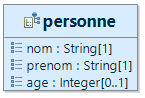

Le paramétrage pour l'attribut nom : 

<div align="center">
  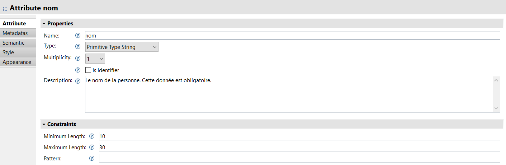
</div>

Le paramétrage pour l'attribut prénom : 
<div align="center">
  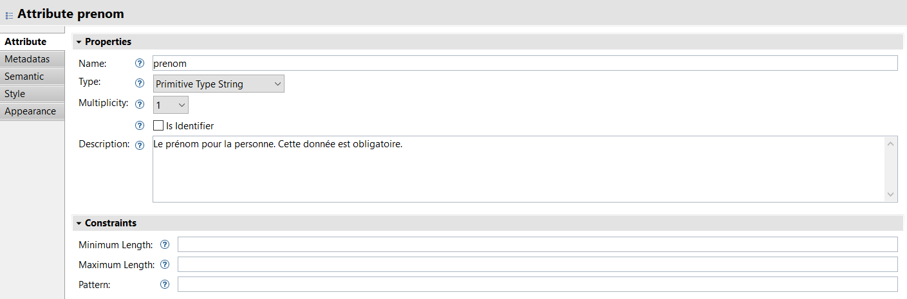
</div>

Le paramétrage pour l'attribut âge : 
<div align="center">
  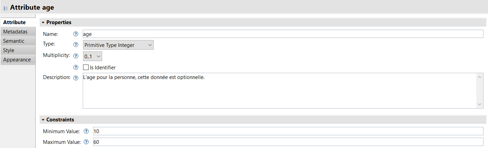
</div>

#### Génération

Dans l'explorateur de modèles, aller au niveau du projet de modélisation ***[nom de l'application]-model***, se positionner sur le fichier de modélisation des entités ***[nom de l'application].entity*** et par un clique droit, faire apparaitre le menu de génération **Pacman**. Sont présentés (à l'inverse des versions précedentes) uniquement les générateurs associés au type du fichier sur lequel le développeur s'est positionné. 

<div align="center">
  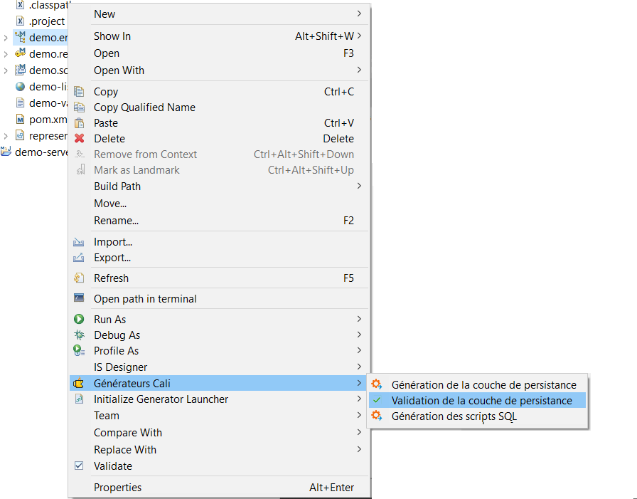
</div>

❗ Il est à noter que, avec la version 5 de **Pacman**,  les menus contextuels affichés dépendent maintenant  directement de la nature du fichier source. Ainsi , le fichier '.entity' n'aura que les générateurs qui concernent directement cette ressource.

On peut remarquer la présence d'un  "***Validation du diagramme de modélisation***". Quelle que soit la couche à générer, il est toujours possible de lancer directement le générateur désiré et celui-ci va automatiquement activer la validation du diagramme avant de se lancer. Si des erreurs sont detectées, il est alors possible d'aller voir le résultat de la validation au niveau de la vue dédiée à la validation (Rapport de validation). 

Par ailleurs il est aussi possible de lancer spécifiquement la validation du modèle afin de vérifier par avance si tout est correct. Si la validation est lancée en "standalone", et que le diagramme est valide, alors un message spécifique est affiché au développeur : 

<div align="center">
  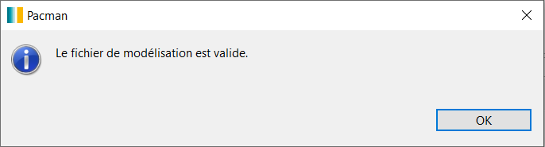
</div>

Lancer successivement la génération des scripts SQL et de la couche de persistance...

Aucune classe n'a été générée au niveau de la couche métier ce qui est normal puisque l'entité appartient à la couche de persistance, la persistance étant gérée par l'infrastructure. Se reporter au niveau du projet serveur ***[nom de l'application]-server***, les scripts de création, de suppression et d'initialisation de la base de données sont disponibles soit : 

- au niveau du répertoire ***/src/main/resources/sql*** pour les scripts de création et de suppression de la base de données (développement et production).

  - create\_tables\_demo\_h2.sql
  - drop\_tables_demo\_h2.sql
 
- au niveau du répertoire ***/scr/test/resources*** pour les les scripts de création et d'initialisation de la base de données (tests unitaires).

  - create\_tables\_demo\_h2.sql
  - init\_tables\_demo\_h2.sql

Plusieurs remarques à ce stade : 

• Tous les scripts sont toujours sous la forme "***[create/drop/init]\_tables\_[nom de l'application]\_[type de base]***"

• Il existe autant de scripts que de bases de données déclarées au niveau du répertoire ***/src/main/resources/sql*** (pour les tests, seule la base H2 est utilisée)

• Le script de création H2 est aussi présent au niveau du répertoire  ***/scr/test/resources*** car très légèrement différent de celui utilisé pour la production (déclaration des contraintes pour les tests unitaires qui passent au niveau de l'initialisation des données).
 
• On peux voir dans les scripts la présence des champs supplémentaires qui ont été demandés dans le cadre du projet "demo".
  
```sql
/******************************************************************/
/* Base de donnees:      h2                                       */
/* Application:          demo                                     */
/* Date de creation:     07/05/2025 15:50:30                      */ /******************************************************************/

/******************************************************************/
/* Schema: SCH                                                    */ /******************************************************************/
create schema SCH;
    
/******************************************************************/
/* Sequences                                                      */
/******************************************************************/
create sequence SCH.TBL_PERSONNE_SEQ start with 1;
    
/******************************************************************/
/* TABLE : SCH.TBL_PERSONNE                                       */
/******************************************************************/
create table SCH.TBL_PERSONNE
(
  /* PK de la table SCH.TBL_PERSONNE */
  TBL_PERSONNE_ID NUMBER(19) not null,
  NOM VARCHAR(100) not null,
  PRENOM VARCHAR(100) not null,
  AGE NUMBER(10),
  XTOPSUP BOOLEAN not null DEFAULT 'false',
  XDMAJ TIMESTAMP not null,
  XUUID VARCHAR(36) not null,
  constraint TBL_PERSONNE_PK1_1 primary key (TBL_PERSONNE_ID)
);
    
comment on column SCH.TBL_PERSONNE.TBL_PERSONNE_ID is 'Clé primaire pour la table SCH.TBL_PERSONNE';
comment on column SCH.TBL_PERSONNE.NOM is 'Le nom de la personne. Cette donnée est obligatoire';
comment on column SCH.TBL_PERSONNE.PRENOM is 'Le prénom pour la personne. Cette donnée est obligatoire';
comment on column SCH.TBL_PERSONNE.AGE is 'L''age pour la personne, cette donnée est optionnelle';
```
   
• Au niveau du script d'initialisation pour les tests il est à noter que l'identifiant est initialisé à 1000 et non à 1 comme pour la séquence au niveau du script de création. Comme le développeur peut ajouter autant d'insertions que désirées dans le script, cela évite d'avoir des collisions de clés primaires lors de l'exécution des tests, entre les tuples qui sont enregistrés par le script d'initialisation et les tuples enregistrés programmatiquement dans le cadre des tests par les classes automatiquement générées par Pacman. 


```sql
insert into SCH.TBL_PERSONNE (TBL_PERSONNE_ID,NOM,PRENOM,AGE,XTOPSUP,XDMAJ,XUUID) values
(1000,'S','S',0,false,current_timestamp,'a81bc81b-dead-4e5d-abff-90865d1e13b1');
```
  
Au niveau des classes générées : 

➤ ***[package racine].infra*** : présence d'une nouvelle classe ***[Nom de l'application]EntityAbs***, cette classe est regénérée à chaque fois (possibilité de changement des données au niveau du fichier de configuration de **Pacman**). Elle contient et gère le cycle de vie des différents champs supplémentaires qui sont communs à l'ensemble des tables. Dans le cadre du projet "demo" comme il a été demandé de rajouter les champs "Xtopsup, Xdmaj et Xuuid" on les retrouve donc à ce niveau : 


```java
/** Indicateur de suppression logique. */
@Column(name = "xtopsup", nullable = false, length = 1)
protected Boolean xtopsup = false;

/** Date de mise à jour de la ligne. */
@Column(name = "xdmaj", nullable = false)
protected Instant xdmaj;

/** Identifiant unique universel. */
@Column(name = "xuuid", nullable = false, unique = true, updatable = false)
protected UUID xuuid;
```
    
❗ Il est à noter que cette classe est toujours générée, même en l'absence de champ supplémentaire. Par ailleurs, il est vrai que dans le cadre de **Pacman** on utilise l'héritage afin de factoriser les champs automatiques au niveau des entités (et dtos, xtos) ce qui dans une vision puriste de la programmation orientée objet n'est pas une bonne pratique. Il aurait pu être préférable de passer par de la composition, mais il ne faut pas oublier qu'il s'agit ici d'un générateur et que les entités générées n'auront jamais leur signature modifiable par le développeur lui même (il n'y aura jamais la possibilité de rajouter une notion d'héritage ou d'implémentation). Ainsi la notion d'héritage a été préférée, car plus lisible au premier abord.
  
➤ ***[package racine].infra.entities.[nom du namespace]*** : implémentation de la ou des entités, dans le cas du projet "demo", il s'agit de l'entité "*PersonneEntityImpl*". Ici le générateur se contente de rajouter l'ensemble des annotations de persistance, encore une fois comme un indicateur de suppression logique a été demandé (*Xtopsup*) il est géré automatiquement par Spring Data. 
  
```java
@Entity
@Table(name = "TBL_PERSONNE", schema = "SCH")
@SequenceGenerator(name = "PERSONNE_SEQUENCE", sequenceName = "SCH.TBL_PERSONNE_SEQ", allocationSize = 1)
@SQLDelete(sql = "UPDATE SCH.TBL_PERSONNE SET xtopsup = true WHERE TBL_PERSONNE_ID = ?")
@SQLRestriction("xtopsup = false")
public class PersonneEntityImpl extends DemoEntityAbs {}
```

L'identifiant de l'entité est automatiquement créé et est associé à la séquence par le générateur (séquence aussi créée et initialisée dans le script SQL) : 

```java
/** Id. */
@Id
@GeneratedValue(strategy = GenerationType.SEQUENCE, generator = "PERSONNE_SEQUENCE")
@Column(name = "TBL_PERSONNE_ID", nullable = false)
private Long personne_id;
```
  
Chaque attribut est annoté pour que Spring Data puisse faire la liaison avec la couche de persistance (il est aussi possible de modifier par modélisation le nom de la colonne afin qu'il soit différent de celui de l'attribut au niveau de la classe java (voir plus loin)): 
  
```java
/** Le nom de la personne. Cette donnée est obligatoire. */
// Start of user code aee37c30f5d091a495526f636a3527bb
// End of user code
@Column(name = "NOM", nullable = false)
private String nom;

/** Le prénom pour la personne. Cette donnée est obligatoire. */
// Start of user code 209f4226d4ca0e91af3607674c06a9bc
// End of user code
@Column(name = "PRENOM", nullable = false)
private String prenom;

/** L'age pour la personne, cette donnée est optionnelle. */
// Start of user code 7d637d275668ed6d41a9b97e6ad3a556
// End of user code
@Column(name = "AGE", nullable = true)
private Integer age;
```
 
Chaque entité possède toujours deux constructeurs, un sans paramètre et un second avec l'ensemble des paramètres ce qui peut être utile avec certains lambdas d'initialisation si on désire peupler la base de données non pas par script mais programmatiquement.
  
➤ ***[package racine].infra.entities.repositories.[nom du namespace]*** : création du repository dédié à l'entité, sous la forme ***[nom de l'entité]Repository***. Il s'agit d'une interface vide (CRUD par défaut) pour les opérations basiques de récupération, sauvegarde, etc.... Lors de la génération, **Pacman** privilégie toujours l'utilisation d'un repository par rapport à celle de l'entity manager, car plus simple et plus lisible. Il reste juste au développeur de positionner ses requêtes JPQL au niveau de cette interface. Il est toutefois toujours possible pour le développeur de demander expressément l'utilisation de l'entity manager si besoin (voir plus loin).

```java
public interface PersonneRepository extends JpaRepository<PersonneEntityImpl, Long> {
   // Start of user code f0e770b82a09fdf18b21d0a4b108eef5
   // End of user code
}
```
Exemple de requete JPQL : 

```java
public interface PersonneRepository extends JpaRepository<PersonneEntityImpl, Long> {

  @Query("SELECT u FROM SCH.TBL_PERSONNE u WHERE u.active = true AND u.email LIKE %:emailPart%")
  List<User> findActiveUsersByEmailContaining(@Param("emailPart") String emailPart);
}
```
#### Tests

➤ ***[package racine].infra.adapters.[nom du namespace]*** : Des tests unitaires JUnit sont générés par défaut au niveau du package de test, avec pour chaque entité, une classe ***[nom de l'entité]RepositoryTestImpl***, dans le cadre de l'application "demo", il s"agit de la classe *PersonneRepositoryTestImpl*. Ces tests de base auto générés permettent de vérifier le bon fonctionnement des opérations CRUD pour la base de  données. 

Chaque classe de test récupère le "Repository" par le biais d'une injection par constucteur, on active le profil Spring pour les tests et on demande expressement la configuration issue de "***test.properties***" au lieu de celle de production "***application.properties***". Enfin on demande l'initialisation de la base de donnée avec la ligne "***initSql(dataSource);***" :

```java
@SpringBootTest
@ActiveProfiles("test")
@ExtendWith(SpringExtension.class)
@TestInstance(Lifecycle.PER_CLASS)
@TestPropertySource(locations = "classpath:tests.properties")
public class PersonneRepositoryTestImpl extends DemoTestAbs {
 
  /** Couche de persistance. */
  private final PersonneRepository personneRepository;

  /**
   * Constructeur avec injection de la couche de persistance.
   * 
   * @param personneRepository Le repository pour l'entité.
   * @param dataSource         La source de données à utiliser pour les tests.
   * @param entityManager      L'EntityManager utilisé pour manipuler la base de
   *                           données.
   */
   @Autowired
   PersonneRepositoryTestImpl(final PersonneRepository personneRepository, final DataSource   
      dataSource, final EntityManager entityManager) {
      this.personneRepository = personneRepository;
	  this.entityManager = entityManager;
	  initSql(dataSource);
   }
  etc...
}
```

❗ La demande expresse d'initialisation a été générée suite au constat d'effets de bord si on laissait Spring initialiser la base avec son propre cycle de vie.
  
Voici un exemple de test unitaire pour la persistance : 
  
```java
/**
 * Vérifie que l'entité personne est correctement récupérée par son identifiant.
 * 
 * @throws Exception Si une exception se produit pendant l'exécution du test.
 */
 @Test
 public void testFindById() throws Exception {

   Optional<PersonneEntityImpl> personne = personneRepository.findById(crudId);
   assertTrue(!personne.isEmpty(), "Aucune entité n'a ete recupérée");
   assertTrue(personne.get().getPersonne_id() == crudId, "L'entité recupérée n'est pas la bonne entité");

   // Start of user code 6ace50c02167250b08e7a5ea0d5e8720
   // End of user code
}
```

❗ Avant de lancer les tests, ne pas oublier de demander (si cela n'a pas déjà été effectué au préalable) la génération des scripts SQL. Pour ce faire, se positionner au niveau du fichier de modélisation de la couche de persistance ***[nom de l'application].entity*** et par clique droit, demander la génération : 

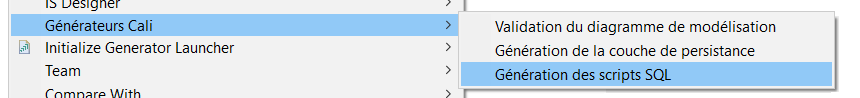

Un clique droit "***Run As/Junit Test***" sur la classe doit renvoyer le résultat suivant : 

<div align="center">
  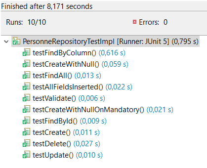
</div>

### 📏 Génération des règles de gestion
---
Il est possible de modéliser un ensemble de règles de gestion afin de générer des méthodes dont le corps doit par la suite être implémenté par les développeurs. Ces règles peuvent être fonctionnelles ou techniques, elles peuvent être hiérarchisées en catégories et sous-catégories, elles sont versionnées, etc... 

Les règles de gestion sont toutes centralisées au niveau du domaine (couche métier) puisqu'il s'agit par excellence d'une partie du code métier. Ces règles seront par la suite appelées au niveau de l'implémentation du service métier qui a été modélisé dans le diagrame SOA.

❗ Ne pas confondre règles de gestion et règles de calcul métier, ici les règles devraient êtres considérées comme des règles ou le seul retour possible est un booléen, ou ce que l'on teste est valide ou n'est pas valide.

Dans le cadre de l'application "demo", avec les informations dont on dispose, une règle très simple va être modélisée, vérifier que la personne est majeure. 

#### Modélisation

Se positionner au niveau de fichier de modélisation des "Requirements" : ***[nom de l'application].requirements*** et ajouter la règle (encore une fois, dans le cadre de ce document l'objectif n'est pas de montrer en détail l'utilisation du modeleur) : 

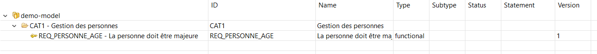

Puis se reporter au niveau du diagramme SOA pour attacher la règle de gestion au niveau de l'opération, grâce à la vue "***Linked Requirements***".

<div align="center">
  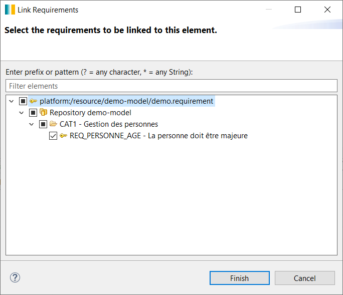
</div>

Une fois que la règle de gestion a été attachée à une opération, une clé jaune apparait alors au niveau de cette dernière afin de confirmer que l'opération à bien une ou plusieurs règles de gestion qui lui sont raccordées : 

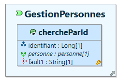

#### Génération

Pour lancer la génération des règles de gestions, utiliser en premier le générateur disponible au niveau du fichier de modélisation pour les "Requirements", en l'occurence le fichier ***[nom de l'application].requirements*** 

<div align="center">
  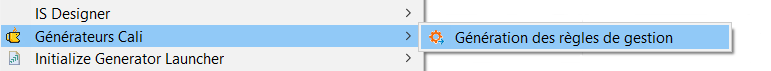
</div>

Pour l'instant, seule l'énumération contenant l'ensemble des règles de gestion est mise à jour au niveau du projet contenant les informations du domaine (***[nom de l'application]-domain***. Pour rappel cette énumération est située au niveau du package ***[package racine].services.requirements***

```java
/**
 * La personne doit être majeure 
 * RequirementVersionTest#testVersion_REQ_PERSONNE_AGE()
 */
REQ_PERSONNE_AGE("La personne doit etre majeure", "1");
```
Pour pouvoir utiliser cette nouvelle règle de gestion, il est maintenant nécessaire de passer à la génération de la couche de service avec le chapitre suivant.

### 🌐 Génération des services
---
C'est ici qu'est effectuée la plus grosse partie du travail de génération et que l'ensemble de la modélisation va permettre d'articuler le code autour de l'architecture hexagonale.

#### Modélisation

La modélisation des objets métier (DTO) est effectuée au niveau du fichier de modélisation (***[nom de l'application].soa***). Le plus simple (méthode conseillée lors de la première modélisation) est de sélectionner au niveau de la palette d'outils "***Namespace from Entity Namespace***" et de cocher l'ensemble des composants. 

Dans le cas de l'application "demo", le diagramme (encore une fois très simple) ressemble à ceci :

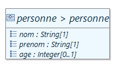

Pareillement, deux opérations de type CRUD sont modélisées, une pour retourner une personne en fonction de l'identifiant et une pour retourner l'ensemble des personnes présentes dans la base de données. Encore une fois il s'agit pour l'instant, de se focaliser sur la manière dont **Pacman** génère les différentes classes et les articule en fonction de l'architecture hexagonale, plutôt que de faire de suite un exemple plus complexe. Il n'est pas non plus dans l'objectif de ce chapître de détailler toutes les possibilités de modélisation.

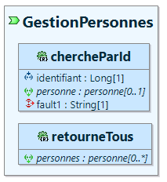

Dans cet exemple : 

- La version de l'application est laissé à la version par défaut soit 0.0.1
- L'uri racine est positionnée sur "*/api*".
- L'uri pour le service est "*/personnes*".
- L'uri pour la recherche par identifiant est "*/{id}*"
- Le service n'est pas sécurisé (accès libre).
- Dans le cas ou la personne n'est pas trouvée, une "fault" a été modélisée avec comme code de retour 404 (il est aussi possible de modéliser un 204).

#### Génération 

Dans l'explorateur de modèles, aller au niveau du projet de modélisation ***[nom de l'application]-model***, se positionner sur le fichier de modélisation des entités ***[nom de l'application].soa*** et par un clique droit, faire apparaitre le menu de génération **Pacman** (Générateurs Cali). 

<div align="center">
  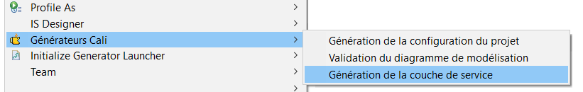
</div>

**Au niveau du projet du domaine (couche métier)** : 

• ***[package racine].domain.entities*** : Comme pour la couche de persistance, une classe parent est automatiquement générée pour les objets métiers. A l'inverse de la classe générée pour les entités, celle-ci ne contient aucune annotation et méthode pour gérer le cycle de vie des champs automatiques. Elle sert juste de conteneur pour mettre à disposition les différents attributs au niveau du DTO.

• ***[package racine].domain.entities.[nom du namespace]*** : Contient les implémentations des objets métier (le DTO) avec pour chaque objet une classe de type ***[nom du dto]DToImpl*** (ici *PersonneDtoImpl*). En plus des attributs et de leurs assesseurs, chaque objet métier généré contient automatiquement : 

  - Une méthode de validation pour les champs obligatoires ainsi que pour les champs qui ont des règles spécifiques issues de la modélisation (taille, pattern). 
  
```java
public PersonneDtoImpl validate() throws DemoValidationException {

	List<String> errors = new ArrayList<>();
	ValidatorUtils.checkMandatory("nom", nom, errors);
	ValidatorUtils.checkSize("nom", nom, 10, 30, errors);
	ValidatorUtils.checkMandatory("prenom", prenom, errors);

	if (!errors.isEmpty()) {
		throw new DemoValidationException(this, errors.toArray(new String[errors.size()]));
	}
	return this;
}
```

  - Une redéfinition de la méthode "*equals()*" 
  
```java
@Override
public boolean equals(Object obj) {
	if (this == obj) {
		return true;
	}

	if (!(obj instanceof PersonneDtoImpl)) {
		return false;
	}

	PersonneDtoImpl personne = (PersonneDtoImpl) obj;
	return Objects.equals(this.personne_id, personne_id)
			&& Objects.equals(this.nom, personne.nom) && Objects.equals(this.prenom, personne.prenom)
			&& Objects.equals(this.age, personne.age)
			&& Objects.equals(this.xtopsup, personne.xtopsup) && Objects.equals(this.xdmaj, personne.xdmaj)
			&& Objects.equals(this.xuuid, personne.xuuid);
}
```

  - Une redéfinition de la méthode "*hashCode()*" 
  
```java
@Override
public int hashCode() {
	return Objects.hash(this.personne_id, this.nom, this.prenom, this.age, this.xtopsup, this.xdmaj, this.xuuid);
}
```

  - Une redéfinition de la méthode "*toString()*" 
  
```java
@Override
public String toString() {
	return "PersonneDtoImpl { personne_id = " + this.personne_id
		+ "nom = " + this.nom + "prenom = " + this.prenom + "age = " + this.age
		+ "xtopsup = " + this.xtopsup + "xdmaj = " + this.xdmaj + "xuuid = " + this.xuuid + "}";
}
```

• ***[package racine].domain.port.adapters.[nom du namespace]*** : Contient les interfaces (ports) pour les services d'infrastructure (couche de persistance), avec pour chaque service modélisé une interface d'accès à l'implémentation (adapter). Il s'agit donc de l'accès au "*inbounds*", toutes les interfaces sont de type ***[nom du DTO]Provider***. 

❗ On parle ici de "Provider" car on considère que, pour la couche métier, l'accès à la couche de persistance est un service fourni. Par ailleurs à ce niveau le domaine n'a pas à savoir si la donnée provient d'une base de données, d'un fournisseur de mail, d'un fournisseur de services REST, etc... Cet accès est transparent à ce niveau, le métier sait uniquement qu'il peut récupérer des informations concernant l'entité qu'il est censé gérer, peut importe comment ces informations sont récupérées. 
 
On reprend ici l'ensemble des opérations modélisées au niveau du diagramme SOA.
    
```java
/**
 * Service de gestion des personnes.
 * 
 * @Author j.dupont
 */
 public interface GestionPersonnesProvider {
 
 /**
  * Cette méthode retourne la personne qui correspond à l'identifiant passé en
  * paramètre.
  * 
  * @param identifiant : L'identifiant pour la personne.
  *
  * @return Optional<PersonneDtoImpl> : La personne.
  */
  public Optional<PersonneDtoImpl> chercheParId(final Long identifiant);

  /**
   * Retourne la liste des personnes présentes en base.
   * 
   *
   * @return List<PersonneDtoImpl> : La liste de toutes les personnes présentes en base.
   */
   public List<PersonneDtoImpl> retourneTous();
}
```

• ***[package racine].domain.port.adapters.features.[nom du namespace]*** : Contient les interfaces (ports) pour l'appel des services métier par l'infrastructure, avec pour chaque service modélisé une interface d'accès à l'implémentation (adapter), ici le service REST. Il s'agit donc de l'accès au "*outbounds*", toutes les interfaces sont de type ***[nom du service]Service***. Avec la version actuelle de **Pacman**, ces interfaces on exactement le même code que l'interface pour l'accès au "Provider" de la couche de persistance (99% des cas d'utilisation).

• ***[package racine].domain.services.[nom du namespace]*** : Contient les implémentations des services métier (qui implémentent l'interface vue juste ci-dessus), avec pour chaque implémentation un service nommé ***[nom du service]ServiceImpl***.
  
```java
/**
 * Service de gestion des personnes.
 *
 * @Author j.dupont
 */
 // Start of user code 4a236703b9d5317c198dc3e3d6db3fc6
 @SuppressWarnings("unused")
 // End of user code
 @DomainService
 public class GestionPersonnesServiceImpl implements GestionPersonnesService {
  
   /** Règles de gestion associées. */
   private final GestionPersonnesRequirementImpl requirements = new GestionPersonnesRequirementImpl();
	  
   /** Le logger pour la classe. */
   private static final Logger LOG = LoggerFactory.getLogger(GestionPersonnesServiceImpl.class);
	  
   /** Interface de persistance. */
   private final GestionPersonnesProvider gestionPersonnesProvider;
	  
   // Start of user code 2234954db9958848e5c5f1c19fe4a482
   // End of user code
	  
   /**
    * Constructeur avec injection de la persistance.
    */
	public GestionPersonnesServiceImpl(final GestionPersonnesProvider gestionPersonnesProvider) {
	  this.gestionPersonnesProvider = gestionPersonnesProvider;
	}
	  
	/**
	 * Cette méthode retourne la personne qui correspond à l'identifiant passé en
	 * paramètre.
	 * 
	 * @param identifiant : L'identifiant pour la personne.
	 *
	 * @return Optional<PersonneDtoImpl> : La personne.
	 */
	 // Start of user code ea90c22bb8cac819a5c286613bb46870
	 // End of user code
	 @Override
	 public Optional<PersonneDtoImpl> chercheParId(final Long identifiant) {
	  
		// Appel des exigences en provenance de la modélisation
	    // Start of user code 1804fe669db8e4489d6be56c814e9b1d
	     
		// End of user code
		
		Optional<PersonneDtoImpl> personne = this.gestionPersonnesProvider.chercheParId(identifiant);

		// Start of user code 1f02d896fb99cca181e0d94fc20b42f2
		// End of user code
		 
		 return personne;
	 }

	 /**
	  * Retourne la liste des personnes présentes en base.
	  * 
	  *
	  * @return List<PersonneDtoImpl> : La liste des personnes présentes en base.
	  */
	  // Start of user code 0cef7902fd0827c082758b681c5b9e44
	  // End of user code
	  @Override
	  public List<PersonneDtoImpl> retourneTous() {

		// Appel des exigences en provenance de la modélisation
		// Start of user code b3cd801bacaa8215ea8b99cd493f3c64
		// End of user code

		List<PersonneDtoImpl> personnes = this.gestionPersonnesProvider.retourneTous();

		// Start of user code fc7467f7f1fb6f5cccd57590429003e4
		// End of user code

		return personnes;
    }
  }
```

Il s'agit de la classe "centrale" pour la manipulation des objets de l'application, afin d'être prise en compte par Spring, la classe est annoté "***@DomainService***": 
  
  - Par le bais de son interface "*GestionPersonnesService*", ce service est appelable par le service REST de l'infrastructure.
  - Par le biais de l'interface "*GestionPersonnesProvider*" (et l'injection dans le constructeur de son implémentation), ce service est capable d'appeler l'infrastructure pour avoir accès à la couche de persistance. Comme l'implémentation du fournisseur de persistance est au niveau de l'infrastructure, mais que son interface est définie au niveau du domaine, le domaine n'a pas à connaitre l'infrastructure et n'a donc aucune dépendance Maven sur le projet ***[nom de l'application]-server*** 
 
Par ailleurs, une classe ***[nom du service]RequirementsImpl*** est aussi automatiquement générée (même si aucune règle de gestion n'a été préalablement modélisée, dans ce cas le corps est vide). Cette classe contient l'ensemble des règles qui ont été attachées au service. Comme dans le cas de l'application "demo" une règle concernant le contrôle de l'âge a été préalablement positionnée sur l'opération, le code généré par défaut pour cette classe est donc le suivant : 

```java
public class GestionPersonnesRequirementImpl {

	/**
	 * La personne doit être majeure .
	 */
	@Requirement(RequirementsEnum.REQ_PERSONNE_AGE)
	// Start of user code 1b38da379e5345c55bdffa8f819e2607

	public void exigenceREQ_PERSONNE_AGE() {

		throw new DemoNotImplementedException(
				"La règle de gestion : La personne doit être majeure n'a pas été implémentée.");
	}

	// End of user code

	// Start of user code 5b1f0e7b5b1a0ffc337957baef521227
	// End of user code
}
```
C'est au développeur d'implémenter le code pour la règle de gestion (on peut par ailleurs constater que c'est la totalité de la méthode qui est positionnée entre balises de type "*user code*" car le générateur ne peut connaitre par avance les paramètres entrants et sortants pour la règle de gestion. Ainsi dans le cas (très simple) de la précédente modélisation l'implémentation pourrait être la suivante : 

```java
public boolean exigenceREQ_PERSONNE_AGE(final PersonneDtoImpl personne) {
   return personne.getAge() >= 18;
}
```

Ou encore : 

```java
public void exigenceREQ_PERSONNE_AGE(final PersonneDtoImpl personne) {
   if (personne.getAge() < 18) {
      throw new RuntimeException("La personne doit avoir plus de 18 ans");
   }
}
```
Pour intégrer la règle de gestion, c'est encore une fois au développeur de coder l'appel à l'emplacement désiré au sein de l'implémentation de son service (avant ou après l'appel selon la règle) et d'effectuer les actions nécessaires en fonction du retour de ladite règle. 

Par exemple : 

```java
@Override
@Requirement(value = { RequirementsEnum.REQ_PERSONNE_AGE })
public PersonneDtoImpl chercheParId(final Long identifiant) {

   // Appel des exigences en provenance de la modélisation
   // requirements.exigenceREQ_PERSONNE_AGE();

   // Start of user code 1804fe669db8e4489d6be56c814e9b1d
   // End of user code

   PersonneDtoImpl personne = this.gestionPersonnesProvider.chercheParId(identifiant);

   // Start of user code 1f02d896fb99cca181e0d94fc20b42f2
   // On lance diretement l'exception qui va effectuer un traitement particulier 
   // si la personne retournée n'est pas majeure
   requirements.exigenceREQ_PERSONNE_AGE(personne);
   // End of user code

   return personne;
}
```

Ou encore : 

```java
// Start of user code 1f02d896fb99cca181e0d94fc20b42f2
if (!requirements.exigenceREQ_PERSONNE_AGE(personne)) {
   // On ajoute un message indiquant que la personne retournée n'est pas majeure....
}
// End of user code
```

Voici donc un bref schéma récapitulatif qui permet de mieux appréhender l'ensemble de traitements lors de l'appel d'un service métier : 
  
<div align="center">
  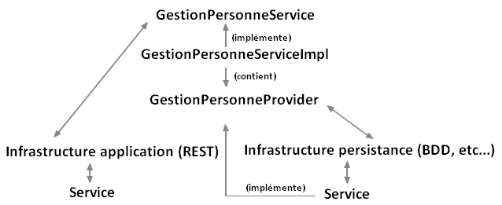
</div>

 • ***[package racine].domain.port.adapters.stub.[nom du namespace]*** (TESTS) : Au niveau des tests unitaires, le domaine doit pouvoir fonctionner en totale autonomie (il ne s'agit pas ici de tests d'intégration mais bien de tests métier). Dans cette optique une classe bouchon (stub) ***[nom du service]StubImpl*** est automatiquement générée pour chaque entité afin de remplacer la couche de persistance. Par défaut, toutes les méthodes renvoient une "***NotImplementedException***". C'est au développeur d'implémenter son propre jeu de test.

```java
@StubService
public class GestionPersonnesProviderStubImpl implements GestionPersonnesProvider {
   
   /**
    * Cette méthode retourne la personne qui correspond à l'identifiant passé en 
    * paramètre.
    * 
    * @param identifiant : L'identifiant pour la personne.
    *
    * @return Optional<PersonneDtoImpl> : La personne.
    */ 
   @Override
   public Optional<PersonneDtoImpl> chercheParId(final Long identifiant) {

	// Start of user code 3526af85e72642a68569bcae02d07e77
	throw new DemoNotImplementedException(
			"Le test n'a pas été implémenté pour le stub : GestionPersonnesServiceImpl");

	// End of user code
  }
  etc...
}
```

❗ Le stub implémente toujours la même interface que l'implémentation de production, afin d'être pris en compte par Spring, il est annoté "***@StubService***".     
   
• ***[package racine].domain.services.[nom du namespace]*** (TESTS) : Contient les classes Junit de test métier ***[nom du service]ServiceTestImpl*** pour les services. Chaque service bénéficie de sa propre classe de test. Non implémentée par défaut, c'est au développeur de réaliser le codage nécessaire pour effectuer l'ensemble de ses propres tests métier.
   
```java
@ExtendWith(GestionPersonnesServiceParamResolver.class)
public class GestionPersonnesServiceTestImpl {

   @Test
   public void chercheParId(final GestionPersonnesServiceImpl gestionPersonnes) {

	// Start of user code 3526af85e72642a68569bcae02d07e77

	throw new DemoNotImplementedException(
			"Le test n'a pas été implémenté pour le service : GestionPersonnesServiceImpl");

	// End of user code
   }
   etc...
}
```

•  ***[package racine].domain.services.resolvers.[nom du namespace]*** (TESTS) : Contient les classes de résolution ***[nom du service]ParamResolver*** pour les Stubs de chaque service dans le cadre des tests. Il s'agit d'une petite classe technique qui permet à JUnit d'injecter le Stub à la place du fournisseur initial ("Provider") de la couche d'accès à la persistance.

**Au niveau du projet du serveur (couche infrastructure)** : 

C'est au niveau du projet infrastructure que se situe la plus grande partie du code généré. Vont être générés, les services REST, les services de persistance (pour la majorité un accès à la base de données) et les différentes couches techniques qui permettent la communication et le partage des objets métier entre les différentes couches (surplus de code inhérent à l'architecture hexagonale). Comme vu précédemment, il a été décidé pour plus de lisibilié, de séparer la couche "globale" infrastructure en deux : infrastructure et application.

• ***[package racine].infra.adapters.[nom du namespace]*** : Contient l'ensemble des classes pour l'implémentation des services de persistance. Chaque service métier bénéficie de son service de persistance ***[nom du service]JpaProviderImpl*** qui lui permet de coder ses accès à la base de données, grâce au "Repository" qui a été généré au niveau de la demande de génération de la couche de persistance (voir plus haut) et qui est automatiquement injectée dans le service. La classe est annotée "***@AdapterService***" pour être prise en compte par Spring.
  
```java
@AdapterService
public class GestionPersonnesJpaProviderImpl implements GestionPersonnesProvider {

	 // Start of user code 2129864a49adcaa3a812f92be467bf4e
	 // End of user code

	 /** Gestionnaires de persistance disponibles. */
	 final PersonneRepository personneRepository;

	 /**
	  * Constructeur.
	  */
	  @Autowired
	  public GestionPersonnesJpaProviderImpl(final PersonneRepository personneRepository) {

		this.personneRepository = personneRepository;

		// Start of user code 2e3e969fd52202f4f94ef7456a361c15
		// End of user code
	  }
	etc...
}
```

❗ A ce niveau dans l'application, il aurait été possible de simplement positionner une annotation "***@Service***" ou "***@Component***" puisque l'infrastructure est sous Spring mais il a été noté des effets de bord avec les couches de test, et de manière générale, il a été considéré comme plus homogène que l'ensemble des couches aient des annotations spécifiques projet, mais enregistrée auprès de Spring.
  
❗ Bien noter le commentaire "Gestionnaires..disponibles", en effet, par défaut **Pacman** va prendre le gestionnaire spécifiquement dédié à l'entité, mais si des relations avec d'autres entités sont trouvées, les gestionnaires de ces entités référencées sont alors eux aussi récupérés et mis à disposition.
  
Chaque implémentation d'opération modélisée est découpée en deux méthodes, la méthode d'accès, qui implémente celle de l'interface et qui est chargée des opérations de copie entre les objets, et la méthode d'invocation qui contient l'appel à la couche de persistance. Comme toujours (lorsque la modélisation ne permet pas d'effectuer la totalité de la génération), la méthode d'invocation renvoie toujours une exception de type "***NotImplementedExcption***".
  
```java
  /**
	 * Cette méthode retourne la personne qui correspond à l'identifiant passé en
	 * paramètre.
	 * 
	 * @param identifiant : L'identifiant pour la personne.
	 *
	 * @return Optional<PersonneDtoImpl> : La personne.
	 */
	@Override
	public Optional<PersonneDtoImpl> chercheParId(final Long identifiant) {

		// Start of user code 3526af85e72642a68569bcae02d07e77
		// End of user code

		Optional<PersonneEntityImpl> entity = chercheParId_invoke(identifiant);
		if (entity.isPresent()) {
			return Optional.of(PersonneMapper.toDto(entity.get()));
		}
		return Optional.empty();
	}

	/**
	 * Cette méthode retourne la personne qui correspond à l'identifiant passé en
	 * paramètre.
	 * 
	 * @param identifiant : L'identifiant pour la personne.
	 *
	 * @return Optional<PersonneDtoImpl> : La personne.
	 */
	private Optional<PersonneEntityImpl> chercheParId_invoke(final Long identifiant) {

		// Start of user code 0d7aeafd27536987cf0cf491de14ca07

		throw new DemoNotImplementedException("La méthode 'chercheParId' n'a pas été implémentée");

		// End of user code
	}

	/**
	 * Retourne la liste des personnes présente en base.
	 * 
	 *
	 * @return List<PersonneDtoImpl> : La liste des personnes présentes en base.
	 */
	@Override
	public List<PersonneDtoImpl> retourneTous() {

		// Start of user code 1f82841b68b9a27af5cfcf572412847c
		// End of user code

		return retourneTous_invoke().stream().map(o -> PersonneMapper.toDto(o)).collect(Collectors.toList());
	}

	/**
	 * Retourne la liste des personnes présentes en base.
	 * 
	 *
	 * @return List<PersonneDtoImpl> : La liste des personnes présentes en base.
	 */
	private List<PersonneEntityImpl> retourneTous_invoke() {

		// Start of user code ac726b97d06e0252fbb02a99667258b7

		throw new DemoNotImplementedException("La méthode 'retourneTous' n'a pas été implémentée");

		// End of user code
	}
```
  
Dans le cas spécifique de l'application "demo" et selon la modélisation effectuée, il s'agit pour ces deux opérations de simples opérations de type CRUD, il est donc possible de réaliser très simplement l'implémentation suivante pour les deux méthodes d'invocation : 
  
```java
private Optional<PersonneEntityImpl> chercheParId_invoke(final Long identifiant) {

	// Start of user code 0d7aeafd27536987cf0cf491de14ca07
	return this.personneRepository.findById(identifiant);
	// End of user code     
}
	
private List<PersonneEntityImpl> retourneTous_invoke() {

	// Start of user code ac726b97d06e0252fbb02a99667258b7
	return this.personneRepository.findAll();
	// End of user code
}
```

• ***[package racine].infra.entities.mappers.[nom du namespace]*** : Au niveau de l'implémentation de la couche de persistance ***[nom du service]JpaProviderImpl*** il a été possible de voir que la classe faisait appel à une méthode de mappeur (en locurence "*PersonneMapper.toDto(o)*"). Ce package contient l'ensemble des mappeurs qui permettent pour chaque entité, la recopie des données vers un objet métier et celle de l'objet métier vers l'entité. Ceci est effectué à l'aide des deux méthodes implémentées : "***toDto(..)***" et "***toEntity()***". 
 
Chaque mappeur contient un code très simple qui permet cette copie, voici par exemple le code pour la création de l'objet métier, il s'agit du code le plus complet car la seule méthode à effectuer consiste à la recopie des champs automatiques (pour rappel, les champs automatiques ne redescendent pas et ne montent pas plus haut que la couche métier) : 
  
```java
public static PersonneDtoImpl toDto(final PersonneEntityImpl entity) {
	if (null == entity) {
		return null;
	}
	PersonneDtoImpl dto = new PersonneDtoImpl();

	try {

		dto.setPersonne_id(entity.getPersonne_id());
		dto.setNom(entity.getNom());
		dto.setPrenom(entity.getPrenom());
		dto.setAge(entity.getAge());
		dto.setXtopsup(entity.getXtopsup());
		dto.setXdmaj(entity.getXdmaj());
		dto.setXuuid(entity.getXuuid());

		// Start of user code 856cc109a8cab6eb0a3676613acc6f8f
		// End of user code

	} catch (Exception e) {
		throw new DemoMapperException("Impossible de mapper la classe : PersonneDtoImpl");
	}
	return dto;
}
```

• ***[package racine].app.adapters.controllers.[nom du namespace]*** : Contient les points d'entrée (sous forme de services REST dans le cas de **Pacman**) pour les différents service ("*outbounds*" au niveau de l'architecture REST). Chaque service ***[nom du service]ControllerImpl*** fait appel à  l'interface en provenance du domaine ***[nom du service]Feature*** dont l'injection de l'implémentation est effectuée dans le constructeur par le framework Spring : 
  
```java 
@Controller
@RequestMapping("/v0/api/personnes")
@Tag(name = "GestionPersonnes", description = "Service de gestion des personnes.")
// Start of user code 5279f4e79131b3bfeb4c9f26a960106d
// End of user code
class GestionPersonnesControllerImpl {

	/**
	 * Interface service métier.
	 */
	private final GestionPersonnesService gestionPersonnes;

	/**
	 * Constructeur.
	 */
	@Autowired
	public GestionPersonnesControllerImpl(final GestionPersonnesService gestionPersonnes) {
		this.gestionPersonnes = gestionPersonnes;
	}
}
```
  
Le code est ici standard et ne mérite pas d'explication particulière. L'URI est ici branchée sur "*/v0/api/personnes*" selon les différents éléments de modélisation (pour la version on prend toujours uniquement le numéro majeur précédé de la lettre "v"). Au niveau des opérations modélisées, le générateur passe toujours par un monteur pour la réponse, ce qui permet à la fois d'avoir l'ensemble du code d'appel entièrement généré et de laisser la possibilité au développeur de rajouter des informations supplémentaires au niveau des balises de type "*user code*". La description Open Api est, elle aussi, automatiquement générée.

Pour la première opération de recherche par identifiant, comme il est possible de ne pas avoir d'enregistrement et que une "*fault*" a été modélisée, cela permet d'avoir un message personnalisé en cas d'erreur fonctionnelle. 
  
❗ La documentation Open Api a été volontairement retirée du code généré afin de limiter le nombre de lignes et, dans un premier temps, se focaliser uniquement sur l'appel des différents services.
   
```java 
/**
 * Cette méthode retourne la personne qui correspond à l'identifiant passé en
 * paramètre.
 * 
 * @param identifiant : L'identifiant pour la personne.
 *
 * @return Optional<PersonneDtoImpl> : La personne.
 */
// Start of user code ea90c22bb8cac819a5c286613bb46870
// End of user code
@GetMapping(value = "/{id}", produces = "application/json;charset=utf8")
public ResponseEntity<PersonneXtoImpl> chercheParId(@PathVariable(name = "id", required = true) Long identifiant) {

	ResponseEntity.BodyBuilder responseBuilder = ResponseEntity.status(200);

	// Start of user code 3526af85e72642a68569bcae02d07e77

	// End of user code

	return this.gestionPersonnes.chercheParId(identifiant).map(o -> responseBuilder.body(PersonneMapper.toXto(o)))
			.orElseThrow(() -> new DemoNotFoundException(404, "La personne n'a pas été trouvée."));
}

/**
 * Retourne la liste des personnes présentes en base.
 * 
 *
 * @return List<PersonneDtoImpl> : La liste des personnes présentes en base.
 */
// Start of user code 0cef7902fd0827c082758b681c5b9e44
// End of user code
@GetMapping(produces = "application/json;charset=utf8")
public ResponseEntity<List<PersonneXtoImpl>> retourneTous() {

	ResponseEntity.BodyBuilder responseBuilder = ResponseEntity.status(200);

	// Start of user code 1f82841b68b9a27af5cfcf572412847c

	// End of user code

	return responseBuilder.body(this.gestionPersonnes.retourneTous().stream().map(o -> PersonneMapper.toXto(o))
			.collect(Collectors.toList()));
}
```
   
❗ Il est à remarquer que les objets métier ne sont jamais envoyés au client, il sont avant recopiés dans des objets sérialisés de type ***[nom du dto]XtoImpl***.

• ***[package racine].app.entities.mappers.[nom du namespace]*** : Contient les mappeurs pour effectuer les conversions entre les objets métier et les objets serialisés. Le code est similaire à celui des mappeurs de la couche d'infrastructure.

• ***[package racine].app.entities.[nom du namespace]*** : Contient la liste des objets serialisés qui seront envoyés vers ou en provenance du client. A noter simplement qu'il est possible à ce niveau de positionner des annotations spécifiques JSON afin de masquer des champs, spécifier un nom particulier pour l'attribut, etc...
  
```java
/** Le nom de la personne. Cette donnée est obligatoire. */
// Start of user code aee37c30f5d091a495526f636a3527bb
@JsonProperty("nom")
// End of user code
private String nom;
```
• ***[package racine].[nom de l'application]TestConfig*** (TESTS) : Classe de configuration pour les tests d'intégration au niveau serveur. Cette classe contient l'ensemble des filtres pour pouvoir basculer entre les tests effectués avec l'aide de la base de données embarquée H2 ou des bouchons (Stubs) qui permettent justement de se passer de cette dernière de de spécifier un jeu de données particulier pour des tests ponctuels. 

Par défaut le code de cette classe est le suivant (le corps est vide, il s'agit juste de positionner l'ensemble des annotations de configuration pour la prise en compte des classes de persistance) : 

```java
@TestConfiguration
@ComponentScan(basePackages = { "fr.demo" }, includeFilters = {
		@ComponentScan.Filter(type = FilterType.ANNOTATION, classes = { DomainService.class, StubService.class, AdapterService.class }) }, excludeFilters = {
		@ComponentScan.Filter(type = FilterType.ASSIGNABLE_TYPE, classes = {}) })
public class DemoTestConfig {
}
```
Avec ce code, on demande au framework Spring de prendre en compte les annotations du domaine pour le scan des différentes classes à injecter et par ailleurs, une liste de classes à exclure est mise à disposition par le biais du mot-clé : ***excludeFilters***. Cette liste de classe est automatiquement générée par **Pacman** et, après génération, sont présents l'ensemble des Stubs (bouchons). Par défaut tous les tests sont automatiquement joués avec la base de données. 

Dans le cas du projet d'exemple, comme il n'y a qu'un seul service de modélisé, c'est le bouchon ***GestionPersonnesProviderStubImpl*** qui est évincé de l'injection. Comme Spring ne trouve plus qu'une seule classe éligible, il va injecter uniquement la classe pour la couche de persistance JPA, à savoir : ***GestionPersonnesJpaProviderImpl***.

```java	
excludeFilters = {
	    @ComponentScan.Filter(type = FilterType.ASSIGNABLE_TYPE, classes = {
		GestionPersonnesProviderStubImpl.class }) })
```
Si le développeur souhaite basculer sur le (ou les) bouchon(s), il suffit alors de modifier la liste et de remplacer la classe bouchon par son homologue, la classe de gestion de la persistance JPA.

❗ A noter que cette classe est recréé à chaque demande de génération pour la couche soa, pour l'instant il n'a pas été considéré comme justifié de positionner des balises de type 'user code'. A voir dans le futur si ce besoin s'avère nécessaire.

#### Tests

• ***[package racine].app.adapters.[nom du namespace]*** : Contient la liste des classes de test d'intégration pour chaque service REST. Chaque classe ***[nom du service]ServiceTestImpl*** permet de lancer le serveur et d'effectuer un appel REST avec des informations par défaut. Suite à la génération, on vérifie si le code de retour du service est bien celui attendu et le test est alors validé. Le développeur, à l'aide des balises de type "*user code*" peut toujours ajouter à sa guise autant d'éléménts que nécessaires pour complexifier ses propres cas de test. 

A l'aide de l'annotation "***@TestPropertySource***" on demande à Spring de prendre le fichier de configuration "***test.properties***" au lieu de la configuration de production "***application.properties***", on demande le chargement et l'initialisation de la base de données. Toujours de la même manière, les différentes ressources sont injectées par le biais du constructeur.
  
```java
@AutoConfigureMockMvc
@ExtendWith(SpringExtension.class)
@SpringBootTest(webEnvironment = SpringBootTest.WebEnvironment.MOCK)
@TestPropertySource(locations = "classpath:tests.properties")
public class GestionPersonnesServiceTestImpl extends DemoTestAbs {

	/**
	 * Instance de {@link MockMvc} pour effectuer des requêtes HTTP simulées dans
	 * les tests.
	 */
	private MockMvc restHelper;

	/**
	 * Instance de {@link GestionPersonnesProvider} qui est utilisée pour gérer les
	 * opérations de persistance au niveau des tests.
	 */
	@SuppressWarnings("unused") // Pour l'instant.
	private GestionPersonnesProvider provider;

	/**
	 * Instance de {@link ObjectMapper} utilisée pour gérer les opérations de
	 * conversion entre une entité et json.
	 */
	ObjectMapper objectMapper;

	/**
	 * Constructeur.
	 */
	@Autowired
	GestionPersonnesServiceTestImpl(final DataSource dataSource, final GestionPersonnesProvider provider,
			final MockMvc restHelper, final ObjectMapper objectMapper) {

		this.provider = provider;
		this.objectMapper = objectMapper;
		this.restHelper = restHelper;
		initSql(dataSource);
	}
  etc...
}
```

A partir du moment ou la génération de la couche de service a été effectuée, il est possible (après avoir implémenté le code de la couche de persistance au niveau de la classe ***[nom du service]JpaProviderImpl***) d'attaquer directement les tests d'intégration qui permettent de valider la globalité de la chaine. 

❗ Il est important de noter que si les tests sont lancés alors que l'implémentation de la classe de persistance n'a pas encore été effectuée, les tests renvoient (au niveau JUnit) un retour positif mais le détail des tests est, quant à lui, négatif :  

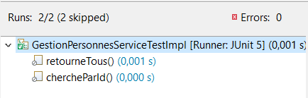

Cela est du à la présence par défaut de l'annotation "***@Disabled("En attente de l'implémentation de la couche de persistance")***" positionnée par défaut sur chaque test. Ne pas oublier d'enlever cette annotation une fois que les tests sont implémentés. A voir si cette annotation sera conservée dans le future, mais cela évite d'être en erreur sur un serveur d'intégration continue alors qu'en fait, la chaine est valide (sur 90% du code que l'on désire tester) hormis une simple problématique de récupération des donnnées non encore implémentée (ce qui en soit n'est pas considéré comme une erreur). 

Cela est donc laissé au choix des développeurs qui peuvent, suite à la première génération, supprimer de suite cette annotation s'ils désirent que les tests soient en erreur.

Au niveau des tests, comme précisé ci-dessus et par défaut, le code généré pose juste la structure d'appel de base et vérifie simplement si le code de retour du service est bien celui attendu. Si cela est le cas, le test est alors considéré comme validé.

```java
@Test
// Start of user code b9016888c594d13644084667286bfe9c
@Disabled("En attente de l'implémentation de la couche de persistance")
// End of user code
public void retourneTous() throws Exception {

	// Start of user code bd802d7d3e35db7077c719c62b551092
	// End of user code

	/** Le statut attendu suite au test. */
	int expectedStatus = 200;

	restHelper.perform(get("/v0/api/personnes").contentType("application/json"))

			// Start of user code 6446dd56a2bc98c406960c0c3f2f9d1a
			// End of user code

			.andExpect(status().is(expectedStatus));
}
```
❗ Dans le cas de recherche par identifiant, afin d'éviter une complexité technique au niveau des générateurs (à ce niveau il n'est plus possible (complexe) de distinguer la clé primaire pour l'objet métier), ce champ est donc initialisé à 0L comme tout champ de type "Long". Or pour rappel, au niveau des scripts d'initialisation la valeur de la clé primaire comment à 1000L pour éviter les collisions avec les éventuels ajouts de tuples par le développeur. Il ne faut donc pas oublier de positionner la valeur "manuellement" à 1000L sous peine de faire échouer le test avec une exception de type "***NotFoundException***". 

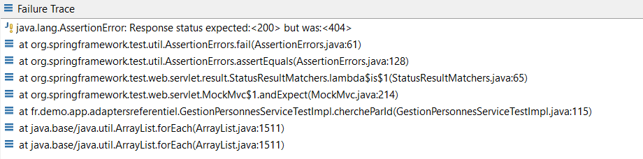

C'est donc au développeur d'ajouter l'ensemble des attendus nécessaires pour compléter et consolider le test de base (si nécessaire). Une fois la couche de persistance complétée, les tests doivent êtres positifs.  

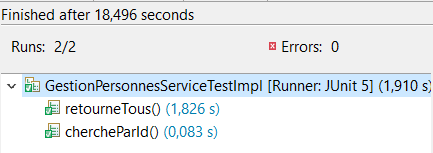

### ➕ Gestion des champs automatiques
---
Il a été brièvement évoqué la notion de champs automatiques précédemment (au niveau de la modélisation des entités) mais l'objectif de ce paragraphe est d'entrer plus en profondeur dans la classe de gestion pour l'ensemble de ces champs. A chaque demande de génération de la couche de persistance, c'est la classe ***[package racine].infra.[nom de l'application]EntityAbs*** qui est recréée et qui centralise la gestion des champs automatiques. A chaque demande de génération pour la couche de service, c'est la classe ***[package racine].domain.entities.[nom de l'application]EntityAbs*** qui est recréée et qui centralise les attributs pour mise à disposition au niveau des différents objets métier.

#### Champs prédéfinis

Comme précité; il existe trois types de champs automatiques "prédéfinis" qui sont respectivement les champs : 

- **Xtopsup** : gère la suppression logique des entités dans le cas ou la base de données ne doit pas permettre la suppression physique des informations. Cet indicateur, sous la forme d'un booléen, est piloté automatiquement par Spring Data à l'aide des annotations suivantes au niveau de chaque entité : 
```java
@SQLDelete(sql = "UPDATE SCH.TBL_PERSONNE SET xtopsup = true WHERE TBL_PERSONNE_ID = ?")
@SQLRestriction("xtopsup = false")
```
  ❗ Ces annotations sont pour l'instant positionnées au niveau de chaque entité et non au niveau de la classe parent (commune à l'ensemble des entités) afin d'apporter plus de flexibilité si toutefois une entité échappe à cette règle. A voir si plus tard cela est véritablement utile et si cette solution est toujours pérenne.

- **Xdmaj** : La dernière date de mise à jour pour l'entité, il s'agit d'un indicateur standard sous forme de Timestamp.

- **Xuuid** : Un identifiant unique universel pour l'entité. Il est à noter que cette identifiant ne doit jamais être modifié par la suite, hors il existe toutefois un "*setter*" pour cet attribut (sinon il est impossible d'effectuer les mappings entre entités et objets de transfert). Cepandant, afin d'assurer l'immutabilité de cet attribut, il est considéré comme non modifiable au niveau JPA.
  
```java	
/** Identifiant unique universel. */
@Column(name = "xuuid", nullable = false, unique = true, updatable = false)
protected UUID xuuid;
```
Toutes les autres types de champs (String, Long, Boolean, etc...) sont (comme vu au niveau du formulaire de création), ajoutables en tant que champs automatiques à l'ensemble des entités.

❗ Pour rappel, les champs automatiques sont des champs destinés à la couche de persistance, ils sont donc présents au niveau des entités et des objets métier uniquement, mais ne sont jamais transférés au niveau des services REST (la seule exception à la règle étant l'identifiant unique universel). Ainsi au niveau des mappeurs, la seule recopie globale se situe dans la copie de l'entité vers le dto afin de mettre à disposition de l'objet de transfert ces informations et de rendre possibles les traitements internes métier se basant sur ces informations.

#### Cycle de vie

L'initialisation de ces champs est centralisée au niveau de la classe de définition des champs automatiques et sont gérés avec les annotations "***@PrePersist***"  et/ou "***@PreUpdate***". L'annotation "*@PrePersist*" est appelée uniquement lors de la création du tuple dans la base de données, "*@PreUpdate*" est appelé lors des demandes de mise à jour (totale ou partielle).

Par exemple : 

```java
@PrePersist
public void prePersist() {
   // Start of user code c68eaf37cb78a1bd3a58dc7e563107ed
   this.xuuid = UUID.randomUUID();
   this.xtopsup = false;
   // End of user code
}
```

❗ Si l'écriture est automatique pour les champs *Xtopsup* et *Xuuid*, dans le cas ou d'autres champs sont ajoutés, ne pas oublier de les initialiser correctement avec les valeurs désirées ou de les mettre à jour dans l'une de ces deux méthodes sous peine d'avoir des erreurs (valeur nulle) à la création du tuple dans la base de données.
  
Il est possible de vouloir désactiver cette initialisation automatique dans le cadre de traitements spécifiques ou de tests (c'est d'ailleurs le cas pour le test unitaire sur le contrôle d'insertion de l'ensemble des attributs en base de données cf : "***testAllFieldsInserted()***"). La classe contient donc un indicateur de demande de désactivation pour l'initialisation de ces champs, cet indicateur est non persistant pour la couche de persistance : 
  
```java
@Transient
private boolean disableAutoInit;
```
  
Et fait le véritable code généré (avec ce contrôle supplémentaire) pour "***@PrePersist***" (et "***@PreUpdate***") est du type : 
  
```java
@PrePersist
public void prePersist() {
    if (!this.disableAutoInit) {
      // Start of user code c68eaf37cb78a1bd3a58dc7e563107ed
      setXtopsup(false);
      setXdmaj(Instant.now());
      setXuuid(UUID.randomUUID());
     // End of user code
  }
}
```
  
Avant d'effectuer le traitement ou le test, simplement demander au niveau de l'entité, la désactivation des annotations et renseigner "manuellement" les différents attributs de l'entité à l'aide du code suivant : 
  
```java
PersonneEntityImpl personne = new PersonneEntityImpl();
personne.setDisableAutoInit(true);
personne.setXtopsup(true);
personne.setXdmaj(Instant.now().truncatedTo(....);
personne.setXuuid("axd125fg.......");
```
  
L'avantage de cet attribut est qu'il est positionnable au niveau d'un seul traitement alors que l'utilisation de profils (***@ActiveProfile***) est, quant à elle, disponible uniquement au niveau de la classe de traitement. Mais encore une fois, cet attribut peut fonctionner en collaboration avec l'utilisation de profils.
  
❗ Note : Les objets de transfert et les objets de sérialisation (pour les services REST) ont eux aussi leur classe parent, mais épurée selon le type de l'objet (DTO ou XTO). Cette classe est regénérée au moment de la demande de génération de la couche de services et a volontairement le même nom ***[nom de l'application]EntityAbs*** afin de bien rappeler qu'il s'agit avant tout d'attributs spécifiques à l'entité et non au DTO.

### 🔑 Gestion de la sécurité
---
Par défaut, la sécurité des services REST est toujours activée, il est en effet considéré que tout service devrait à priori être sécurisé. Toutes les classes concernant la gestion de la sécurité sont situées au niveau du package suivant : ***[package racine].app*** dans le projet d'infrastructure.  

La configuration de la sécurité pour l'ensemble de l'application se nomme : ***[nom de l'application]SecurityConfig*** et son code par défaut est le suivant : 
```java
@Configuration
@EnableWebSecurity
class DemoSecurityConfig {
    @Bean
    public SecurityFilterChain tokenFilterChain(HttpSecurity http) throws Exception {
       return http.cors(Customizer.withDefaults()).csrf(csrf -> csrf.disable())
	      .sessionManagement(session -> session.sessionCreationPolicy(SessionCreationPolicy.STATELESS))
	      .authorizeHttpRequests(request -> {
           request.requestMatchers("/**").permitAll().anyRequest().permitAll();
	   }).build();
    }
}
```

Pour l'instant on peut constater que toutes les URIs sont en accès libre ce qui semble contredire la précédente affirmation mais la sécurité est quant à elle bien enclanchée, même si dans le cadre de la modélisation les développeurs ne veulent sécuriser aucun service ! 

❗ Avec les options prises pour **Pacman** quelle que soit la sécurité modélisée  (*Http*, *ApiKey*, etc...) le service va attendre un jeton de type JWT. Si cela fait partie intégrante de la norme pour *Oauth2*, c'est une décision qui a été prise dans le cadre de l'utilisation d'une sécurité de type *Http* ou *Apikey*. Dans ces deux derniers cas, un service d'obtiention du jeton est automatiquement généré sur le point de terminaison : "***/token***".

#### Modélisation

Dans le cadre de l'application "demo" l'exemple ici donné va être la modélisation d'une sécurité de type Open Id Connect (sécurité de tpe *Oauth2* la plus courante pour les applications importantes). La sécurité se modélise toujours au niveau du composant dans le diagramme de modélisation SOA. Ceci s'effectue au niveau de l'onglet "*Security Schemes*" dans les propriétés du composant. 

❗ Il est à noter que, dans la version actuelle de **Pacman** il est pour l'instant impossible de modéliser plusieurs sécurités au niveau du composant. 

<div align="center">
  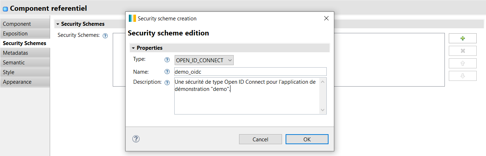
</div>

Une fois la première étape de saisie effectuée, effectuer une double-clique sur la ligne de définition de la nouvelle sécurité qui est apparue et dans la nouvelle fenêtre, simplement renseigner l'URI pour le serveur d'authentification  (il est à noter que dans le cadre d'une sécurité de type OIDC, le flow est authomatiquement vérouillé à "*AUTHORIZATION CODE*"). Le nom de la sécurité est, quant à lui, totalement libre afin d'être explicite pour les développeurs.

<div align="center">
  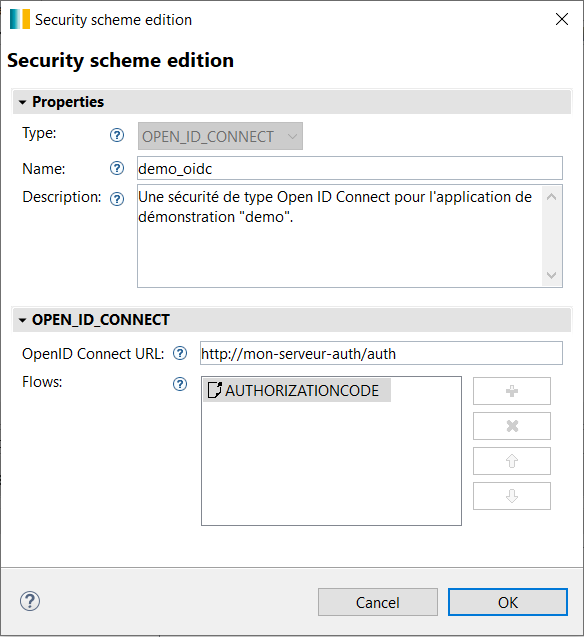
</div>

Enfin, il est possible de renseigner si besoin les "*Scopes*" nécessaires en effectant un double-clique sur le "*Flow*" et en renseignant pour chaque "*Scope*" les rubriques "*Name*" et "*Description*".

<div align="center">
  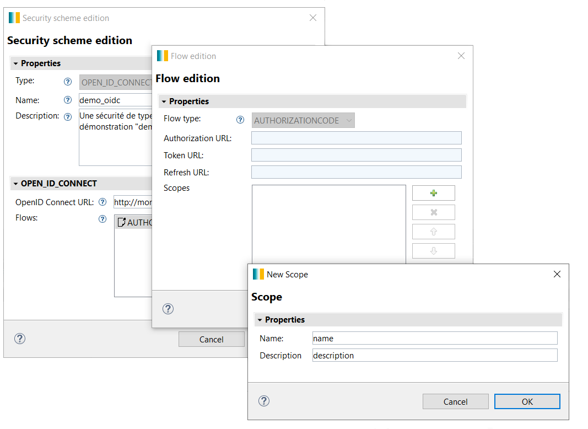
</div>

Une fois le schéma de sécurité défini, se positionner au niveau des différents services et ajouter la sécurité, soit directement au niveau du service, soit plus spécifiquement au niveau des différentes opérations qui ont été modélisées (si par exemple une des opérations ne doit pas être sécurisée). Pour ce faire, se positionner sur l'onglet "*Security*" et ajouter la sécurité désirée.

<div align="center">
  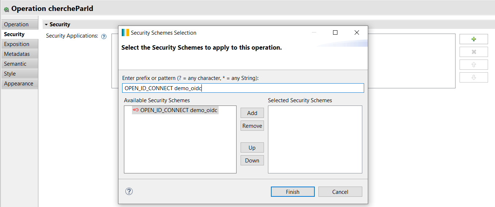
</div>

Une clé rouge (ou orange si c'est le service qui a été sécurisé dans sa globalité) doit alors apparaitre au niveau de chaque opération afin de confirmer que désormais, l'opération est soumise à validation d'un jeton de sécurité.


Il est aussi possible d'ajouter si besoin des métadonnées supplémentaires de permission au niveau des différentes opérations afin de spécifier un (ou des) rôle(s) pour donner accès au service. Se positionner au niveau de l'opération et au niveau de l'onglet "*Metadatas*" et sélectionner selon le besoin les métadonnées "***PERMISSION***", "***PERMISSION\_OR***" et "***PERMISSION\_AND***"

<div align="center">
  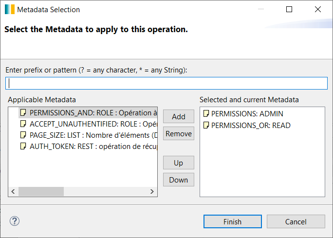
</div>

Pour ces annotations, le corps est important, il convient donc de supprimer la description de la métadonnée qui est positionnée par défaut dans le corps et de la remplacer par le rôle désiré pour l'obtention de la permission d'accès. Ici par exemple, il est nécessaire que l'utilisateur ait le rôle "*ADMIN*" ou "*READ*".

<div align="center">
  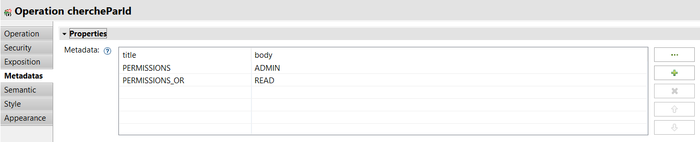
</div>

#### Génération

La demande de génération est de type "SOA", toutes les informations concernant la sécurisation des services REST sont donc analysés et générées au moment de la demande de génération pour la couche de service. Suite à la génération, le nouveau code pour la classe de configuration de la sécurité devient donc le suivant : 

```java
@Bean
public SecurityFilterChain tokenFilterChain(HttpSecurity http) throws Exception {
return http.cors(Customizer.withDefaults()).csrf(csrf -> csrf.disable())
	.sessionManagement(session -> session.sessionCreationPolicy(SessionCreationPolicy.STATELESS))
	.authorizeHttpRequests(request -> {

	/**
	 * Gestion de la sécurité pour les apis de santé, spécifications OpenAPI, etc...
	 */
	request.requestMatchers(whiteListPaths).permitAll()

	/** Liste des uris non sécurisées. */
    
	/** Liste des uris sécurisées avec un rôle spécifique. */

	// Start of user code f93dcfaeb3f3471dffb8f1981854aebe
	// End of user code

	/** Par défaut, tout le reste est sécurisé. */
	.anyRequest().authenticated();
})
.oauth2ResourceServer(
	oauth2 -> oauth2.bearerTokenResolver(new DemoJwtTokenResolver())
	.jwt(Customizer.withDefaults()))
	.exceptionHandling(Customizer.withDefaults()).build();
}
``` 

Ce nouveau code appelle quelques explications : 

• La ligne d'authorisation a été modifiée et prend maintenant une variable nommée "***whiteListPaths***". cette variable est injectée un peu plus haut dans le code à l'aide des lignes suivantes : 

```java
@Value("${security.whitelist.paths}")
private String[] whiteListPaths;
``` 
Grâce à cette injection, la variable va prendre automatiquement le contenu du paramétre "***security.whitelist.paths***" présent dans le fichier de configuration de l'application "***application.properties***". Par rappel (et par défaut) la valeur de ce paramètre est le suivant : 

```properties
# ----------------------------------------------------------------------------------------------
# LISTE DES URIS NON SECURISEES
# ----------------------------------------------------------------------------------------------
# Ne pas oublier de reporter les modifications issues des rubriques precedentes 
security.whitelist.paths=/swagger-ui/**,/api-docs/**,/actuator/**
```

Ce qui permet donc d'éviter de sécuriser ces différentes ressources...
 
• Pour toutes les URIs qui ne sont pas sécurisées, une ligne par URI est ajoutée sous la rubrique "Liste des uris non sécurisées". 

Il s'agit d'une ligne du type : 

```java
/** Liste des uris non sécurisées. */
.requestMatchers("/v0/personnes/xxx").permitAll()
```

❗ Il est donc particulièrement important de bien réfléchir à la hiérarchie de ses URIs afin déviter d'avoir des trous de sécurité et d'ouvrir une URI qui serait en amont d'une URI qui, elle, est sécurisée. 
  
• Si des métadonnées de permission avaient été positionnées (comme l'option avait été vue précedemment au niveau de la modélisation), sous la rubrique "Liste des uris sécurisées avec un rôle spécifique" des lignes supplémentaires auraient été ajoutées, ligne de type :  

```java
/** Liste des uris sécurisées avec un rôle spécifique. */
.requestMatchers("/v0/personnes/{id}").hasAnyRole("ROLE_ADMIN", "ROLE_TOTO")    
```

• Pour récupérer le jeton JWT, un "Resolver" est codé au niveau de la classe de configuration de la sécurité (afin de centraliser l'ensemble du code de sécurité au niveau de cette classe). Cette méthode va par défaut, toujours rechercher le jeton au niveau de l'en-tête avec comme clé de propriété : "***Authorization***", ce qui est la norme. 

En cela, cette méthode ne rajoute rien de plus à l'implémentation par défaut, sauf qu'au niveau de la modélisation et dans le cadre des sécurités de type *Http* ou *ApiKey*, il est possible de choisir le mode de passage différent pour ce jeton. Cette méthode va donc, en fonction de la modélisation, éventuellement ajouter une recherche au niveau de la query, des cookies, etc... (la recherche dans l'en-tête est toujours privilégiée).
  
Le code par défaut pour cette méthode est le suivant : 
 
```java
@Bean
public BearerTokenResolver jwtTokenResolver() {
	return new BearerTokenResolver() {
 @Override
 public String resolve(HttpServletRequest request) {
       /** Recherche dans l'en-tête, le plus courant (toujours présent). */
       String authHeader = request.getHeader("Authorization");
       if (authHeader != null && authHeader.startsWith("Bearer ")) {
          return authHeader.substring(7);
       }
       return null; // Aucun jeton trouvé.
	}
  }; 
}
```
  
• Afin de pouvoir décoder le jeton JWT, un décodeur est mis à disposition de la configuration de sécurité. Toutes les lignes pour cette méthode sont entre balises de type "*user code*" afin que le développeur puisse ajouter, modifier, supprimer et surtout vérifier la présence de toutes les demandes d'informations attendues au niveau du jeton.  

```java
@Bean
public JwtDecoder jwtDecoder() {
    // Start of user code 7115a832499feae23171aafa8601602f
      
	SecretKeySpec secretKey = new SecretKeySpec(this.jwtKey.getBytes(), 0, this.jwtKey.getBytes().length,
				"HmacSHA256");
	NimbusJwtDecoder decoder = NimbusJwtDecoder.withSecretKey(secretKey).macAlgorithm(MacAlgorithm.HS256).build();

	/** Validation issuer. */
	OAuth2TokenValidator<Jwt> withIssuer = JwtValidators.createDefaultWithIssuer("http://votre-application");

	/** Validation subject. */
	OAuth2TokenValidator<Jwt> withSubject = jwt -> {
	String subject = jwt.getSubject();
	return (subject != null && !subject.isBlank()) ? OAuth2TokenValidatorResult.success()
			: OAuth2TokenValidatorResult.failure(new OAuth2Error("jeton non valide", "Manque le sujet", null));
	};

	/** Validation audience. */
	OAuth2TokenValidator<Jwt> withAudience = jwt -> {
	List<String> audience = jwt.getAudience();
	return (audience != null && audience.contains("votre-audience")) ? OAuth2TokenValidatorResult.success()
			: OAuth2TokenValidatorResult
				.failure(new OAuth2Error("jeton non valide", "Audience invalide", null));
	};

	OAuth2TokenValidator<Jwt> validator = new DelegatingOAuth2TokenValidator<>(withIssuer, withSubject, withAudience);

	decoder.setJwtValidator(validator);

	// End of user code
      
    return decoder;
}
```

• Au niveau de la couche d'infrastructure, si les développeurs veulent accéder aux différentes informations contenues dans le jeton, une classe utilitaire ***[nom de l'application]CurrentJwtTokenHelper*** est aussi disponible et appelable directement au niveau de n'importe quelle partie de code.

• Quelle que soit le type de sécurité, au niveau des applications générées par **Pacman**, cela se soldera toujours pas le décodage d'un jeton de type JWT. 

Si la sécurité est de type "*ApiKey*" ou "*Http*", quelques ajouts de code sont alors effectués au niveau de la classe de gestion de la sécurité, comme par exemple, la mise à disposition de l'encodeur JWT qui va se baser sur une clé symétrique contenue dans le fichier "***application.properties***", la mise en place automatique d'une URI "***/token***" pour l'obtention du jeton, etc... 

```java
@Bean
@Order(1)
public SecurityFilterChain authFilterChain(HttpSecurity http) throws Exception {
   return http.cors(Customizer.withDefaults()).csrf(csrf -> csrf.disable())
      .sessionManagement(session -> session.sessionCreationPolicy(SessionCreationPolicy.STATELESS))
      .securityMatcher("/token")
      .authorizeHttpRequests(auth -> {
      auth.anyRequest().authenticated();
   })
   .exceptionHandling(Customizer.withDefaults())
   .httpBasic(basic -> basic.authenticationEntryPoint(authEntryPoint))
   .build();
}
```
  
De même une classe supplémentaire de création du jeton est générée au niveau du package ***[package-racine].app***, il s'agit de la classe ***[nom de l'application]JwtTokenService*** qui va permettre de créer le jeton JWT. Enfin un service ***[nom de l'application]JwtTokenControllerImpl*** est aussi automatiquement généré au niveau du package ***[nom de l'application].app.adapters.controllers***. 
  
Ce service est le point d'entrée (toujours sous le point de terminaison "***/token***") pour obtenir ledit jeton, et ceci en échange d'un couple de données d'identification, généralement un identifiant et un mot de passe. Le code du contrôleur est le suivant : 

```java
@Controller
@RequestMapping("/token")
public class DemoJwtTokenControllerImpl {

  /** Décodeur pour le jeton jwt. */
  private final DemoJwtTokenService jwtService;

  public DemoJwtTokenControllerImpl(DemoJwtTokenService jwtService) {
 	this.jwtService = jwtService;
  }

  @PostMapping
  public ResponseEntity<?> authenticate(Authentication authentication) {

	 // Start of user code 29748a05013c1ae3bc50822d509ea36e
	 String token = this.jwtService.generateToken(authentication);
	 return ResponseEntity.status(200).body(token);
	 // End of user code
  }
}
```
Le développeur peut alors ajouter l'ensemble de son code personnalisé afin de décoder les informations d'authentification (balises de type "*user code*") et fournir le jeton à l'aide du service qui a été injecté.
  
• De manière générale (et même si aucune modélisation de sécurité n'a encore été effectuée), on constate (ce qui est aussi la résultante des précédents points) la présence des lignes suivantes : 

```java
.oauth2ResourceServer(oauth2 -> oauth2
    .bearerTokenResolver(jwtTokenResolver)
    .jwt(Customizer.withDefaults()))
    .exceptionHandling(Customizer.withDefaults())
    .build();
```
Spring Boot n'a pas nativement de système de décodage des jetons JWT, il convient donc d'utiliser celui qui est fourni par les ressources pour la gestion *OAuth2*. C'est pourquoi *OAuth2* sera toujours présent au niveau de la classe de configuration de la sécurité, même si la sécurité demandée est de type *Http* ou *ApiKey*.

#### Tests

Il est alors possible d'effectuer de nouveaux test (avec Swagger UI par example) afin de vérifier que l'appel est désormait sécurisé et que toute tentative d'accès non authorisé se soldera par un code de type 401 ou 403.

❗ Dans le cas de l'utilisation de l'interface Swagger UI, et d'une sécurité de type Oauth2, il est important de comprendre que les points de terminaison doivent être valides, ce qui signifie que le serveur d'authentification doit exister et être en état de fonctionnement. dans le cas contraire, le service ne sera pas considéré comme sécurisé et l'icône avec le cadena ne sera pas affichée.

### 🧩 Génération des relations

Dans ce chapitre, est abordé la gestion des relations dans l'outil de modélisation, en présentant les différents types de relations supportées (association simple, bidirectionnelle, récursive, etc.) ainsi que leurs variantes cardinalitaires. Pour chaque type de relation, est détaillé la manière dont elle peut être exprimée dans le modèle ainsi que le code généré automatiquement par l’outil, tant du point de vue des scripts SQL que de la configuration JPA. 

L’objectif est de fournir une vue claire et pratique des possibilités offertes, tout en mettant en lumière les impacts concrets de chaque choix de modélisation sur le code qui est produit. 

Ici deux entités seront modélisées, avec toujours pour noms respectifs, simplement A et B.

❗ Attention dans ce chapitre, à ne pas confondre bidirectionnel au sens JPA et bidirectionnel au sens de la modélisation. Ce n'est pas parceque le développeur doit tirer une relation bidirectionnelle (appelée telle qu'elle au niveau de l'outil de modélisation) que l'on désire au niveau JPA attaquer la relation dans les deux sens (bidirectionnel au sens JPA). La nécessité du bidirectionnel au sens JPA sera à étudier selon les éventuels futurs besoins au niveau des générateurs **Pacman**.

❗ Au niveau des scripts SQL, ne sont pour l'instant affichées que les créations de table afin de rapidement visualiser les différentes relations. Ne sont donc pas présentés les indexs et contraintes inhérentes à la création de ces relations.

#### Relation (1)/(0,1)

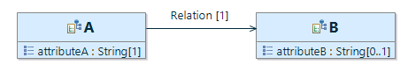

La seule différence selon que la cardinalité soit à 1 ou à (0,1) consiste en la présence de "*not null*" au niveau de la clé étrangère pour l'entité A. La navigabilité étant dirigée vers l'entité B, c'est l'entité A qui récupère la clé étrangère.

Le code SQL généré est donc le suivant : 

```sql
create table A
(
  /* PK de la table A */
  A_ID NUMBER(19) not null,
  ATTRIBUTEA VARCHAR(100) not null,
  /* FK vers la table B */
  B_ID NUMBER(19) not null,
  constraint A_PK1_1 primary key (A_ID)
);

create table B
(
  /* PK de la table B */
  B_ID NUMBER(19) not null,
  ATTRIBUTEB VARCHAR(100),
  constraint B_PK1_1 primary key (B_ID)
);
```
Au niveau des classes Java, on retrouve une relation de type ***@ManyToOne*** au niveau de l'entité A (**Pacman** n'utilise pas les relations ***@OneToOne***). Même si cela n’est pas exclusif dans le sens de la base de données et que cela n'est pas intuitif, du point de vue métier, la cardinalité (0,1) peut cependant, être exprimée avec *@ManyToOne*, c'est le choix qui a été effectué pour le générateur **Pacman**.

En effet, *@ManyToOne* est plus courant et mieux optimisé dans les moteurs JPA/Hibernate. Il est chargé plus efficacement, et les jointures SQL sont plus simples. Si à terme la relation devait évoluer vers (0,\*), *@ManyToOne* s’adapte sans pour autant casser le schéma. Par ailleurs, *@OneToOne* impose généralement une contrainte UNIQUE sur la colonne de jointure, ce qui peut poser des problèmes de performances si mal indexé, surtout sur de grandes tables.

Entité A : 

```java
@ManyToOne(fetch = FetchType.EAGER)
@JoinColumn(name = "B_ID", referencedColumnName = "B_ID", nullable = true)
private BEntityImpl b;
```

#### Relation (0,\*)/(1,\*)

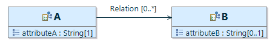

Ici, avec la navigabilité dirigée vers B, c'est l'entité B qui récupère la clé étrangère pour pointer sur l'entité A. La relations se traduit par un ***@OneToMany*** au niveau de l'entité A et un ***@ManyToOne*** au niveau de l'entité B. Par défaut, *@OneToMany* sans *mappedBy* crée une relation unidirectionnelle avec une jointure explicite. Dans un modèle bidirectionnel, il est courant d’utiliser *mappedBy* dans A, et un *@ManyToOne* dans B. Cela permet à JPA de comprendre que la relation est gérée par B (le côté possédant la clé étrangère).

```sql
create table A
(
  /* PK de la table A */
  A_ID NUMBER(19) not null,
  ATTRIBUTEA VARCHAR(100) not null,
  constraint A_PK1_1 primary key (A_ID)
);

create table B
(
  /* PK de la table B */
  B_ID NUMBER(19) not null,
  ATTRIBUTEB VARCHAR(100),
  /* FK vers la table A */
  A_ID NUMBER(19),
  constraint B_PK1_1 primary key (B_ID)
);
```

Entité A : 

```java
@OneToMany(fetch = FetchType.EAGER, mappedBy = "a")
private List<BEntityImpl> relation;
```

Entité B : 

```java
@ManyToOne
@JoinColumn(name = "A_ID", nullable = false)
private AEntityImpl a;
```

❗ Il est particulièrement important de ne pas utiliser ce type de relation pour modéliser une véritable relation bidirectionnelle (0,\*) ou (1,\*). En effet, deux relations (0,\*) ou (1,\*) ne sont pas générées par **Pacman** de la même manière qu'une relation bidirectionnelle, et cela entrainera des effets de bords non désirés. Un des effets principaux étant simplement que l'on va perdre une relation (\*) au niveau d'une des deux entités. 

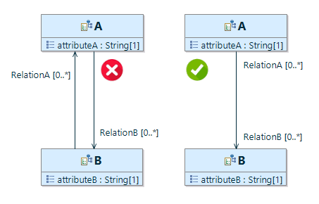

#### Relation récursive (1)/(0,1)

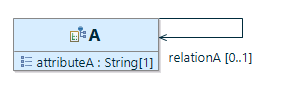

Ici la relation récursive est annotée ***@ManyToOne***, de même que pour une relation (1)(0,1) entre deux entités. La seule différence est que la clé étrangère prend le nom de la relation (avec toujours "*_ID*" comme suffixe).

```sql
create table A
(
  /* PK de la table A */
  A_ID NUMBER(19) not null,
  ATTRIBUTEA VARCHAR(100) not null,
  /* FK vers la table A */
  RELATIONA_ID NUMBER(19),
  constraint A_PK1_1 primary key (A_ID)
);
```
Entité A : 

```java
@ManyToOne(fetch = FetchType.EAGER)
@JoinColumn(name = "RELATIONA_ID", referencedColumnName = "A_ID", nullable = true)
private AEntityImpl relationA;
```

#### Relation récursive (0,\*)/(1,\*)

Comme pour les relations bidirectionnelles, une table de liaison est automatiquement créée, cette table prend pour nom la concaténation du nom de la table et du nom de la relation. Chaque nom est séparé par un underscore. Bien noter cependant que le nom de l'attribut au niveau de la classe est bien le nom de la relation.

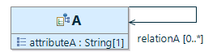

```sql
create table A_RELATIONA
(
  A_ID NUMBER(19) not null,
  A_RECURSIVE_ID NUMBER(19) not null,
  constraint A_RELATIONA_PK2_1 primary key (A_ID, A_RECURSIVE_ID)
);
```
Entité A : 

```java
@ManyToMany(fetch = FetchType.EAGER, targetEntity = AEntityImpl.class)
@JoinTable(name = "A_RELATIONA", joinColumns = @JoinColumn(name = "A_ID"), inverseJoinColumns = @JoinColumn(name = "A_RECURSIVE_ID"))
private List<AEntityImpl> relationA;
```

#### Relation bidirectionnelle (0,\*)/(1,\*)

❗ Il est impossible avec **Pacman** d'avoir des relations bidirectionnelles avec la navigabilité dans les deux sens, il est donc nécessaire après avoir tiré la relation bidirectionnelle entre deux entités, de supprimer une des deux navigabilités.

Cette relation utilise l'annotation ***@ManyToMany*** soit au niveau de l'entité A, soit au niveau de l'entité B, selon la navigabilité qui a été initialement modélisée. Ici la navigabilité est pointée sur B, c'est donc l'entité A qui prend la relation. Par ailleurs, une table de liaison est automatiquement générée avec la concaténation du nom de la table et celui de la relation (dépend de la navigabilité). Les deux noms sont séparés par un underscore. Bien noter par contre que le nom de l'attribut au niveau de l'entité est celui de la relation (dépend aussi du sens de la navigabilité).

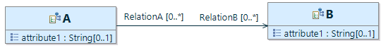

```sql
create table A_RELATIONB
(
  A_ID NUMBER(19) not null,
  B_ID NUMBER(19) not null,
  constraint A_RELATIONB_PK2_1 primary key (A_ID, B_ID)
);
```
Entité A : 

```java
@ManyToMany(fetch = FetchType.EAGER, targetEntity = BEntityImpl.class)
@JoinTable(name = "A_RELATIONB", joinColumns = @JoinColumn(name = "A_ID"), inverseJoinColumns = @JoinColumn(name = "B_ID"))
private Set<BEntityImpl> relationB;
```
❗ On peut aussi noter que dans le cadre des relations bidirectionnelles *@ManyToMany*, **Pacman** utilise des *Set* et non des *List* pour le stockage des collections. Cela est préconisé avec JPA car un *Set* garantit l’unicité des éléments, ce qui est cohérent avec le modèle relationnel sous-jacent (en base de données, une table de jointure pour une relation *@ManyToMany* n’a pas de doublons.). En outre, JPA (notamment avec Hibernate) traite les *Set* de manière plus simple et plus performante. Enfin le *Set* n’a pas d’ordre, il correspond naturellement à ce que fait la base de données (pas d’ordre garanti dans une table de jointure).


### 🔧 Documentation Open Api
---
Lors de la génération de la couche de services, outre l'ensemble du code à éxécuter, la documentation Open Api est aussi créée automatiquement afin de pouvoir générer un fichier Swagger et être lue  (notamment) par l'interface "Swagger-ui". Cette documentation (par le biais d'annotations), est générée à trois niveaux :

- La documentation générale concernant l'ensemble des informations relatives à l'application.
- La documentation spécifique pour l'appel de chaque service (les différentes opérations modélisées).
- La documentation pour chaque objet sérialisé, en entrée ou en sortie.

❗ Noter que lorsque l'on parle ici de service, il s'agit de service au sens global du terme, un service est modélisé avec des opérations, mais par rapport au client, une seule opération est aussi un service qui est fourni par le fournisseur de service, à ce niveau tout est service...

#### Documentation générale

Toutes les informations concernant la documentation générale de l'application (ainsi que celles concernant la sécurité) est à modéliser au niveau du composant dans le fichier de modélisation ***[nom de l'application].soa***, principalement au niveau de l'onglet "***Exposition***".

<div align="center">
  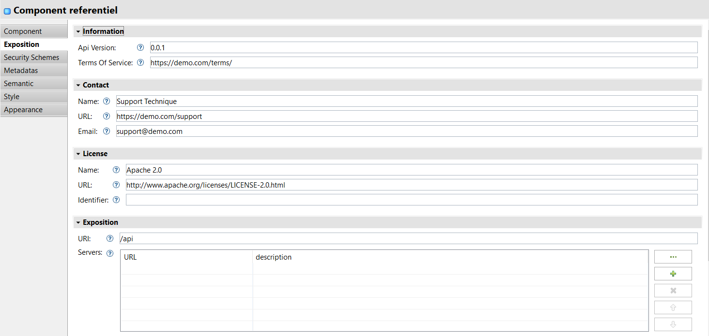
</div>

❗ Il n'est possible de modéliser qu'un seul composant au niveau du diagramme soa, toute velléité pour modéliser plusieurs composant se soldera par une alerte au niveau de la validation du diagramme.

Une fois la demande de génération de la couche de services effectuée, toutes les informations globales sont centralisées au niveau de la classe (au niveau de l'infrastructure) ***[package racine].app.[nomde l'application]OpenApiConfig***. Cette classe n'est pas destinée à avoir un corps, seules les annotations de type Open Api sont présentes. 

Par exemple : 

```java
/**
 * Configuration de la documentation OpenAPI pour ce composant.
 * 
 * Cette classe déclare la configuration générale de l'API pour Springdoc. Elle
 * permet de définir les métadonnées principales de la documentation Swagger,
 * telles que le titre, la version, la description, les informations de contact,
 * les termes de licence et d'utilisation.
 *
 * Aucun code métier ou logique n’est présent ici, uniquement des déclarations
 * d’annotations à but documentaire.
 *
 * @see io.swagger.v3.oas.annotations.OpenAPIDefinition
 * @see io.swagger.v3.oas.annotations.info.Info
 * @see org.springframework.context.annotation.Configuration
 */
@Configuration
@OpenAPIDefinition(info = @Info(title = "referentiel", version = "3.0.3", 
	description = "Cette API permet de gérer les personnes.", 
	termsOfService = "https://demo.com/terms/", 
	contact = @Contact(name = "Support Technique", email = "support@demo.com", url = "https://demo.com/support"), 
	license = @License(name = "Apache 2.0", url = "http://www.apache.org/licenses/LICENSE-2.0.html")))
class DemoOpenApiConfig {
}
```
#### Documentation des services

La documentation pour les différents services est, quant à elle, accrochée à chaque opération qui a été modélisée, il n'y a pas de champ supplémentaire spécifique à saisir, toutes les informations sont récupérées à partir de la modélisation nécessaire (si correctement remplie) pour faire fonctionner un service (avec ses opérations). Cette documentation (toujours sous forme d'annotations) ressemble à ceci (on reprend le précédent exemple de code pour l'opération  "*chercheParId(...)*") mais cette fois avec la documentation Open Api :
```java
@GetMapping(value = "/{id}", produces = "application/json;charset=utf8")
@Operation(operationId = "chercheParId", 
    description = "Cette méthode retourne la personne qui correspond à l'identifiant passé en paramètre."
    , tags = {"GestionPersonnes" }, parameters = {
		@Parameter(name = "id", description = "L'identifiant pour la personne."
		, required = true, in = ParameterIn.PATH, example = "") })
@ApiResponses(value = {
    @ApiResponse(responseCode = "200", description = "OK", content = @Content(mediaType = "application/json", 
                           schema = @Schema(implementation = PersonneXtoImpl.class))),
    @ApiResponse(responseCode = "404", description = "La personne n'a pas été trouvée.") })
public ResponseEntity<PersonneXtoImpl> chercheParId(@PathVariable(name = "id", required = true) Long identifiant) {
....
}
```
#### Documentation pour les objets sérialisés

Au niveau des objets de type "XTO", seule l'annotation "***@Schema***" permet de rajouter une description pour chaque attribut (et au niveau de l'objet) : 
```java
@Schema(description = "Une personne pour l'application de démo")
public class PersonneXtoImpl implements Serializable {
   ...
}
```

```java
/** Le nom de la personne. Cette donnée est obligatoire. */
// Start of user code aee37c30f5d091a495526f636a3527bb
@JsonProperty("nom")
// End of user code
@Schema(description = "Le nom de la personne. Cette donnée est obligatoire.")
private String nom;
```
#### Affichage et tests

Il est ainsi possible (après lancement de l'application), d'utiliser l'outil open source Swagger UI qui permet d'afficher et de tester visuellement une API décrite avec Swagger/OpenAPI, ceci, directement dans un navigateur web. Swagger UI va lire le fichier de spécification et le transformer en une interface web qui permet :

- De naviguer dans les endpoints de l’API (groupés par ressource).
- De voir les paramètres, le corps des requêtes ainsi que les réponses attendues.
- D’exécuter des requêtes HTTP directement via les formulaires interactifs.

<div align="center">
  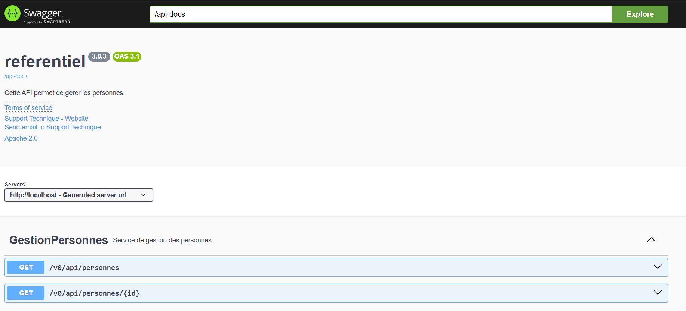
</div>

### 📐 Génération avancée
---
#### Mise à disposition de l'entity manager

Au niveau de la couche de persistance, pour l'accès à la base de données, il est préconisé de passer par la notion de "Repository". Spring Data fournit en effet  une abstraction très pratique pour la plupart des opérations CRUD et les requêtes simples ou modérément complexes. Cependant, il existe certains cas où il est préférable (ou nécessaire) d'utiliser directement l'EntityManager. Par exemple :

- Effectuer plusieurs opérations dans une seule transaction, avec un contrôle fin sur le flush, clear, ou l'ordre des opérations.
- Utiliser des requêtes dynamiques ou avec critères très complexes.
- Optimiser les performances (batchs, fetch tuning, etc.).
- Faire des utilisations avancées de Lock, Hints, FlushMode, etc...
- Contourner la gestion automatique par Spring Data.

Il est donc possible de demander expressément au générateur d'effectuer l'injection de l'Entity Manager. Comme, au niveau de la modélisation, il s'agit d'une information qui concerne la persistance, il est nécessaire d'agir au niveau de l'entité en positionnant la métadonnée "***ENTITY_MANAGER***". Cette métadonnée n'a pas besoin de corps, il est donc possible de supprimer ou non le commentaire associé lors de l'affectation de la métadonnée.

<div align="center">
  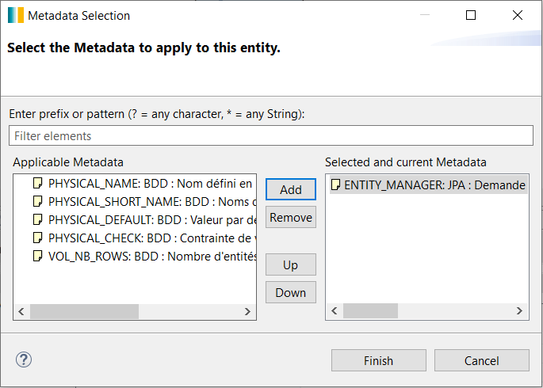
</div>

Visualisation de la métadonnée associée à l'entité "*Personne*" :


❗ Le résultat ne sera visible par contre, qu'au moment de la demande de génération de la couche de service puisque la classe d'implémentation de la persistance *[nom du service]JpaProvider* est générée uniquement lors de la création de la couche SOA. Par contre, tout service qui detecte l'utilisation de cette entité (en entrée ou en sortie) va automatiquement bénéficier d'un paramètre supplémentaire au niveau de son constructeur pour injecter et mettre à disposition du développeur l'Entity Manager. Ainsi, dans le cadre de l'application "demo", le code de la classe "*GestionPersonnesJpaProviderImpl*" devient : 

```java
@AdapterService
public class GestionPersonnesJpaProviderImpl implements GestionPersonnesProvider {

	// Start of user code 2129864a49adcaa3a812f92be467bf4e
	// End of user code

	/** Le gestionnaire de persistance de jpa. */
	final EntityManager entityManager;

	/** Gestionnaires de persistance disponibles. */
	final PersonneRepository personneRepository;

	/**
	 * Constructeur.
	 */
	@Autowired
	public GestionPersonnesJpaProviderImpl(final PersonneRepository personneRepository, EntityManager entityManager) {

		this.personneRepository = personneRepository;
		this.entityManager = entityManager;

		// Start of user code 2e3e969fd52202f4f94ef7456a361c15
		// End of user code
	}
	etc...
}
```

#### Utilisation du lazy loading    

Par défaut, dans les relations, toute entité référencée est automatiquement chargée en "EAGER", ainsi, si une entité référence une autre entité qui référence elle même une autre entité, etc... toute la grappe va être chargée et renvoyée au niveau du service REST. Il existe cependant de nombreux cas ou le chargement paresseux peut être préférable. **Pacman** met donc à disposition une métadonnée qui peut s'appliquer aux références entre les entités. 

Si on rajoute une entité au niveau de la modélisation déjà existante (par exemple, une personne habite à une ou plusieurs adresses), le diagramme devient le suivant : 

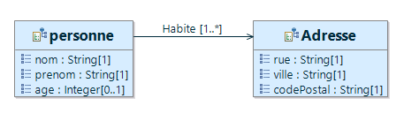

Il est alors possible de sélectionner le lien qui effectue la référence et de lui affecter la métadonnée "***FETCH_LAZY***". 

<div align="center">
  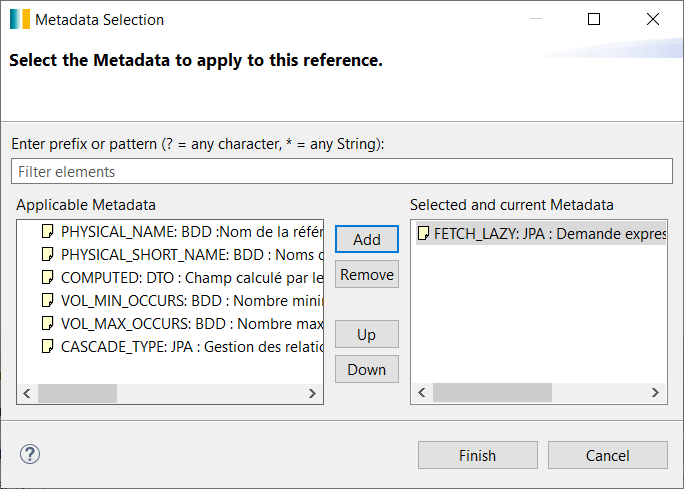
</div>

❗ Cela n'est pas montré au niveau de ce document, mais il est évident que la modification a aussi été reportée au niveau de la couche SOA avec rajout du DTO et de la relation associée.

Cette métadonnée n'a pas besoin de corps, il est donc possible pour le développeur de supprimer ou non la description pour la métadonnée.

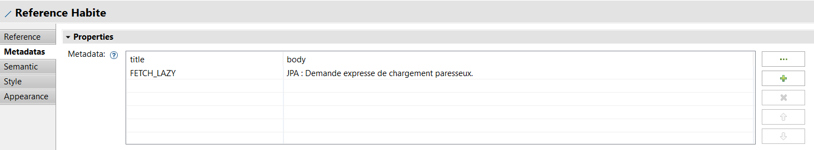

Au niveau du code généré, un nouvel attribut pour la classe "*PersonneEntityImpl*" est créé, avec le code suivant : 

```java
@OneToMany(fetch = FetchType.LAZY, mappedBy = "personne")
private List<AdresseEntityImpl> habite;
```
Sans annotation le code aurait simplement été du type (par défaut) : 

```java
@OneToMany(fetch = FetchType.EAGER, mappedBy = "personne")
private List<AdresseEntityImpl> habite;
```
Par contre une différence majeure est visible au niveau des mappeurs d'infrastructure, au niveau de la recopie de la liste, le mappeur vérifie auparavant si l'entité référencée est toujours pilotable par JPA. Cela évite de demander le chargement lors de la recopie des objets, recopie encore une fois inhérente à l'architecture hexagonale. 

Le code devient alors le suivant : 

```java
public static PersonneDtoImpl toDto(final PersonneEntityImpl entity) {
	if (null == entity) {
		return null;
	}
	PersonneDtoImpl dto = new PersonneDtoImpl();
	try {

		dto.setPersonne_id(entity.getPersonne_id());
		dto.setNom(entity.getNom());
		dto.setPrenom(entity.getPrenom());
		dto.setAge(entity.getAge());
		dto.setHabite(Hibernate.isInitialized(entity.getHabite())
				? entity.getHabite().stream().map(o -> AdresseMapper.toDto(o)).collect(Collectors.toList())
				: new ArrayList<AdresseDtoImpl>());
		dto.setXtopsup(entity.getXtopsup());
		dto.setXdmaj(entity.getXdmaj());
		dto.setXuuid(entity.getXuuid());

		// Start of user code 856cc109a8cab6eb0a3676613acc6f8f
		// End of user code

	} catch (Exception e) {
		throw new DemoMapperException("Impossible de mapper la classe : PersonneDtoImpl");
	}
	return dto;
}
```
#### Utilisation de cascade

En JPA (Java Persistence API), l'attribut cascade est utilisé pour propager automatiquement certaines opérations (comme persist, merge, remove, etc.) d'une entité parent vers ses entités enfants associées via une relation (@OneToMany, @ManyToOne, @OneToOne, @ManyToMany).

Pour rappel, les différentes valeurs possibles de propagation pour cet attribut sont :

| **Valeur** | **Description** | **Opérations couvertes** |
|------------------------|------------------------------|-------------------------------------|
| `CascadeType.ALL`       | Applique toutes les opérations de persistance | `PERSIST`, `MERGE`, `REMOVE`, `REFRESH`, `DETACH` |
| `CascadeType.PERSIST`   | Propage l'opération de persistance  | `PERSIST` |
| `CascadeType.MERGE`     | Propage l'opération de fusion  | `MERGE` |
| `CascadeType.REMOVE`    | Propage l'opération de suppression  | `REMOVE`  |
| `CascadeType.REFRESH`   | Propage l'opération de rafraîchissement  | `REFRESH`      |
| `CascadeType.DETACH`    | Propage l'opération de détachement  | `DETACH`             |


Si besoin, il est possible d'ajouter le paramètre "*Cascade*" dans le cadre du chargement des relations. Se positionner sur la relation et rajouter une métadonnée "***CASCADE***". Ici le corps de la métadonnée est important, supprimer la description et renseigner le type de "*Cascade*" désiré.

<div align="center">
  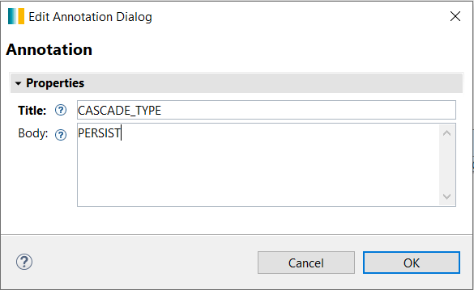
</div>

Une fois la demande de génération de la couche de persistance effectuée, le code des relations devient alors : 

- Pour ***PersonneEntityImpl*** : 
 
```java
@OneToMany(fetch = FetchType.EAGER, cascade = CascadeType.PERSIST, mappedBy = "personne")
private List<AdresseEntityImpl> habite;
```
- Pour ***AdresseEntityImpl*** : 

```java
@ManyToOne()
@JoinColumn(name = "PERSONNE_ID", nullable = false)
private PersonneEntityImpl personne;
```

Il est bien entendu possible au niveau de la métadonnée, de rentrer plusieurs valeurs séparées par une virgule, par exemple "*PERSIST, MERGE, DETACH*" donnera à la génération : 

```java
@OneToMany(fetch = FetchType.EAGER, cascade = {CascadeType.PERSIST, CascadeType.MERGE, CascadeType.DETACH}, mappedBy = "personne")
private List<AdresseEntityImpl> habite;
```

#### Utilisation des transactions

Il est possible de positionner des transactions soit directement au niveau de l'infrastructure pour la couche de persistance, soit au niveau plus général de la couche métier. Dans le cas de la couche d'infrastructure, des balises de type "*user code*" permettent de positionner l'annotation "***@Transactionnal***" de JPA au niveau de la classe ***[nom du service]JpaProviderImpl*** : 

```java
// Start of user code 488633ccb55331e8e15a31ef0159efbc
@Transactional
// End of user code
private PersonneEntityImpl sauvegarde_invoke(final PersonneDtoImpl personne, etc....) {
   // Start of user code 0d7aeafd27536987cf0cf491de14ca07
   opération 1
   opération 2
   etc...
   // End of user code
}
```

Comme précité, il est aussi possible de poser l'annotation plus haut au niveau de la couche métier sur la classe ***[nom du service]ServiceImpl***, soit directement sur la totalité de la classe : 

```java
// Start of user code 4a236703b9d5317c198dc3e3d6db3fc6
@Transactionnal
// End of user code
@DomainService
public class GestionPersonnesServiceImpl implements GestionPersonnesService {
   etc...
}
```
soit au niveau d'une ou plusieurs opérations : 

```java
// Start of user code ea90c22bb8cac819a5c286613bb46870
@Transactionnal
// End of user code
@Override
@Requirement(value = { RequirementsEnum.REQ_PERSONNE_AGE })
public PersonneDtoImpl sauvegarde(final PersonneDtoImpl personne, etc...) {
   etc...
}
```

❗ Dans le dernier cas, il s'agit ici de l'annotation ***@Transactionnal*** du domaine (**[package racine].domain.Transactionnal***) et non celle de JPA, puisque le domaine est totalement indépendant de toute technologie. Pour rappel, cette annotation est gérée automatiquement grâce aux classes situées dans le package d'infrastructure : ***[package racine].infra***

#### Utilisation de l'héritage

❗ La modélisation de l'héritage est encore en version Alpha, elle sera pleinement supportée très prochainement.

Avec **Pacman** l'héritage entre entités est supporté afin de favoriser la réutilisation et la structuration du modèle métier. Cependant, de manière générale, il est conseillé de ne pas en abuser car il ne faut pas oublier que l’implémentation de l’héritage en JPA peut introduire une complexité technique non négligeable et avoir un impact négatif sur les performances.

En effet, si JPA propose par défaut plusieurs stratégies de mapping pour l’héritage, aucune des stratégies disponibles (SINGLE\_TABLE, JOINED, TABLE\_PER\_CLASS) n’est pleinement satisfaisante. Chacune présente des compromis importants en termes de performances, de lisibilité des données ou de complexité des requêtes SQL générées. Par exemple, la stratégie SINGLE\_TABLE centralise toutes les entités dans une seule table avec des colonnes parfois inutilisées, ce qui peut alourdir la structure et la maintenance. La stratégie JOINED, plus propre sur le plan du modèle relationnel, implique de multiples jointures coûteuses à l'exécution. Quant à TABLE\_PER\_CLASS, elle rend les requêtes globales complexes voire inefficaces. 

Ces limitations font que l’héritage JPA doit être abordé avec prudence. Il est donc recommandé de l'utiliser avec parcimonie et uniquement lorsqu’il apporte une réelle valeur métier, afin de garantir un code généré plus simple, plus lisible et plus efficace à l'exécution.

Cela dit,  **Pacman** permet de pallier pour majeure partie à ces limitations car il génère sa propre implémentation de l'héritage.  

Les règles sont les suivantes : 

- Tous les attributs définis dans les entités parentes sont automatiquement repris dans les sous-entités.
- Toutes les relations définies dans les entités parentes sont automatiquement reprises dans les sous-entités. 
- Ceci implique la création d'une table de liaison par sous-entité lors de relations bidirectionnelles de type (0,\*) ou (1,\*).
- Ceci implique la multiplication des identifiants pour les clés étrangères dans le cas des relations non-bidirectionnelles de type (0,\*) ou (1,\*).

Quant utiliser l'héritage avec **Pacman** et sous quelle forme ?

- ✅ pleinement supporté, aucun impact de performance.
- ⚠️ supporté mais en version alpha pour l'instant.️
- 🛠️️️ en cours d'implémentation, non finalisé sur l'ensemble des couches.


✅ Factoriser un ensemble d'attributs communs à plusieurs entités. Ici il ne faut pas confondre avec la notion de champs automatiques vue précédement qui elle, applique des attributs mais sur la totalité des entités modélisées. Avec l'héritage il est ainsi possible d'avoir un contrôle plus fin sur les attributs communs. 

⚠️  Ajouter des relations de type (0,1) entre les entités héritées.

🛠️️️️️️ Ajouter des relations de type (0,*) entre les entités héritées.

🛠️️️️️️ Ajouter des relations bidirectionnelles de type (0,*) entre les entités héritées.

A titre indicatif, voici un exemple de modélisation avec héritage qui regroupe l'ensemble des possibilités disponibles (au niveau des différentes relations) par **Pacman**.

<div align="center">
  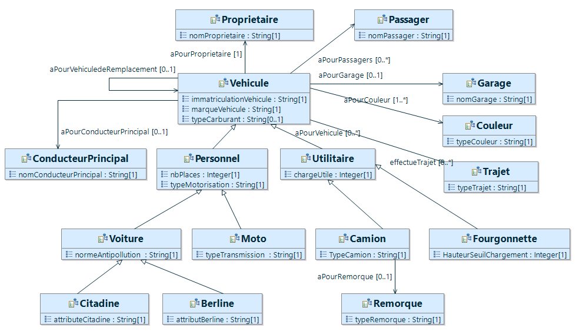
</div>

Et le code SQL généré (ne sont pas présentées pour l'instant les couches Java au niveau entités et objets métier) : 

```sql
/******************************************************************/
/* Base de donnees:      h2                                       */
/* Application:          demo                                     */
/* Date de creation:     02/06/2025 12:59:43                      */
/******************************************************************/

/******************************************************************/
/* Sequences                                                      */
/******************************************************************/
create sequence CAMION_SEQ start with 1;
create sequence MOTO_SEQ start with 1;
create sequence FOURGONNETTE_SEQ start with 1;
create sequence CITADINE_SEQ start with 1;
create sequence BERLINE_SEQ start with 1;
create sequence COULEUR_SEQ start with 1;
create sequence REMORQUE_SEQ start with 1;
create sequence GARAGE_SEQ start with 1;
create sequence CONDUCTEURPRINCIPAL_SEQ start with 1;
create sequence TRAJET_SEQ start with 1;
create sequence PROPRIETAIRE_SEQ start with 1;
create sequence PASSAGER_SEQ start with 1;

/******************************************************************/
/* TABLE : CAMION                                                 */
/******************************************************************/
create table CAMION
(
  /* PK de la table CAMION */
  CAMION_ID NUMBER(19) not null,
  TYPECAMION VARCHAR(100) not null,
  CHARGEUTILE NUMBER(10) not null,
  IMMATRICULATIONVEHICULE VARCHAR(100) not null,
  MARQUEVEHICULE VARCHAR(100) not null,
  TYPECARBURANT VARCHAR(100),
  /* FK vers la table CONDUCTEURPRINCIPAL */
  CONDUCTEURPRINCIPAL_ID NUMBER(19),
  /* FK vers la table GARAGE */
  GARAGE_ID NUMBER(19),
  /* FK vers la table PROPRIETAIRE */
  PROPRIETAIRE_ID NUMBER(19) not null,
  /* FK vers la table REMORQUE */
  REMORQUE_ID NUMBER(19),
  /* FK vers la table CAMION */
  APOURVEHICULEDEREMPLACEMENT_ID NUMBER(19),
  constraint CAMION_PK1_1 primary key (CAMION_ID)
);
create index CAMION_IDX1_1 on CAMION(CONDUCTEURPRINCIPAL_ID);
create index CAMION_IDX1_2 on CAMION(GARAGE_ID);
create index CAMION_IDX1_3 on CAMION(PROPRIETAIRE_ID);
create index CAMION_IDX1_4 on CAMION(REMORQUE_ID);
create index CAMION_IDX1_5 on CAMION(APOURVEHICULEDEREMPLACEMENT_ID);

comment on column CAMION.CAMION_ID is 'Clé primaire pour la table CAMION';
comment on column CAMION.CHARGEUTILE is 'commentaire attribut utilitaire';
comment on column CAMION.IMMATRICULATIONVEHICULE is 'commentaire attribute vehicule';

/******************************************************************/
/* TABLE : MOTO                                                   */
/******************************************************************/
create table MOTO
(
  /* PK de la table MOTO */
  MOTO_ID NUMBER(19) not null,
  TYPETRANSMISSION VARCHAR(100) not null,
  NBPLACES NUMBER(10) not null,
  TYPEMOTORISATION VARCHAR(100) not null,
  IMMATRICULATIONVEHICULE VARCHAR(100) not null,
  MARQUEVEHICULE VARCHAR(100) not null,
  TYPECARBURANT VARCHAR(100),
  /* FK vers la table CONDUCTEURPRINCIPAL */
  CONDUCTEURPRINCIPAL_ID NUMBER(19),
  /* FK vers la table GARAGE */
  GARAGE_ID NUMBER(19),
  /* FK vers la table PROPRIETAIRE */
  PROPRIETAIRE_ID NUMBER(19) not null,
  /* FK vers la table MOTO */
  APOURVEHICULEDEREMPLACEMENT_ID NUMBER(19),
  constraint MOTO_PK1_1 primary key (MOTO_ID)
);
create index MOTO_IDX1_1 on MOTO(CONDUCTEURPRINCIPAL_ID);
create index MOTO_IDX1_2 on MOTO(GARAGE_ID);
create index MOTO_IDX1_3 on MOTO(PROPRIETAIRE_ID);
create index MOTO_IDX1_4 on MOTO(APOURVEHICULEDEREMPLACEMENT_ID);

comment on column MOTO.MOTO_ID is 'Clé primaire pour la table MOTO';
comment on column MOTO.NBPLACES is 'commentaire pesonnel';
comment on column MOTO.IMMATRICULATIONVEHICULE is 'commentaire attribute vehicule';

/******************************************************************/
/* TABLE : FOURGONNETTE                                           */
/******************************************************************/
create table FOURGONNETTE
(
  /* PK de la table FOURGONNETTE */
  FOURGONNETTE_ID NUMBER(19) not null,
  HAUTEURSEUILCHARGEMENT NUMBER(10) not null,
  CHARGEUTILE NUMBER(10) not null,
  IMMATRICULATIONVEHICULE VARCHAR(100) not null,
  MARQUEVEHICULE VARCHAR(100) not null,
  TYPECARBURANT VARCHAR(100),
  /* FK vers la table CONDUCTEURPRINCIPAL */
  CONDUCTEURPRINCIPAL_ID NUMBER(19),
  /* FK vers la table GARAGE */
  GARAGE_ID NUMBER(19),
  /* FK vers la table PROPRIETAIRE */
  PROPRIETAIRE_ID NUMBER(19) not null,
  /* FK vers la table FOURGONNETTE */
  APOURVEHICULEDEREMPLACEMENT_ID NUMBER(19),
  constraint FOURGONNETTE_PK1_1 primary key (FOURGONNETTE_ID)
);
create index FOURGONNETTE_IDX1_1 on FOURGONNETTE(CONDUCTEURPRINCIPAL_ID);
create index FOURGONNETTE_IDX1_2 on FOURGONNETTE(GARAGE_ID);
create index FOURGONNETTE_IDX1_3 on FOURGONNETTE(PROPRIETAIRE_ID);
create index FOURGONNETTE_IDX1_4 on FOURGONNETTE(APOURVEHICULEDEREMPLACEMENT_ID);

comment on column FOURGONNETTE.FOURGONNETTE_ID is 'Clé primaire pour la table FOURGONNETTE';
comment on column FOURGONNETTE.CHARGEUTILE is 'commentaire attribut utilitaire';
comment on column FOURGONNETTE.IMMATRICULATIONVEHICULE is 'commentaire attribute vehicule';

/******************************************************************/
/* TABLE : CITADINE                                               */
/******************************************************************/
create table CITADINE
(
  /* PK de la table CITADINE */
  CITADINE_ID NUMBER(19) not null,
  ATTRIBUTECITADINE VARCHAR(100) not null,
  NORMEANTIPOLLUTION VARCHAR(100) not null,
  NBPLACES NUMBER(10) not null,
  TYPEMOTORISATION VARCHAR(100) not null,
  IMMATRICULATIONVEHICULE VARCHAR(100) not null,
  MARQUEVEHICULE VARCHAR(100) not null,
  TYPECARBURANT VARCHAR(100),
  /* FK vers la table CONDUCTEURPRINCIPAL */
  CONDUCTEURPRINCIPAL_ID NUMBER(19),
  /* FK vers la table GARAGE */
  GARAGE_ID NUMBER(19),
  /* FK vers la table PROPRIETAIRE */
  PROPRIETAIRE_ID NUMBER(19) not null,
  /* FK vers la table CITADINE */
  APOURVEHICULEDEREMPLACEMENT_ID NUMBER(19),
  constraint CITADINE_PK1_1 primary key (CITADINE_ID)
);
create index CITADINE_IDX1_1 on CITADINE(CONDUCTEURPRINCIPAL_ID);
create index CITADINE_IDX1_2 on CITADINE(GARAGE_ID);
create index CITADINE_IDX1_3 on CITADINE(PROPRIETAIRE_ID);
create index CITADINE_IDX1_4 on CITADINE(APOURVEHICULEDEREMPLACEMENT_ID);

comment on column CITADINE.CITADINE_ID is 'Clé primaire pour la table CITADINE';
comment on column CITADINE.NORMEANTIPOLLUTION is 'commentaire attribut voiture';
comment on column CITADINE.NBPLACES is 'commentaire pesonnel';
comment on column CITADINE.IMMATRICULATIONVEHICULE is 'commentaire attribute vehicule';

/******************************************************************/
/* TABLE : BERLINE                                                */
/******************************************************************/
create table BERLINE
(
  /* PK de la table BERLINE */
  BERLINE_ID NUMBER(19) not null,
  ATTRIBUTBERLINE VARCHAR(100) not null,
  NORMEANTIPOLLUTION VARCHAR(100) not null,
  NBPLACES NUMBER(10) not null,
  TYPEMOTORISATION VARCHAR(100) not null,
  IMMATRICULATIONVEHICULE VARCHAR(100) not null,
  MARQUEVEHICULE VARCHAR(100) not null,
  TYPECARBURANT VARCHAR(100),
  /* FK vers la table CONDUCTEURPRINCIPAL */
  CONDUCTEURPRINCIPAL_ID NUMBER(19),
  /* FK vers la table GARAGE */
  GARAGE_ID NUMBER(19),
  /* FK vers la table PROPRIETAIRE */
  PROPRIETAIRE_ID NUMBER(19) not null,
  /* FK vers la table BERLINE */
  APOURVEHICULEDEREMPLACEMENT_ID NUMBER(19),
  constraint BERLINE_PK1_1 primary key (BERLINE_ID)
);
create index BERLINE_IDX1_1 on BERLINE(CONDUCTEURPRINCIPAL_ID);
create index BERLINE_IDX1_2 on BERLINE(GARAGE_ID);
create index BERLINE_IDX1_3 on BERLINE(PROPRIETAIRE_ID);
create index BERLINE_IDX1_4 on BERLINE(APOURVEHICULEDEREMPLACEMENT_ID);

comment on column BERLINE.BERLINE_ID is 'Clé primaire pour la table BERLINE';
comment on column BERLINE.NORMEANTIPOLLUTION is 'commentaire attribut voiture';
comment on column BERLINE.NBPLACES is 'commentaire pesonnel';
comment on column BERLINE.IMMATRICULATIONVEHICULE is 'commentaire attribute vehicule';

/******************************************************************/
/* TABLE : COULEUR                                                */
/******************************************************************/
create table COULEUR
(
  /* PK de la table COULEUR */
  COULEUR_ID NUMBER(19) not null,
  TYPECOULEUR VARCHAR(100) not null,
  /* FK vers la table CAMION */
  CAMION_ID NUMBER(19),
  /* FK vers la table MOTO */
  MOTO_ID NUMBER(19),
  /* FK vers la table FOURGONNETTE */
  FOURGONNETTE_ID NUMBER(19),
  /* FK vers la table CITADINE */
  CITADINE_ID NUMBER(19),
  /* FK vers la table BERLINE */
  BERLINE_ID NUMBER(19),
  constraint COULEUR_PK1_1 primary key (COULEUR_ID)
);
create index COULEUR_IDX1_1 on COULEUR(CAMION_ID);
create index COULEUR_IDX1_2 on COULEUR(MOTO_ID);
create index COULEUR_IDX1_3 on COULEUR(FOURGONNETTE_ID);
create index COULEUR_IDX1_4 on COULEUR(CITADINE_ID);
create index COULEUR_IDX1_5 on COULEUR(BERLINE_ID);

comment on table COULEUR is 'commentaire couleur';
comment on column COULEUR.COULEUR_ID is 'Clé primaire pour la table COULEUR';

/******************************************************************/
/* TABLE : REMORQUE                                               */
/******************************************************************/
create table REMORQUE
(
  /* PK de la table REMORQUE */
  REMORQUE_ID NUMBER(19) not null,
  TYPEREMORQUE VARCHAR(100) not null,
  constraint REMORQUE_PK1_1 primary key (REMORQUE_ID)
);

comment on column REMORQUE.REMORQUE_ID is 'Clé primaire pour la table REMORQUE';

/******************************************************************/
/* TABLE : GARAGE                                                 */
/******************************************************************/
create table GARAGE
(
  /* PK de la table GARAGE */
  GARAGE_ID NUMBER(19) not null,
  NOMGARAGE VARCHAR(100) not null,
  constraint GARAGE_PK1_1 primary key (GARAGE_ID)
);

comment on table GARAGE is 'commentaire usine';
comment on column GARAGE.GARAGE_ID is 'Clé primaire pour la table GARAGE';

/******************************************************************/
/* TABLE : CONDUCTEURPRINCIPAL                                    */
/******************************************************************/
create table CONDUCTEURPRINCIPAL
(
  /* PK de la table CONDUCTEURPRINCIPAL */
  CONDUCTEURPRINCIPAL_ID NUMBER(19) not null,
  NOMCONDUCTEURPRINCIPAL VARCHAR(100) not null,
  constraint CONDUCTEURPRINCIPAL_PK1_1 primary key (CONDUCTEURPRINCIPAL_ID)
);

comment on column CONDUCTEURPRINCIPAL.CONDUCTEURPRINCIPAL_ID is 'Clé primaire pour la table CONDUCTEURPRINCIPAL';

/******************************************************************/
/* TABLE : TRAJET                                                 */
/******************************************************************/
create table TRAJET
(
  /* PK de la table TRAJET */
  TRAJET_ID NUMBER(19) not null,
  TYPETRAJET VARCHAR(100) not null,
  constraint TRAJET_PK1_1 primary key (TRAJET_ID)
);

comment on column TRAJET.TRAJET_ID is 'Clé primaire pour la table TRAJET';

/******************************************************************/
/* TABLE : PROPRIETAIRE                                           */
/******************************************************************/
create table PROPRIETAIRE
(
  /* PK de la table PROPRIETAIRE */
  PROPRIETAIRE_ID NUMBER(19) not null,
  NOMPROPRIETAIRE VARCHAR(100) not null,
  constraint PROPRIETAIRE_PK1_1 primary key (PROPRIETAIRE_ID)
);

comment on column PROPRIETAIRE.PROPRIETAIRE_ID is 'Clé primaire pour la table PROPRIETAIRE';

/******************************************************************/
/* TABLE : PASSAGER                                               */
/******************************************************************/
create table PASSAGER
(
  /* PK de la table PASSAGER */
  PASSAGER_ID NUMBER(19) not null,
  NOMPASSAGER VARCHAR(100) not null,
  /* FK vers la table CAMION */
  CAMION_ID NUMBER(19),
  /* FK vers la table MOTO */
  MOTO_ID NUMBER(19),
  /* FK vers la table FOURGONNETTE */
  FOURGONNETTE_ID NUMBER(19),
  /* FK vers la table CITADINE */
  CITADINE_ID NUMBER(19),
  /* FK vers la table BERLINE */
  BERLINE_ID NUMBER(19),
  constraint PASSAGER_PK1_1 primary key (PASSAGER_ID)
);
create index PASSAGER_IDX1_1 on PASSAGER(CAMION_ID);
create index PASSAGER_IDX1_2 on PASSAGER(MOTO_ID);
create index PASSAGER_IDX1_3 on PASSAGER(FOURGONNETTE_ID);
create index PASSAGER_IDX1_4 on PASSAGER(CITADINE_ID);
create index PASSAGER_IDX1_5 on PASSAGER(BERLINE_ID);

comment on column PASSAGER.PASSAGER_ID is 'Clé primaire pour la table PASSAGER';

/******************************************************************/
/* TABLE DE LIAISON : CAMION_EFFECTUETRAJET                       */
/******************************************************************/
create table CAMION_EFFECTUETRAJET
(
  CAMION_ID NUMBER(19) not null,
  TRAJET_ID NUMBER(19) not null,
  constraint CAMION_EFFECTUETRAJET_PK2_1 primary key (CAMION_ID, TRAJET_ID)
);


/******************************************************************/
/* TABLE DE LIAISON : MOTO_EFFECTUETRAJET                         */
/******************************************************************/
create table MOTO_EFFECTUETRAJET
(
  MOTO_ID NUMBER(19) not null,
  TRAJET_ID NUMBER(19) not null,
  constraint MOTO_EFFECTUETRAJET_PK2_1 primary key (MOTO_ID, TRAJET_ID)
);


/******************************************************************/
/* TABLE DE LIAISON : FOURGONNETTE_EFFECTUETRAJET                 */
/******************************************************************/
create table FOURGONNETTE_EFFECTUETRAJET
(
  FOURGONNETTE_ID NUMBER(19) not null,
  TRAJET_ID NUMBER(19) not null,
  constraint FOURGONNETTE_EFFECTUETRAJET_PK2_1 primary key (FOURGONNETTE_ID, TRAJET_ID)
);


/******************************************************************/
/* TABLE DE LIAISON : CITADINE_EFFECTUETRAJET                     */
/******************************************************************/
create table CITADINE_EFFECTUETRAJET
(
  CITADINE_ID NUMBER(19) not null,
  TRAJET_ID NUMBER(19) not null,
  constraint CITADINE_EFFECTUETRAJET_PK2_1 primary key (CITADINE_ID, TRAJET_ID)
);


/******************************************************************/
/* TABLE DE LIAISON : BERLINE_EFFECTUETRAJET                      */
/******************************************************************/
create table BERLINE_EFFECTUETRAJET
(
  BERLINE_ID NUMBER(19) not null,
  TRAJET_ID NUMBER(19) not null,
  constraint BERLINE_EFFECTUETRAJET_PK2_1 primary key (BERLINE_ID, TRAJET_ID)
);


/******************************************************************/
/* Contraintes                                                    */
/******************************************************************/
alter table CAMION add constraint CAMION_FK1_1 foreign key (CONDUCTEURPRINCIPAL_ID) references CONDUCTEURPRINCIPAL (CONDUCTEURPRINCIPAL_ID);
alter table CAMION add constraint CAMION_FK1_2 foreign key (GARAGE_ID) references GARAGE (GARAGE_ID);
alter table CAMION add constraint CAMION_FK1_3 foreign key (PROPRIETAIRE_ID) references PROPRIETAIRE (PROPRIETAIRE_ID);
alter table CAMION add constraint CAMION_FK1_4 foreign key (REMORQUE_ID) references REMORQUE (REMORQUE_ID);
alter table CAMION add constraint CAMION_FK1_5 foreign key (APOURVEHICULEDEREMPLACEMENT_ID) references CAMION (CAMION_ID);
alter table MOTO add constraint MOTO_FK1_1 foreign key (CONDUCTEURPRINCIPAL_ID) references CONDUCTEURPRINCIPAL (CONDUCTEURPRINCIPAL_ID);
alter table MOTO add constraint MOTO_FK1_2 foreign key (GARAGE_ID) references GARAGE (GARAGE_ID);
alter table MOTO add constraint MOTO_FK1_3 foreign key (PROPRIETAIRE_ID) references PROPRIETAIRE (PROPRIETAIRE_ID);
alter table MOTO add constraint MOTO_FK1_4 foreign key (APOURVEHICULEDEREMPLACEMENT_ID) references MOTO (MOTO_ID);
alter table FOURGONNETTE add constraint FOURGONNETTE_FK1_1 foreign key (CONDUCTEURPRINCIPAL_ID) references CONDUCTEURPRINCIPAL (CONDUCTEURPRINCIPAL_ID);
alter table FOURGONNETTE add constraint FOURGONNETTE_FK1_2 foreign key (GARAGE_ID) references GARAGE (GARAGE_ID);
alter table FOURGONNETTE add constraint FOURGONNETTE_FK1_3 foreign key (PROPRIETAIRE_ID) references PROPRIETAIRE (PROPRIETAIRE_ID);
alter table FOURGONNETTE add constraint FOURGONNETTE_FK1_4 foreign key (APOURVEHICULEDEREMPLACEMENT_ID) references FOURGONNETTE (FOURGONNETTE_ID);
alter table CITADINE add constraint CITADINE_FK1_1 foreign key (CONDUCTEURPRINCIPAL_ID) references CONDUCTEURPRINCIPAL (CONDUCTEURPRINCIPAL_ID);
alter table CITADINE add constraint CITADINE_FK1_2 foreign key (GARAGE_ID) references GARAGE (GARAGE_ID);
alter table CITADINE add constraint CITADINE_FK1_3 foreign key (PROPRIETAIRE_ID) references PROPRIETAIRE (PROPRIETAIRE_ID);
alter table CITADINE add constraint CITADINE_FK1_4 foreign key (APOURVEHICULEDEREMPLACEMENT_ID) references CITADINE (CITADINE_ID);
alter table BERLINE add constraint BERLINE_FK1_1 foreign key (CONDUCTEURPRINCIPAL_ID) references CONDUCTEURPRINCIPAL (CONDUCTEURPRINCIPAL_ID);
alter table BERLINE add constraint BERLINE_FK1_2 foreign key (GARAGE_ID) references GARAGE (GARAGE_ID);
alter table BERLINE add constraint BERLINE_FK1_3 foreign key (PROPRIETAIRE_ID) references PROPRIETAIRE (PROPRIETAIRE_ID);
alter table BERLINE add constraint BERLINE_FK1_4 foreign key (APOURVEHICULEDEREMPLACEMENT_ID) references BERLINE (BERLINE_ID);
alter table COULEUR add constraint COULEUR_FK1_1 foreign key (CAMION_ID) references CAMION (CAMION_ID);
alter table COULEUR add constraint COULEUR_FK1_2 foreign key (MOTO_ID) references MOTO (MOTO_ID);
alter table COULEUR add constraint COULEUR_FK1_3 foreign key (FOURGONNETTE_ID) references FOURGONNETTE (FOURGONNETTE_ID);
alter table COULEUR add constraint COULEUR_FK1_4 foreign key (CITADINE_ID) references CITADINE (CITADINE_ID);
alter table COULEUR add constraint COULEUR_FK1_5 foreign key (BERLINE_ID) references BERLINE (BERLINE_ID);
alter table PASSAGER add constraint PASSAGER_FK1_1 foreign key (CAMION_ID) references CAMION (CAMION_ID);
alter table PASSAGER add constraint PASSAGER_FK1_2 foreign key (MOTO_ID) references MOTO (MOTO_ID);
alter table PASSAGER add constraint PASSAGER_FK1_3 foreign key (FOURGONNETTE_ID) references FOURGONNETTE (FOURGONNETTE_ID);
alter table PASSAGER add constraint PASSAGER_FK1_4 foreign key (CITADINE_ID) references CITADINE (CITADINE_ID);
alter table PASSAGER add constraint PASSAGER_FK1_5 foreign key (BERLINE_ID) references BERLINE (BERLINE_ID);
alter table CAMION_EFFECTUETRAJET add constraint CAMION_EFFECTUETRAJET_FK1_1 foreign key (CAMION_ID) references CAMION (CAMION_ID);
alter table CAMION_EFFECTUETRAJET add constraint CAMION_EFFECTUETRAJET_FK1_2 foreign key (TRAJET_ID) references TRAJET (TRAJET_ID);
alter table MOTO_EFFECTUETRAJET add constraint MOTO_EFFECTUETRAJET_FK1_1 foreign key (MOTO_ID) references MOTO (MOTO_ID);
alter table MOTO_EFFECTUETRAJET add constraint MOTO_EFFECTUETRAJET_FK1_2 foreign key (TRAJET_ID) references TRAJET (TRAJET_ID);
alter table FOURGONNETTE_EFFECTUETRAJET add constraint FOURGONNETTE_EFFECTUETRAJET_FK1_1 foreign key (FOURGONNETTE_ID) references FOURGONNETTE (FOURGONNETTE_ID);
alter table FOURGONNETTE_EFFECTUETRAJET add constraint FOURGONNETTE_EFFECTUETRAJET_FK1_2 foreign key (TRAJET_ID) references TRAJET (TRAJET_ID);
alter table CITADINE_EFFECTUETRAJET add constraint CITADINE_EFFECTUETRAJET_FK1_1 foreign key (CITADINE_ID) references CITADINE (CITADINE_ID);
alter table CITADINE_EFFECTUETRAJET add constraint CITADINE_EFFECTUETRAJET_FK1_2 foreign key (TRAJET_ID) references TRAJET (TRAJET_ID);
alter table BERLINE_EFFECTUETRAJET add constraint BERLINE_EFFECTUETRAJET_FK1_1 foreign key (BERLINE_ID) references BERLINE (BERLINE_ID);
alter table BERLINE_EFFECTUETRAJET add constraint BERLINE_EFFECTUETRAJET_FK1_2 foreign key (TRAJET_ID) references TRAJET (TRAJET_ID);
```

Si on effectue une modélisation inverse avec un outil de modélisation à partir du script SQL généré par  **Pacman** , on peut mieux visualiser les différentes relations qui seront effectivement appliquées au niveau de la base de données (les impacts majeurs ont été entourés avec un cadre de couleur rouge) : 

<div align="center">
  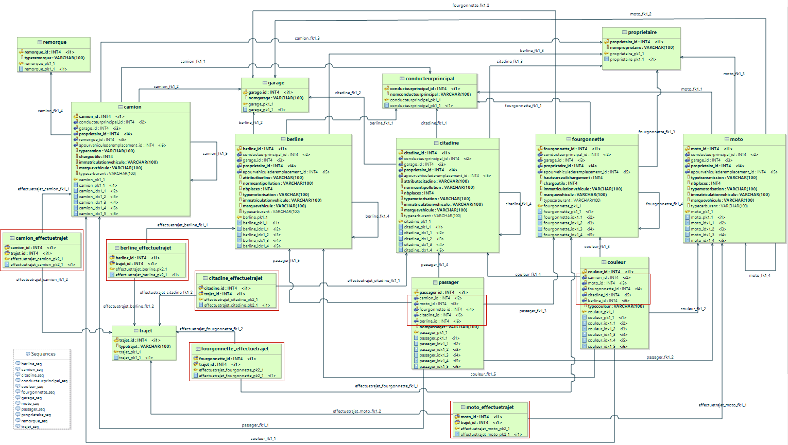
</div>

#### Renvoie d'entités partielles

Pour une entité, il est souvent souhaitable de ne pas vouloir renvoyer la totalité des informations au niveau du client. 

Les solutions les plus simples consistent : 

- A positionner une annotation JSON de type "***@JsonIgnore***" au niveau de l'objet sérialisé :  cette solution est rapidement limitée car elle s'applique à l'ensemble des services qui vont utiliser cette entité.  Or selon  le service, il peut en exister qui demandent à renvoyer la totalité des informations, d'autres qui ne vont renvoyer qu'une partie, etc...

- A créer autant d'entités que désirées, avec plus ou moins d'informations selon les services. Ce solution n'est pas vraiment envisageable car chaque entité est mappée sur une table de la base de données, il y aurait donc plusieurs tables pour le stockage de l'information, ce qui semble incohérent au niveau de la persistance. 

  La problématique principale est qu'au niveau de la modélisation, si un objet métier (DTO) est reliée à une entité, il n'est pas possible de supprimer des attributs au niveau de l'objet métier (il est seulement possible d'en rajouter). 

- A utiliser le lazy loading sur le chargement des références afin de renvoyer seulement une partie de la grappe d'objet. Cette solution est viable, mais son seul inconvénient est que cela n'évite pas l'affichage d'objets nulls au niveau de l'objet sérialisé (XTO). Le client est ainsi averti que  potentiellement, cette information est disponible, ce que ne désire pas forçément les développeurs. Par ailleur si la donnée que l'on ne souhaite pas renvoyer ne se situe pas au niveau d'une relation mais directement au niveau de l'entité, cette solution ne permet pas de résoudre la problématique.

👍 Le plus simple et le plus efficace consiste à utiliser l'annotation "***@JsonView***" en collaboration avec la définition de "vues" qui sont essentiellement des groupes de propriétés que l'on souhaite sérialiser pour des cas d’utilisation spécifiques. 

Ici, la modélisation n'apporte aucune valeur ajoutée et c'est au développeur d'écrire le code nécessaire pour la définition et la prise en compte de ses vues. Les différentes étapes sont les suivantes : 

1 - Renseigner la classe ***[nom de l'application]JsonViews*** située au niveau du package racine pour la couche application ***[package racine].app*** avec la définition des différentes vues souhaitées, par exemple : 

```java
public class DemoJsonViews {
  // Vue publique
  public static class Publique {}   
  // Vue pour les audits
  public static class Audit {} 
  // Vue de synthèse, par exemple pour une liste ou un aperçu rapide. Hérite de la vue d'audit
  public static class Sommaire extends Audit {} 
}
```

2 - Au niveau de l'objet XTO de sérialisation utiliser les balises de type "*user code*" afin de positionner sur chaque attribut l'annotation désirée avec le nom de la vue, par exemple : 
  
```java
// Start of user code aee37c30f5d091a495526f636a3527bb
@JsonProperty("nom")
JsonView(DemoJsonViews.Audit.class)
// End of user code
@Schema(description = "DESCRIPTION A IMPLEMENTER")
private String nom;
  	
// Start of user code 209f4226d4ca0e91af3607674c06a9bc
@JsonProperty("prenom")
@JsonView(DemoJsonViews.Publique.class)
// End of user code
@Schema(description = "DESCRIPTION A IMPLEMENTER")
private String prenom;
```

3 - Au niveau du service REST, utiliser les balises de type "*user code*" pour spécifier les différentes vues gérées par le service.

```java
// Start of user code 2374b233496f92fc018299b4aa11a061
@JsonView(DemoJsonViews.Audit.class)
// End of user code
@GetMapping(value = "/{id}", produces = "application/json;charset=utf8")
public ResponseEntity<PersonneXtoImpl> rechercheParId(
    @PathVariable(name = "id", required = true) Long identifiant) {
    etc...
}
```

#### Domaine et persistances.

Ce paragraphe sera complété prochainement.

#### Mise en place d'un service paginé

Les étapes pour mettre en place un service paginé, sont les suivantes : 

- Définir un paramètre pour le numéro de la page demandée.
- Définir un paramètre pour le nombre d'enregistrements à renvoyer par page.
- Cocher la case "Paged" au niveau des propriétés pour l'opération

L'opération est alors marquée comme "paginée" et une petit icône apparait en bas à droite de cette dernière. 

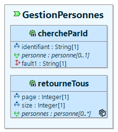

Au niveau de l'onlet "***Exposition***" pour le paramètre qui véhicule le numéro de page demandé, il est nécessaire de lui définir son mode de passage :
<div align="center">
  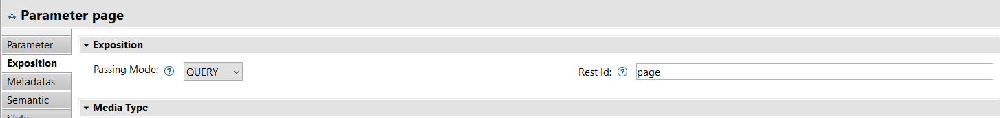
</div>

Faire de même pour le paramètre qui véhicule le nombre d'enregistrements demandés par page : 
<div align="center">
  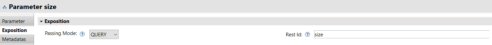
</div>

Enfin, attribuer les deux paramètres à la notion de pagination en saisissant la rubrique "***Pagination***" au niveau de l'onglet "***Operation***" : 
<div align="center">
  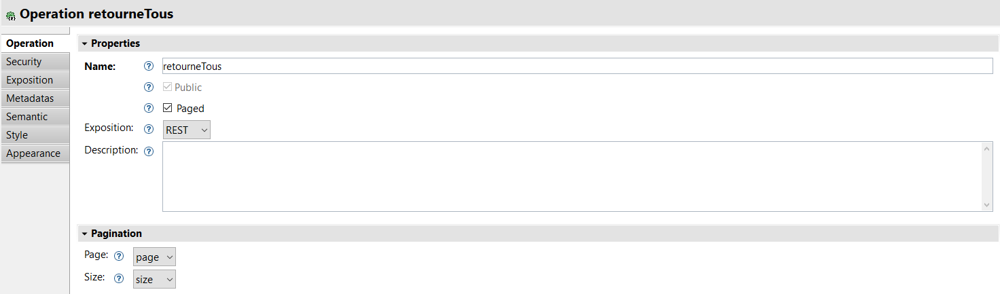
</div>

❗ Selon la "norme" en vigueur, il est conseillé de nommer les paramètres "***page***" et "***size***". Il est possible avec la modélisation d'appeler différement les paramètres (en interne) et de laisser "***page***" et "***size***" uniquement au niveau du paramètre de passage, par exemple : 

<div align="center">
  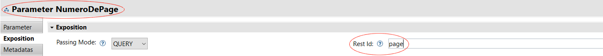
</div>

Une fois la demande de génération de la couche de service effectuée, le code est alors le suivant pour le service REST : 

```java
public ResponseEntity<List<PersonneXtoImpl>> retourneTous(
	@RequestParam(name = "page", required = true) Integer page,
	@RequestParam(name = "size", required = true) Integer size) {

	ResponseEntity.BodyBuilder responseBuilder = ResponseEntity.status(200);

	// Start of user code 1f82841b68b9a27af5cfcf572412847c
	final String sortBy = "";
	// End of user code

	return responseBuilder.body(this.gestionPersonnes.retourneTous(page, size, sortBy).stream()
				.map(o -> PersonneMapper.toXto(o)).collect(Collectors.toList()));
}
```
On peut remarquer la présence d'un paramètre "***sortBy***" qui est automatiquement ajouté et transféré au niveau de couches inférieures. Ce paramètre est initialisé entre balises de type "*user code*" ce qui permet au développeur de définir ses critères de tri pour la réponse (le nom de la colonne).

**Le code du service métier au niveau du domaine** : 

```java
@Override
public List<PersonneDtoImpl> retourneTous(final Integer page, final Integer size, String sortBy) {

	// Appel des exigences en provenance de la modélisation
	// Start of user code b3cd801bacaa8215ea8b99cd493f3c64
	// End of user code

	List<PersonneDtoImpl> personnes = this.gestionPersonnesProvider.retourneTous(page, size, sortBy);

	// Start of user code fc7467f7f1fb6f5cccd57590429003e4
	// End of user code
	return personnes;
}
```
Et enfin, le code au niveau de l'implementation de la couche de persistance : 

```java
@Override
public List<PersonneDtoImpl> retourneTous(final Integer page, final Integer size, String sortBy) {

	// Start of user code 1f82841b68b9a27af5cfcf572412847c
	// End of user code

	Page<PersonneEntityImpl> pageEntity = retourneTous_invoke(PageRequest.of(page, size, Sort.by(sortBy)));
	return pageEntity.getContent().stream().map(o -> PersonneMapper.toDto(o)).collect(Collectors.toList());
}
```
#### Mise en place du "circuit-breaker"

Un "circuit-breaker" est un mécanisme qui empêche un système de continuer à appeler un service en échec, afin de limiter la propagation des erreurs et de laisser le service défaillant se rétablir.

Dans le contexte des services REST il s'agit d'un mécanisme de protection qui interrompt temporairement les appels vers un service distant lorsqu’un certain seuil d’échecs est atteint, afin d’éviter de surcharger un service instable, de préserver les ressources du client, et améliorer la résilience globale de l’architecture. 

Les objectifs sont donc de : 

- Limiter l’impact des pannes de services tiers ou en cascade.
- Réduire les temps de réponse côté client en évitant des appels voués à l’échec.
- Permettre la reprise progressive d’un service REST une fois rétabli.

Avec **Pacman** la modélisation d'un tel service s'effectue par l'ajout de services de type "***Required***", à la différence des services de type "***Provided***" utilisés jusqu'à maintenant. La modélisation n'impacte ni la couche domaine, ni la couche application au niveau de l'infrastructure, seul un "*adapter*" est ajouté avec pour nom ***[nom du service]ExternalProvider*** (au lieu de ***[nom du service]JpaProvider***)

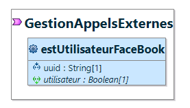

Le code généré au niveau de l'implémentation du service d'infrastructure est le suivant : 

```java
@AdapterService
public class GestionAppelsExternesExternalProviderImpl implements GestionAppelsExternesProvider {

  @Override
  @CircuitBreaker(name = "estUtilisateurFaceBookCircuitBreaker", fallbackMethod = "estUtilisateurFaceBookFallback")
  public Boolean estUtilisateurFaceBook(final String uuid) {

     // Start of user code ee90aef40f6fecc8cc4976ab9a5abe88
     throw new DemoNotImplementedException("La méthode 'estUtilisateurFaceBook' n'a pas été implémentée");
     // End of user code
  }

  /**
   * Méthode de repli pour {@link #estUtilisateurFaceBook} en cas d'échec ou
   * d'indisponibilité du service externe. Il est à noter que cette méthode doit
   * avoir exactement les mêmes paramètres (dans le même ordre) que la méthode
   * principale, seule une exception de type 'Throwable' est ajoutée en fin de
   * signature.
   */
   public Boolean estUtilisateurFaceBookFallback(final String uuid) {

    // Start of user code a5dbdd4d474e95235c3ac793abc576e5
    // Logique de repli (par exemple, retourner une réponse par défaut)
    
    throw new DemoNotImplementedException(
	  "La méthode 'estUtilisateurFaceBook' de fallback n'a pas été implémentée");
    
    // End of user code
  }
}
```
Le paramètrage du nombre de tentatives d'appel, du délai entre chaque appel, etc.. est disponible au niveau du fichier de configuration de l'application : "***application.properties***".

#### Exemple de modélisation avancée

Voici à titre d'exemple, une modélisation pour la couche de persistance qui permet de visualiser rapidement l'ensemble des possibilités disponibles, on ne s'interesse ici qu'a l'entité principale afin principalement de montrer les différentes relations générées. 

<div align="center">
  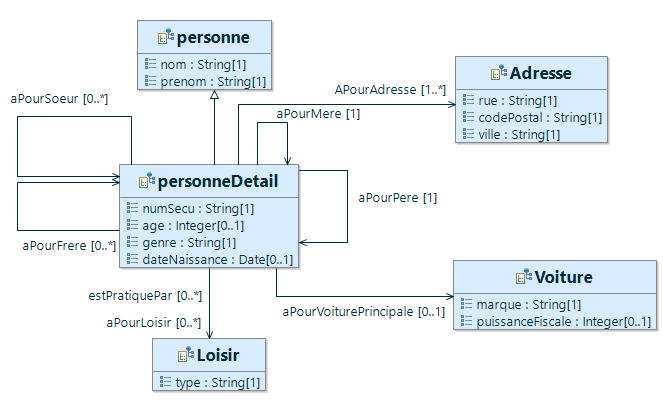
</div>

Et le code des relations associées pour l'entité principale *PersonneDetailEntityImpl* : 

```java
@Entity
@Table(name = "TBL_PERSONNE_DETAIL", schema = "SCH")
@SequenceGenerator(name = "PERSONNEDETAIL_SEQUENCE", sequenceName = "SCH.TBL_PERSONNE_DETAIL_SEQ", allocationSize = 1)
@SQLDelete(sql = "UPDATE SCH.TBL_PERSONNE SET xtopsup = true WHERE TBL_PERSONNE_DETAIL_ID = ?")
@SQLRestriction("xtopsup = false")
public class PersonneDetailEntityImpl extends DemoEntityAbs {

   // CONSTANTES ET ATTRIBUTS
   // Start of user code d7bbcbe6a7acc56177d5556a145d9bb1

   // End of user code

   /** Id. */
   @Id
   @GeneratedValue(strategy = GenerationType.SEQUENCE, generator = "PERSONNEDETAIL_SEQUENCE")
   @Column(name = "TBL_PERSONNE_DETAIL_ID", nullable = false)
   private Long personneDetail_id;

   /** Le numéro de sécurité sociale pour la personne. */
   // Start of user code 2fc90baa97ca768b902d1318a899060e
   // End of user code
   @Column(name = "NUMSECU", nullable = false)
   private String numSecu;

   /** L'âge de la personne. */
   // Start of user code 7d637d275668ed6d41a9b97e6ad3a556
   // End of user code
   @Column(name = "AGE", nullable = true)
   private Integer age;

   /** Le genre de la personne. */
   // Start of user code 7f80095aea4d66af1121f1fbe916066d
   // End of user code
   @Column(name = "GENRE", nullable = false)
   private String genre;

   /** La date de naissance pour la personne. */
   // Start of user code 204e5968d93f74819a495317664f9a8a
   // End of user code
   @Column(name = "DATENAISSANCE", nullable = true, columnDefinition = "DATE")
   private LocalDate dateNaissance;

   /** Le nom pour la personne (hérité). */
   // Start of user code aee37c30f5d091a495526f636a3527bb
   // End of user code
   @Column(name = "NOM", nullable = false)
   private String nom;

   /** Le prénom pour la personne (hérité). */
   // Start of user code 209f4226d4ca0e91af3607674c06a9bc
   // End of user code
   @Column(name = "PRENOM", nullable = false)
   private String prenom;

   /** La liste des adresses pour la personne. */
   // Start of user code d6d3f83da68f8d7a4af10f3792bc571a
   // End of user code
   @OneToMany(fetch = FetchType.EAGER, mappedBy = "personneDetail")
   private List<AdresseEntityImpl> aPourAdresse;

   /** La mère pour la personne. */
   // Start of user code 4f8b5bff6538bc508d8cc45e8a1ec6dd
   // End of user code
   @ManyToOne(fetch = FetchType.EAGER)
   @JoinColumn(name = "APOURMERE_ID", referencedColumnName = "TBL_PERSONNEDETAIL_ID", nullable = false)
   private PersonneDetailEntityImpl aPourMere;

   /** Le père pour la personne. */
   // Start of user code 88bb032457e70f1191a3c6542f38fce4
   // End of user code
   @ManyToOne(fetch = FetchType.EAGER)
   @JoinColumn(name = "APOURPERE_ID", referencedColumnName = "TBL_PERSONNEDETAIL_ID", nullable = false)
   private PersonneDetailEntityImpl aPourPere;

   /** La voiture principale pour la personne. */
   // Start of user code 08432f639b4515c84e5338822fea6baf
   // End of user code
   @ManyToOne(fetch = FetchType.EAGER)
   @JoinColumn(name = "TBL_VOITURE_ID", referencedColumnName = "TBL_VOITURE_ID", nullable = true)
   private VoitureEntityImpl voiture;

   /** La liste des frères pour la personne. */
   // Start of user code d06fd39424c52878b6c1b055a2469523
   // End of user code
   @ManyToMany(fetch = FetchType.EAGER, targetEntity = PersonneDetailEntityImpl.class)
   @JoinTable(name = "TBL_PERSONNEDETAILAPOURFRERE", schema = "SCH", joinColumns = @JoinColumn(name = "TBL_PERSONNEDETAIL_ID")
   , inverseJoinColumns = @JoinColumn(name = "TBL_PERSONNEDETAIL_1_ID"))
   private List<PersonneDetailEntityImpl> aPourFrere;

   /** La liste des loisirs pour la personne. */
   // Start of user code 373fdd8ab6e4368cee4c045b1594d983
   // End of user code
   @ManyToMany(fetch = FetchType.EAGER, targetEntity = LoisirEntityImpl.class)
   @JoinTable(name = "TBL_PERSONNEDETAILAPOURLOISIR", schema = "SCH", joinColumns = @JoinColumn(name = "TBL_PERSONNEDETAIL_ID")
   , inverseJoinColumns = @JoinColumn(name = "TBL_LOISIR_ID"))
   private Set<LoisirEntityImpl> aPourLoisir;

   /** La liste des soeurs pour la personne. */
   // Start of user code aa719428a3d8ea0dc0813733b65145c3
   // End of user code
   @ManyToMany(fetch = FetchType.EAGER, targetEntity = PersonneDetailEntityImpl.class)
   @JoinTable(name = "TBL_PERSONNEDETAILAPOURSOEUR", schema = "SCH", joinColumns = @JoinColumn(name = "TBL_PERSONNEDETAIL_ID")
   , inverseJoinColumns = @JoinColumn(name = "TBL_PERSONNEDETAIL_1_ID"))
   private List<PersonneDetailEntityImpl> aPourSoeur;
   
   etc...
}
```

Au niveau du script de création pour la base de données, comme il y a une notion d'héritage qui a été modélisée (uniquement pour pouvoir renvoyer des objets *personneEntityIml* et *personneDetailEntityImpl*, une seule table est crée, la table *TBL_PERSONNE_DETAIL*. 

```sql
/******************************************************************/
/* Base de donnees:      h2                                       */
/* Application:          demo                                     */
/* Date de creation:     13/05/2025 10:55:16                      */
/******************************************************************/

/******************************************************************/
/* Sequences                                                      */
/******************************************************************/
create sequence PERSONNE_DETAIL_SEQ start with 1;
create sequence LOISIR_SEQ start with 1;
create sequence ADRESSE_SEQ start with 1;
create sequence VOITURE_SEQ start with 1;

/******************************************************************/
/* TABLE : PERSONNE                                               */
/******************************************************************/
create table PERSONNE_DETAIL
(
  /* PK de la table PERSONNE */
  PERSONNE_DETAIL_ID NUMBER(19) not null,
  NUMSECU VARCHAR(100) not null,
  AGE NUMBER(10),
  GENRE VARCHAR(100) not null,
  DATENAISSANCE TIMESTAMP,
  NOM VARCHAR(100) not null,
  PRENOM VARCHAR(100) not null,
  XTOPSUP BOOLEAN not null DEFAULT 'false',
  XDMAJ TIMESTAMP not null,
  XUUID VARCHAR(36) not null,
  APOURMERE_ID NUMBER(19) not null,
  APOURPERE_ID NUMBER(19) not null,
  VOITURE_ID NUMBER(19),
  constraint PERSONNE_PK1_1 primary key (PERSONNE_ID)
);
create index PERSONNEDETAIL_IDX1_1 on PERSONNE(APOURMERE_ID);
create index PERSONNEDETAIL_IDX1_2 on PERSONNE(APOURPERE_ID);
create index PERSONNEDETAIL_IDX1_3 on PERSONNE(PERSONNE_ID);

comment on column PERSONNE.PERSONNE_ID is 'Clé primaire pour la table PERSONNE';
comment on column PERSONNE.NUMSECU is 'Le numéro de sécurité sociale pour la personne';
comment on column PERSONNE.AGE is 'L''âge de la personne';
comment on column PERSONNE.GENRE is 'Le genre de la personne';
comment on column PERSONNE.DATENAISSANCE is 'La date de naissance pour la personne';
comment on column PERSONNE.NOM is 'Le nom de la personne';
comment on column PERSONNE.PRENOM is 'Le prénom de la personne';
comment on column PERSONNE.APOURMERE_ID is 'La mère pour la personne';
comment on column PERSONNE.APOURPERE_ID is 'Le père pour la personne';
comment on column PERSONNE.VOITURE_ID is 'La personne peut avoir une voiture principale';

/******************************************************************/
/* TABLE : LOISIR                                                 */
/******************************************************************/
create table LOISIR
(
  /* PK de la table LOISIR */
  LOISIR_ID NUMBER(19) not null,
  TYPE VARCHAR(100) not null,
  XTOPSUP BOOLEAN not null DEFAULT 'false',
  XDMAJ TIMESTAMP not null,
  XUUID VARCHAR(36) not null,
  constraint LOISIR_PK1_1 primary key (LOISIR_ID)
);

comment on table LOISIR is 'Les loisirs pratiqués par des personnes';
comment on column LOISIR.LOISIR_ID is 'Clé primaire pour la table LOISIR';
comment on column LOISIR.TYPE is 'Le type pour le loisir';

/******************************************************************/
/* TABLE : ADRESSE                                                */
/******************************************************************/
create table ADRESSE
(
  /* PK de la table ADRESSE */
  ADRESSE_ID NUMBER(19) not null,
  RUE VARCHAR(100) not null,
  CODEPOSTAL VARCHAR(100) not null,
  VILLE VARCHAR(100) not null,
  XTOPSUP BOOLEAN not null DEFAULT 'false',
  XDMAJ TIMESTAMP not null,
  XUUID VARCHAR(36) not null,
  PERSONNE_ID NUMBER(19) not null,
  constraint ADRESSE_PK1_1 primary key (ADRESSE_ID)
);
create index ADRESSE_IDX1_1 on ADRESSE(PERSONNE_ID);

comment on table ADRESSE is 'La liste des adresses pour les personnes';
comment on column ADRESSE.ADRESSE_ID is 'Clé primaire pour la table ADRESSE';
comment on column ADRESSE.RUE is 'La rue pour l''adresse';
comment on column ADRESSE.CODEPOSTAL is 'Le code postal pour l''adresse';
comment on column ADRESSE.VILLE is 'La ville pour l''adresse';
comment on column ADRESSE.PERSONNE_ID is 'Une personne peut avoir de une à plusieurs adresses';

/******************************************************************/
/* TABLE : VOITURE                                                */
/******************************************************************/
create table VOITURE
(
  /* PK de la table VOITURE */
  VOITURE_ID NUMBER(19) not null,
  MARQUE VARCHAR(100) not null,
  PUISSANCEFISCALE NUMBER(10),
  XTOPSUP BOOLEAN not null DEFAULT 'false',
  XDMAJ TIMESTAMP not null,
  XUUID VARCHAR(36) not null,
  constraint VOITURE_PK1_1 primary key (VOITURE_ID)
);

comment on table VOITURE is 'La liste des voitures principales pour les personnes';
comment on column VOITURE.VOITURE_ID is 'Clé primaire pour la table VOITURE';
comment on column VOITURE.MARQUE is 'La marque pour la voiture';
comment on column VOITURE.PUISSANCEFISCALE is 'La puissance fiscale pour la voiture';

/******************************************************************/
/* TABLE DE LIAISON : PERSONNEDETAIL_APOURFRERE                   */
/******************************************************************/
create table PERSONNEDETAIL_APOURFRERE
(
  PERSONNE_DETAIL_ID NUMBER(19) not null,
  PERSONNE_DETAIL_RECURSIVE_ID NUMBER(19) not null,
  constraint PERSONNEDETAILAPOURFRERE_PK2_1 primary key (PERSONNE_ID, PERSONNE_1_ID)
);

comment on table PERSONNEDETAIL_APOURFRERE is 'La liste des frères pour la personne';

/******************************************************************/
/* TABLE DE LIAISON : PERSONNEDETAIL_APOURLOISIR                  */
/******************************************************************/
create table PERSONNEDETAIL_APOURLOISIR
(
  PERSONNE_ID NUMBER(19) not null,
  LOISIR_ID NUMBER(19) not null,
  constraint PERSONNEDETAILAPOURLOISIR_PK2_1 primary key (PERSONNE_ID, LOISIR_ID)
);

comment on table PERSONNEDETAILA_POURLOISIR is 'Une personne peut partiquer de 0 à plusieurs loisirs';

/******************************************************************/
/* TABLE DE LIAISON : PERSONNEDETAIL_APOURSOEUR                    */
/******************************************************************/
create table PERSONNEDETAILAPOURSOEUR
(
  PERSONNE_ID NUMBER(19) not null,
  PERSONNE_DETAIL_RECURSIVE_ID NUMBER(19) not null,
  constraint PERSONNEDETAILAPOURSOEUR_PK2_1 primary key (PERSONNE_ID, PERSONNE_1_ID)
);

comment on table PERSONNEDETAIL_APOURSOEUR is 'La liste des soeurs pour la personne';

/******************************************************************/
/* Contraintes                                                    */
/******************************************************************/
alter table PERSONNE add constraint PERSONNE_FK1_1 foreign key (APOURMERE_ID) references PERSONNE (PERSONNE_ID);
alter table PERSONNE add constraint PERSONNE_FK1_2 foreign key (APOURPERE_ID) references PERSONNE (PERSONNE_ID);
alter table PERSONNE add constraint PERSONNE_FK1_3 foreign key (PERSONNE_ID) references PERSONNE (PERSONNE_ID);
alter table ADRESSE add constraint ADRESSE_FK1_1 foreign key (PERSONNE_ID) references PERSONNE (PERSONNE_ID);
alter table PERSONNEDETAIL_APOURFRERE add constraint PERSONNEDETAILAPOURFRERE_FK1_1 foreign key (PERSONNE_ID) references PERSONNE (PERSONNE_ID);
alter table PERSONNEDETAIL_APOURFRERE add constraint PERSONNEDETAILAPOURFRERE_FK1_2 foreign key (PERSONNE_ID) references PERSONNE (PERSONNE_ID);
alter table PERSONNEDETAIL_APOURLOISIR add constraint PERSONNEDETAILAPOURLOISIR_FK1_1 foreign key (PERSONNE_ID) references PERSONNE (PERSONNE_ID);
alter table PERSONNEDETAIL_APOURLOISIR add constraint PERSONNEDETAILAPOURLOISIR_FK1_2 foreign key (LOISIR_ID) references LOISIR (LOISIR_ID);
alter table PERSONNEDETAIL_APOURSOEUR add constraint PERSONNEDETAILAPOURSOEUR_FK1_1 foreign key (PERSONNE_ID) references PERSONNE (PERSONNE_ID);
alter table PERSONNEDETAIL_APOURSOEUR add constraint PERSONNEDETAILAPOURSOEUR_FK1_2 foreign key (PERSONNE_ID) references PERSONNE (PERSONNE_ID);

```

Au niveau de la couche domaine avec les objets métier on retouve le DTO, comme plusieurs champs ont été marqués comme obligatoires, la méthode de validation est la suivante : 
```java
public PersonneDetailDtoImpl validate() throws DemoValidationException {

	List<String> errors = new ArrayList<>();
	ValidatorUtils.checkMandatory("numSecu", numSecu, errors);
	ValidatorUtils.checkMandatory("genre", genre, errors);
	ValidatorUtils.checkMandatory("nom", nom, errors);
	ValidatorUtils.checkMandatory("prenom", prenom, errors);

	if (!errors.isEmpty()) {
		throw new DemoValidationException(this, errors.toArray(new String[errors.size()]));
	}
	return this;
}
```

Enfin les méthodes "***equals(), hashcode() et toString()***" ont été redéfinies, ici par exemple le code de la méthode "***equals()***" : 
```java
@Override
public boolean equals(Object obj) {
	if (this == obj) {
		return true;
	}
	if (!(obj instanceof PersonneDetailDtoImpl)) {
		return false;
	}
	PersonneDetailDtoImpl personneDetail = (PersonneDetailDtoImpl) obj;
	return Objects.equals(this.personneDetail_id, personneDetail_id)
		&& Objects.equals(this.numSecu, personneDetail.numSecu) 
		&& Objects.equals(this.age, personneDetail.age)
		&& Objects.equals(this.genre, personneDetail.genre)
		&& Objects.equals(this.dateNaissance, personneDetail.dateNaissance)
		&& Objects.equals(this.nom, personneDetail.nom) 
		&& Objects.equals(this.prenom, personneDetail.prenom)
		&& Objects.equals(this.xtopsup, personneDetail.xtopsup)
		&& Objects.equals(this.xdmaj, personneDetail.xdmaj) 
		&& Objects.equals(this.xuuid, personneDetail.xuuid);
}
```
### ✔️ Validation de la modélisation
---
Bien que vu précédemment, un chapitre est toutefois consacré exclusivement à ce "générateur". Comme précité, la validation de la modélisation est automatiquement lancée avant chaque demande de génération pour la couche de persistance, la couche de service ou encore la création des scripts SQL.

• Si aucune erreur n'est détectée, le générateur est alors activé et la génération est effectuée.
• En cas d'erreur, une fenêtre est affichée et la poursuite de la génération est stoppée.

<div align="center">
  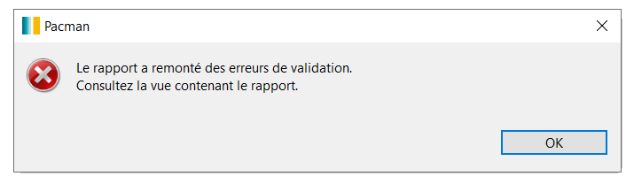
</div>

• Il est alors possible de visualiser le rapport au niveau de la vue de validation (Rapport de validation). Cette vue permet de cibler l'objet en cause, d'afficher la ou les erreur(s) rencontrée(s) et de proposer une solution pour le contournement de chaque erreur.

  Cette vue permet de trier les différentes colonnes (cliquer au niveau du libellé de la colonne pour modifier l'ordre de tri) et de filtrer les données grâce aux quatre critères : 
  
  - Filtrer par règle
  - Filtrer par objet 
  - Filtrer par erreur
  - Filtrer par solution potentielle
 
  En se positionnant sur une ligne, il est alors possible de se positionner directement sur l'élément au niveau de la représentation associée au diagramme et ainsi d'effectuer rapidement la modification demandée.

<div align="center">
  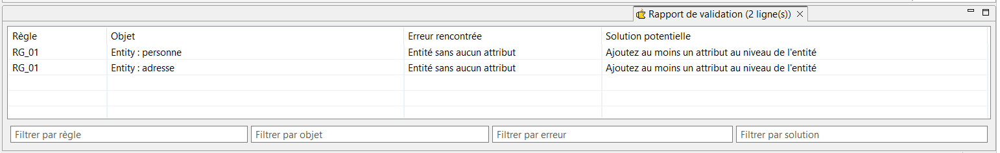
</div>

❗ Il est parfois possible, en voulant se positionner directement sur l'élément, que l'utilisateur soit confronté au message suivant :   

<div align="center">
  
</div>

Comme indiqué, ce message signifie que la représentation n'existe pas (elle n'a pas encore été créée). Il est donc nécessaire pour l'utilisateur de créer manuellement ladite représentation, puis de sélectionner à nouveau la ligne incriminée. La représentation sera alors automatiquement chargée et l'élément du diagramme sera sélectionné. 

• Il est aussi possible de lancer directement la vérification du modèle qui se soldera obligatoirement par l'affichage d'une fenêtre indiquant soit la présence d'erreur(s) de modélisation, soit la bonne prise en compte du modèle.

### 📦 Déploiement de l'application

Pour déployer l'application, ouvrir une fenêtre de commande (cmd ou power shell, etc...) et se positionner à la racine du projet (un **dir** (ou **ls-al**) doit renvoyer l'ensemble des sous-projets). 

```bash
07/11/2025  15:00    <DIR>          .
07/11/2025  15:00    <DIR>          ..
07/11/2025  15:00               384 .project
07/11/2025  15:00    <DIR>          .settings
07/11/2025  15:00    <DIR>          demo-domain
07/11/2025  15:00    <DIR>          demo-model
07/11/2025  15:00    <DIR>          demo-server
07/11/2025  15:00             7 514 pom.xml
               2 fichier(s)            7 898 octets
               6 Rép(s)  350 891 282 432 octets libres
```
Puis tapper simplement la commande : 

```bash
mvn clean install 
```
Une fois le processus de compilation effectué, l'utilisateur doit alors avoir un récapitulatif du type : 
```bash
[INFO] ------------------------------------------------------------------------
[INFO] Reactor Summary for cali 0.0.1-SNAPSHOT:
[INFO]
[INFO] cali ............................................... SUCCESS [  1.221 s]
[INFO] demo-domain ........................................ SUCCESS [ 11.353 s]
[INFO] demo-server ........................................ SUCCESS [  6.475 s]
[INFO] demo-model ......................................... SUCCESS [  0.142 s]
[INFO] ------------------------------------------------------------------------
[INFO] BUILD SUCCESS
[INFO] ------------------------------------------------------------------------
[INFO] Total time:  19.309 s
[INFO] Finished at: 2025-11-07T15:03:39+01:00
[INFO] ------------------------------------------------------------------------
```

Il est alors possible de récupérer l'executable au niveau du répertoire "*/target*" du sous-projet "*[nom de l'application]-server*". Dans le cas de notre application example, le fichier est appelé : **demo-server-0.0.1-SNAPSHOT.jar**. 

Renommer le fichier si besoin, le positionner sur la machine de production et lancer l'application simplement avec la ligne de commande suivante (ne pas oublier que par défaut, le serveur est lancé sur le port 80, par ailleurs dans le cadre de ce document le profil est toujours sous "**dev**") : 

```bash
java -jar demo-server-0.0.1-SNAPSHOT.jar
```

Voici un extrait de ce qui doit être obtenu au niveau de la console : 

```bash
  .   ____          _            __ _ _
 /\\ / ___'_ __ _ _(_)_ __  __ _ \ \ \ \
( ( )\___ | '_ | '_| | '_ \/ _` | \ \ \ \
 \\/  ___)| |_)| | | | | || (_| |  ) ) ) )
  '  |____| .__|_| |_|_| |_\__, | / / / /
 =========|_|==============|___/=/_/_/_/

 :: Spring Boot ::                (v3.4.1)

2025-11-07 22:11:52 - fr.demo.DemoBootstrap - Starting DemoBootstrap using Java 21.0.1 with PID 17036
(C:\Travail\runtime-EclipseApplication-back\demo\demo-server\target\demo-server-0.0.1-SNAPSHOT.jar started by
patrice.garaud in C:\Travail\runtime-EclipseApplication-back\demo\demo-server\target)
2025-11-07 22:11:52 - fr.demo.DemoBootstrap - The following 1 profile is active: "dev"
2025-11-07 22:11:54 - o.s.d.r.c.RepositoryConfigurationDelegate - Bootstrapping Spring Data JPA repositories 
2025-11-07 22:11:59 - o.a.c.c.C.[Tomcat-1].[localhost].[/] - Initializing Spring embedded
WebApplicationContext
[.......]
2025-11-07 22:11:59 - o.s.b.w.s.c.ServletWebServerApplicationContext - Root WebApplicationContext: initialization completed in 89 ms
2025-11-07 22:11:59 - o.s.b.a.e.web.EndpointLinksResolver - Exposing 2 endpoints beneath base path '/actuator'
2025-11-07 22:11:59 - o.s.w.s.m.m.a.RequestMappingHandlerMapping - 1 mappings in 'requestMappingHandlerMapping'
2025-11-07 22:11:59 - o.s.w.s.h.SimpleUrlHandlerMapping - Patterns [/webjars/**, /**,
/swagger-ui*/*swagger-initializer.js, /swagger-ui*/**] in 'resourceHandlerMapping'
2025-11-07 22:11:59 - o.s.w.s.m.m.a.RequestMappingHandlerAdapter - ControllerAdvice beans: 0 @ModelAttribute,
0 @InitBinder, 1 RequestBodyAdvice, 1 ResponseBodyAdvice
2025-11-07 22:11:59 - o.s.b.w.e.tomcat.TomcatWebServer - Tomcat started on port 8080 (http) with context path
'/'
2025-11-07 22:11:59 - fr.demo.DemoBootstrap - Started DemoBootstrap in 7.121 seconds (process running for
7.66)
```

## 📁 Cas projet client 

Deux possibilités de création de client sont offertes par **Pacman**. La création d'un client en SpringBoot et la création d'un client en React. Il faut bien distinguer la différence de positionnement entre ces deux frameworks car le processus de génération est complètement différent entre les deux languages.

- Le client SpringBoot est à utiliser pour créer un client à partir d'une librairie externe (fournisseur externe avec fichier Swagger), c'est à dire d'une api non préalablement générée par la modélisation de **Pacman**. La librairie générée peux alors être utilisée, soit directement au niveau de l'api modélisée (service appelant un service), soit au niveau d'un front Java.

- Le client React, quant à lui, est à utiliser pour créer un client à partir d'une modélisation de type  "*serveur*" par **Pacman** (un fichier de modélisation de type "**.soa"**). Il est à intégrer dans un front qui a été lui  même été modélisé par le générateur **Pacman** (voir le générateur pacman-front).

## 📁 Cas projet client (SpringBoot)

### WebClient

Pendant longtemps, le client HTTP de référence dans l’écosystème Spring a été RestTemplate, introduit pour simplifier les appels REST depuis une application Spring Boot. Il a été largement utilisé car il proposait une API simple, bloquante et proche des modèles de programmation classiques. 

Cependant, avec l’arrivée de Spring 5 et du paradigme réactif, RestTemplate a été marqué comme obsolète et ne bénéficie plus d’évolutions. Son fonctionnement bloquant le rend peu adapté aux architectures modernes, souvent distribuées et fortement concurrentes. Pour répondre à ces besoins, Spring a introduit WebClient, un client HTTP non bloquant, réactif et beaucoup plus flexible : il permet de gérer aussi bien des appels simples que des flux de données continus, tout en offrant un support natif pour l’asynchrone et une meilleure intégration avec Spring WebFlux. 

WebClient est aujourd’hui l’outil recommandé pour les appels REST dans Spring Boot, car il prépare les applications à la scalabilité et aux contraintes de performance actuelles.

### Récupération du fichier Swagger

Le fichier Swagger est à récupérer auprès du fournisseur externe de service, il est au format *Json* ou *Yaml* (**Pacman** accepte les deux formats) et à positionner sur le disque dans un répertoire au choix du développeur. Il est toutefois conseillé de le stocker au niveau du projet de modélisation afin de centraliser toutes les informations au niveau du projet. 

### Modélisation

Pour modéliser l'ensemble des services, dans l'explorateur de modèles, aller au niveau du projet de modélisation ***[nom de l'application]-model***, se positionner sur le fichier de modélisation des services ***[nom de l'application].soa***, développer l'arborescence du fichier et se positionner dans l'arbre au niveau de l'élément *Components*. Par un clique droit, faire apparaitre le menu de génération *Is Designer/Import Swagger*.

<div align="center">
  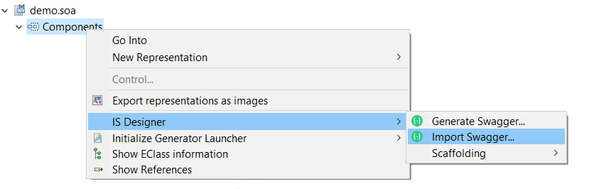
</div>

A l'aide de la fenêtre de recherche, retrouver le fichier et valider avec le bouton "*Finish*" la demande d'importation du fichier Swagger.  

<div align="center">
  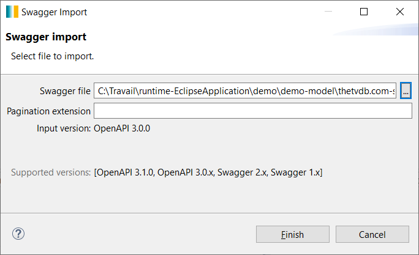
</div>

A ce stade le fichier de modélisation "***.soa***" contient maintenant l'ensemble des objets métier (les objets dto) ainsi que les différents services. Il est maintenant nécessaire (si besoin) d'affiner la modélisation en apposant quelques métadonnées.

• Si un ou plusieurs services sont soumis à une authentification préalable (demande de jeton), lire le fichier de modélisation afin de retrouver l'opération liée à l'obtention dudit jeton. Dans le cas de l'api "TheTVDV", il s'agit du service "*Login*". Se positionner au niveau de l'opération et ajouter la métadonnée *@AUTH_TOKEN*. Le corps de l'annotation n'est pas utile ici, dans le cadre de cette fonctionnalité car le générateur se contente simplement de vérifier la présence de l'annotation. Le developpeur peut le laisser sans modification ou le supprimer. 
 
❗ Bien vérifier la présence de cette annotation (si elle est nécessaire) car en son absence, toutes les classes de test seront en erreur.

<div align="center">
  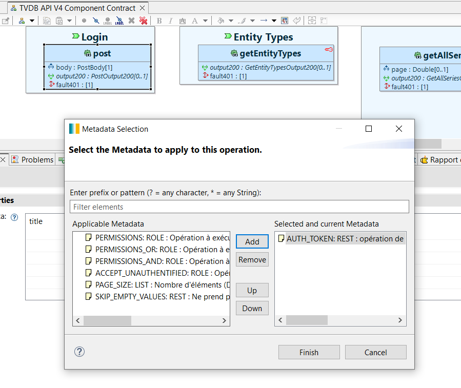
</div>

• **Pacman** ne peut connaitre toutes les intentions du fournisseur de services externes. Il est possible que ce dernier ait par exemple, décidé que pour son api, seuls les paramètres renseignés devaient être envoyés. C'est le cas notamment pour le service de recherche de l'api utilisée dans le cadre de ce document. Afin de pallier à cette problématique, il est possible de positionner une métadonnée ***@SKIP_EMPTY_VALUES*** au niveau de l'opération concernée. Le générateur, lors de l'éxécution de la requête va alors vérifier à la volée quels sont les paramètres effectivement renseignés.       

<div align="center">
  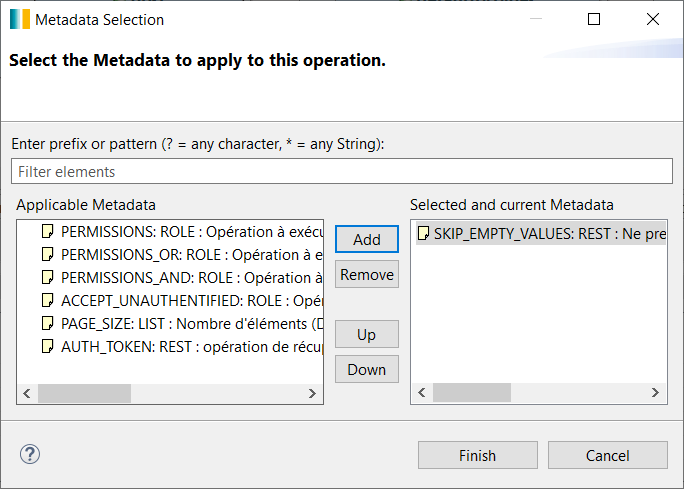
</div>

• Il est possible que le fournisseur externe de services ait utilisé un ou plusieurs mots-clé Java dans la définition des attributs ou références de son api (c'est la cas notamment dans le cadre "TheTVDB"). Il est alors nécessaire de modifier la modélisation sous peine de ne pas pouvoir compiler et de modifier le nom de l'élément incriminé. Cependant, une modification du nom de l'élement entrainera invariablement un disfonctionnement de l'api. 

Par défaut, l'ensemble des attributs et références sont automatiquement annotés avec ***@JsonPropery*** qui permet de spécifier un nom différent pour la sérialisation. Il est ainsi toujours possible de modifier ce nom manuellement. 

Cependant une métadonnée ***@JSON_NAME*** permet aussi d'indiquer au générateur la demande expresse de modification de nom (positionner la métadnnée et saisir dans le corps de la métadonnée le nolm désiré pour la référence ou l'attribut). 

Si la problématique se situe au niveau des paramètres en entrée du service, il suffit alors simplement de modifier la modélisation puisque la modification ne sera prise en compte qu'au niveau local pour la compilation.

### Génération

Dans l'explorateur de modèles, aller au niveau du projet de modélisation ***[nom de l'application]-model***, se positionner sur le fichier de modélisation du métier ***[nom de l'application].soa*** et par un clique droit, faire apparaitre le menu de génération **Pacman** (*Générateurs Cali/Génération du client pour les services*). 

<div align="center">
  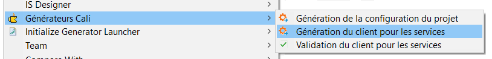
</div>

**Au niveau du projet du domaine (couche métier)** : 

• ***[package racine].domain.entities.[nom du namespace]*** : Ces packages contiennent l'ensemble des objets métier (***dtos***). Comme il s'agit d'objets sérialisés, on parlera donc d'objet de type "***Xto***" dans le cadre de générateurs **Pacman**.

**Au niveau du projet serveur** : 

•  ***[package racine].app.client.[nom du namespace]*** : Ces packages contiennent l'ensemble des services pour l'ensemble des appels du fournisseur externe. Chaque classe client à la même structure et récupère (par le biais de l'injection Spring) le WebClient (***[Nom de l'application]WebClientHelper***) permettant d'effectuer l'appel. 

Si l'opération nécessite une sécurisation par jeton, alors le paramètre "***final String token***" sera automatiquement ajouté dans la liste des différents paramètres en entrée. Ainsi, pour l'opération de recherche des films et séries, point d'entrée de l'api pour "TheTVDB", le code sera le suivant : 

```java
public GetSearchResultsOutput200XtoImpl getSearchResults(
    final String query, final String q, final String type,
	final Double year, final String company, final String country, 
	final String director, final String language,
	final String primaryType, final String network, final String remote_id, 
	final Double offset, final Double limit, final String token) {

	return clientHelper.getBuilder()
	   .get()
	   .withResponseType(GetSearchResultsOutput200XtoImpl.class)
	   .withUri("/v4/search")
	   .withQueryParams(DemoWebClientMapUtils.mapOf("query", query, "q", q, "type",
	       type, "year", year, "company", company, "country", country, 
	       "director", director, "language", language, "primaryType", primaryType, 
	       "network", network, "remote_id", remote_id, "offset", offset, "limit", limit))
	   .withHeaderToken("Authorization", "Bearer " + token)
	   .withSkiEmptyValues()
	   .execute();
}
```
  
  Les différentes étapes dans la construction de la requête sont les suivantes : 
  
  - "***.get()***" : Il s'agit d'une requête avec le verbe "GET" afin de récupérer une liste de films et séries en fonction de différents critères de recherche.
  
  - "***.withResponseType()***" : On spécifie la classe (l'objet XTO) qui va être retourné par la requête afin que le WebClient puisse le peupler automatiquement avec la réponse du fournisseur externe.
  
  - "***.withUri()***" : On spécifie l'URI pour accéder à la bonne requête. On peut remarquer encore une fois que la version est positionnée à ce niveau ce qui permet d'être plus souple au niveau de la gestion des versions entre les différents services.
  
  - "***.withQueryParams()***" : Ici les différents paramètres en entrée ont été modélisés sous forme de paramètres de requête.

  - "***.withHeaderToken()***" : Comme cette opération nécessite une authentification préalable, on injecte le jeton JWT qui aura été obtenu avec le service d'authentification.
  
  - "***.withSkipEmptyValues()***" : Comme cette opération à une annotation "***@SKIP_EMPTY_VALUES***", la requête précise au WebClient qu'il doit filtrer toutes les données entrantes non saisies (nulles ou vide) et ne pas les injecter dans la demande.
     
  - "***.execute()***" : L'execution de la requête est alors demandée et l'objet "***GetSearchResultsOutput200XtoImpl***" est retourné.
  
•  ***[package racine].app*** (TESTS) : Ce package contient (si l'api est sécurisée) la classe utilitaire de gestion du jeton d'authentification ***[Nom de l'application]TokenTestHelper*** afin de récupérer et de mettre à disposition le jeton JWT pour toutes les opérations sécurisées.

Le code de la classe (très simple) est le suivant : 

```java
@Component
@Import(LoginWebClientImpl.class)
public class DemoTokenTestsHelper {

	private String token;
	private LoginWebClientImpl login;

	@Autowired
	DemoTokenTestsHelper(final LoginWebClientImpl login) {
		this.login = login;
	}
	
	public String getToken() {
	 if (token == null || token.isEmpty()) {
		PostBodyXtoImpl body = null;

		// Initialisation des données en entrée.
		// Start of user code e37f0136aa3ffaf149b351f6a4c948e9
		// End of user code

		PostOutput200XtoImpl output200 = this.login.post(body);

		// Affectation du jeton avec les données en sortie.
		// Start of user code 94a08da1fecbb6e8b46990538c7b50b2

		this.token = null;

		// End of user code
	 }
	 return token;
   }
}
```

Une fois la génération effectué, il est alors nécessaire pour le développeur de compléter ce code (à l'aide des zones de type "*user code*") afin d'envoyer les données d'authentification et de récupérer le jeton en retour. Dans le cadre de ce document et de l'api "TheTVDB", le code serait alors le suivant (les données d'authentification sont factices) : 
  
```java
// Initialisation des données en entrée.
// Start of user code e37f0136aa3ffaf149b351f6a4c948e9
  
body = new PostBodyXtoImpl();
body.setApikey("78f2v9d7-h8cb-568q-74df-b347487fg70s");
body.setPin("24GHG7LMN");
		    
// End of user code
```
  
La manière dont l'utilisateur désire récupérer les données d'authentification sont laissées à son libre arbitre, il peut les mettre "en dur", dans un coffre fort électronique, dans le fichier *application.properties* externalisé, etc....
  
Et en retour : 
  
```java
// Affectation du jeton avec les données en sortie.
// Start of user code 94a08da1fecbb6e8b46990538c7b50b2

this.token = output200.getPostOutput200Data_data().getToken();

// End of user code
```
  
•  ***[package racine].app.client.[nom du namespace]*** (TESTS) : Ces packages contiennent l'ensemble des classes de test "**Junit**" qui permettent d'effectuer les appels de chaque opération (requête) vue précedemment. Comme il n'est à ce stade, plus possible de récupérer le code du statut de retour pour la requête (de manière automatique), le test se contente  de vérifier la présence de la réponse pour la requête.  

Voici par exemple le test pour la requête de recherche vue précedemment : 

```java
@Test
void getGetSearchResultsTest() {

      // Start of user code ee13f3b89b027c6b0e254b7b91f6db97
      String query = null;
      String q = null;
      String type = null;
      Double year = null;
      String company = null;
      String country = null;
      String director = null;
      String language = null;
      String primaryType = null;
      String network = null;
      String remote_id = null;
      Double offset = null;
      Double limit = null;
        
      // End of user code

      assertNotNull(client.getSearchResults(query, q, type, year, company
          , country, director, language, primaryType, network, remote_id, offset, limit, tokenHelper.getToken()), "Réponse non valide !");

      // Placer ici les tests supplémentaires (si besoin).
      // Start of user code ee13f3b89b027c6b0e254b7b91f6db97custom tests
      // End of user code
  }
  etc ...
}
```
  
Très simplement on constate la présence de l'ensemble des paramètres en entrée. Il suffit alors de compléter les paramètres avec les valeurs demandées. La requête est prête pour les tests.
  
### Tests

Comme tout test de type "****JUnit**" il suffit simplement au développeur pour vérifier le bon fonctionnement de la requête, de se positionner au niveau de la méthode (opération), de la classe ou encore du/des package(s) et d'effectuer un click droit pour lancer le(s) test(s) Junit. 

<div align="center">
  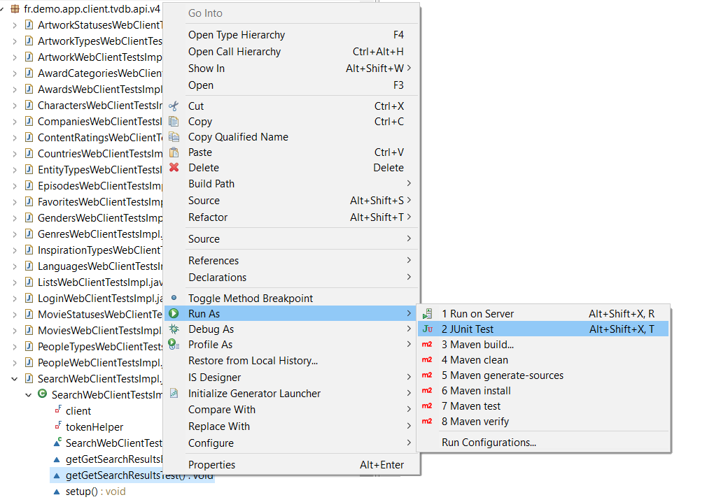
</div>

A partir du momment ou le profil SpringBoot est toujours positionné à "***dev***" au niveau du fichier "***application.properties***", toute requête va automatiquement être tracée et affichée dans la console Eclipse. Pour rappel le fichier à les valeurs suivantes dans le cadre de cet exemple : 

```properties
# Adresse racine utilisée pour toutes les requêtes HTTP du client REST.
demo.api.base-url=https://api4.thetvdb.com
# Timeout de connexion TCP (en millisecondes).
demo.api.connection-timeout-ms=5000
# Timeout de réponse HTTP (en millisecondes).
demo.api.response-timeout-ms=10000
# Profil Spring actif. Ici, on active le profil 'dev'.
spring.profiles.active=dev
```

Voici à titre indicatif les logs affichés pour cette requête de recherche : 

```properties
[ 10:00:24] [main] INFO  fr.demo.app.DemoWebClientConfigImpl - WebClient >> POST https://api4.thetvdb.com/v4/login
[ 10:00:25] [reactor-http-nio-2] INFO  fr.demo.app.DemoWebClientConfigImpl - 
================= WebClient Reponse =================
Statut : 200 200 OK
======================================================

En-tête(s) :
  Content-Type: application/json; charset=UTF-8
  Content-Length: 1152
  Connection: keep-alive
  Date: Tue, 02 Sep 2025 07:59:25 GMT
  Vary: Origin, Accept-Encoding
  X-Cache: Miss from cloudfront
  Via: 1.1 a0bc907aac33bdff3d75027420967ef6.cloudfront.net (CloudFront)
  X-Amz-Cf-Pop: CDG52-P3
  X-Amz-Cf-Id: RUYkOGl4moBWYb3HN92vn2p2ykiVuJEltokn1rgl94Oh4skcZw4DVw==
======================================================

Body (JSON sous forme de table):
  STATUS -> "success"
  data:
    TOKEN -> "eyJhbGciOiJSUzI1NiIsIn[...]ewHcyRsHWbX_amywsr-RVknxc4UQRis"
======================================================
```

Comme la requête est soumise à authentification préalable, et qu'aucun jeton n'a encore été stocké, la requête de demande d'authentification est alors envoyée et le jeton est retourné. Une fois le jeton récupéré, il est alors possible d'effectuer la requête de recherche et d'obtenir en retour le résultat demandé.

❗ Noter que même si le tests ***JUnit*** est en erreur, dans tous les cas la trace complète est affichée sur la console puisque la lecture et le log des informations sont effectués avant le peuplement de l'objet de retour. Il pourrait ainsi être possible d'avoir l'ensemble de la trace mais d'avoir un problème technique lors du peuplement de l'objet métier. Pour cette simple raison, toujours se reporter au niveau du résulat pour le test ***JUnit** et non simplement aux logs.

```properties
[ 10:00:25] [main] INFO  fr.demo.app.DemoWebClientConfigImpl - WebClient >> GET https://api4.thetvdb.com/v4/search?query=stargate
[ 10:00:26] [reactor-http-nio-2] INFO  fr.demo.app.DemoWebClientConfigImpl - 
================= WebClient Reponse =================
Statut : 200 200 OK
======================================================

En-tête(s) :
  Content-Type: application/json; charset=UTF-8
  Transfer-Encoding: chunked
  Connection: keep-alive
  Date: Tue, 02 Sep 2025 07:59:25 GMT
  Vary: Origin, Accept-Encoding
  X-Cache: Miss from cloudfront
  Via: 1.1 a0bc907aac33bdff3d75027420967ef6.cloudfront.net (CloudFront)
  X-Amz-Cf-Pop: CDG52-P3
  X-Amz-Cf-Id: SCpJNE5GTFKsv7vfsQrP1i4F-3LzQ6h4-P55FY_phimeek3JQRTrvA==
======================================================

Body (JSON sous forme de table):
  STATUS -> "success"
  data:

    ===============
    Occurrence #1
    ===============

        OBJECTID -> "movie-1292"
        COUNTRY -> "usa"
        DIRECTOR -> "Roland Emmerich"
        EXTENDED_TITLE -> "Stargate (1994)"
        genres:

          ===============
          Occurrence #1
          ===============

            "Action"

          ===============
          Occurrence #2
          ===============

            "Adventure"

          ===============
          Occurrence #3
          ===============

            "Science Fiction"
        studios:

          ===============
          Occurrence #1
          ===============

            "StudioCanal"
        ID -> "movie-1292"
        IMAGE_URL -> "https://artworks.thetvdb.com/banners/v4/movie/1292/posters/68582b085ba89.jpg"
        NAME -> "Stargate"
        FIRST_AIR_TIME -> "1994-10-27"
        OVERVIEW -> "An interstellar teleportation device, found in Egypt, leads to a planet with humans resembling ancient Egyptians who worship the god Ra."
        PRIMARY_LANGUAGE -> "eng"
        PRIMARY_TYPE -> "movie"
        STATUS -> "Released"
        TYPE -> "movie"
        TVDB_ID -> "1292"
        YEAR -> "1994"
        SLUG -> "stargate"
        etc...
```

### Déploiement

[A traiter]

## 📁 Cas projet client (React)

### Axios

Axios est une bibliothèque JavaScript et TypeScript qui permet de réaliser facilement des requêtes HTTP depuis le navigateur ou Node.js. Elle simplifie l’envoi et la réception de données, notamment au format JSON, et offre des fonctionnalités avancées comme la gestion des en-têtes, des paramètres de requête, des délais d’attente, et l’annulation de requêtes. 

Axios supporte les promesses, ce qui permet d’écrire un code asynchrone clair et lisible, et propose des intercepteurs pour transformer ou traiter les requêtes et réponses avant leur utilisation. Elle est particulièrement appréciée dans les projets TypeScript pour sa simplicité d’usage et sa compatibilité à la fois côté client et côté serveur (si full React).

Dans le cadre des générateurs **Pacman**, Axios est incluse comme bibliothèque de base, ce qui permet aux projets générés de l’utiliser directement pour la communication avec des services REST sans configuration supplémentaire.

### Modélisation

Le plus propre au niveau de la modélisation est d'exporter le projet de modélisation fournisseur en tant que librairie afin de pouvoir ensuite l'importer au niveau du projet de modélisation client. Pour exporter le projet fournisseur, se positionner au niveau du projet de modélisation ***[Nom de l'application]-model*** et par click droit, sélectionner le menu "*Export*". 

Dans la nouvelle fenêtre qui apparait, sélectionner le wizard "*Export modeling project as library*" .

<div align="center">
  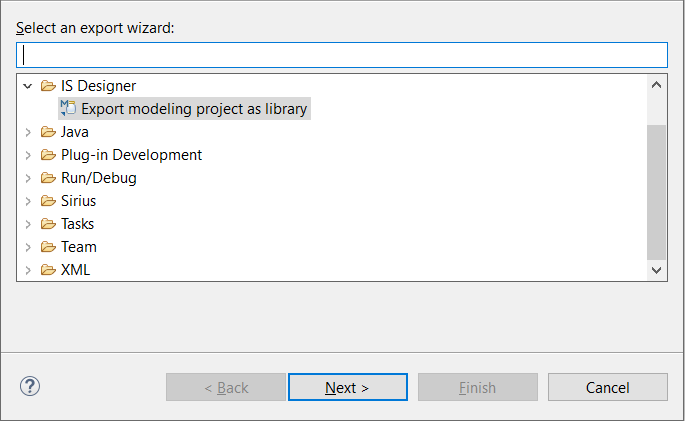
</div>

Après avoir cliqué sur le bouton "*Next*" sélectionner le projet de modélisation à exporter ainsi que le répertoire de sortie pour la création du fichier au format "*.mar*".
<div align="center">
  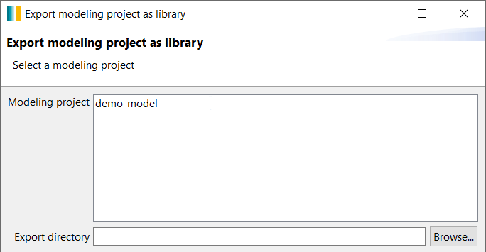
</div>

Enfin, toujours après avoir cliqué sur le bouton "*Next*" renseigner le numéro de version pour la librairie et ajouter ou modifier les informations présentes sur la fenêtre si nécessaire. Enfin cliquer sur le bouton "*Finish*" pour enclancher la procédure d'export.
<div align="center">
  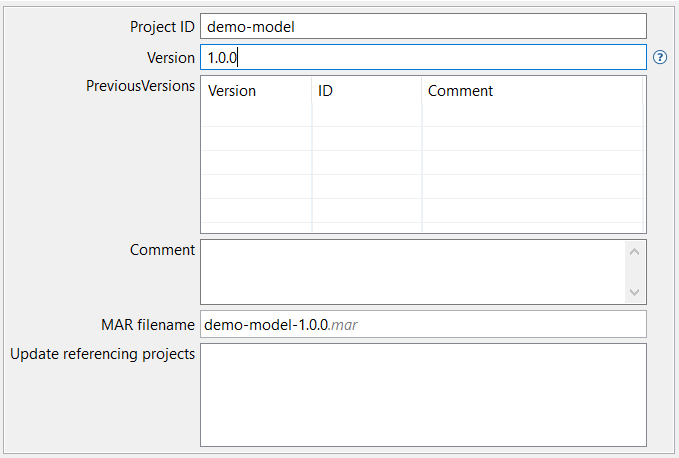
</div>

Récupérer le fichier "*.mar*" en se positionnant au niveau du projet de modélisation client (***[Nom de l'application]-model***) et par click droit, sélectionner le menu "*Import*". De même, dans la nouvelle fenêtre qui apparait, sélectionner le wizard "*Export modeling project as library*", rechercher le fichier d'export au format "*.mar*" et l'importer dans le projet de modélisation client. Les différents fichiers de modélisation seront alors positionnés au niveau du répertoire "***[Nom du fichier '.mar']***", lui même situé dans un répertoire générique "***libraries***" automatiquement créé au niveau du projet de modélisation client. 

Il est alors possible de lancer la génération du client.

### Génération

Se positionner au niveau du projet de modélisation ***[Nom de l'application]-model*** et sélectionner le fichier de modélisation "***.soa***" au niveau du répertoire "*/libraries/[Nom du fichier '.mar']*". 

Enfin toujours par click droit, lancer la génération du client à l'aide du menu vu précédemment (comme pour la création d'un client SpringBoot) : "*Générateur Cali / Génération du client pour les services*".

• ***[Nom de l'application]/src/api*** : Ce répertoire contient le fichier *apiClient.ts* qui sert de point central pour gérer toutes les communications HTTP entre l’application et les services REST. Il encapsule l’utilisation d’axios, en configurant l’URL de base, les en-têtes communs (comme l’authentification ou le type de contenu), et éventuellement les intercepteurs pour gérer globalement les erreurs ou transformer les données. L’objectif est de fournir une interface unique et réutilisable pour toutes les requêtes réseau, afin que le reste de l’application n’ait pas à se soucier des détails d’implémentation d’axios. 

Dans le cadre des générateurs Pacman, ce fichier est généré automatiquement pour chaque projet, prêt à l’emploi, garantissant une cohérence et une simplification du code métier.

Ce fichier contient par défaut le code suivant (exemple ici en fonction des paramètres modélisés): 
```typescript
import axios from "axios";

/**
 * Client HTTP centralisé utilisé par tous les services.
 * La baseURL devra être fournie par l'application consommatrice
 * via une variable d'environnement ou une configuration runtime.
 */
export const apiClient = axios.create({
  baseURL: "http://localhost:8080/api", // pourra être surchargé
  headers: {
    "Content-Type": "application/json",
  },
```

• ***[Nom de l'application]/src/models*** : Ce répertoire contient l'ensemble des objets métier qui vont être utilisés par les différents services modélisés.

• ***[Nom de l'application]/src/services*** : Contient le code pour l'ensemble des services qui vont appeler le fournisseur de services **Rest**. Voici à titre indicatif un exemple de codage pour un service. 

❗ Il est à noter que l'application étant une application de type React, elle est destinée à communiquer avec un frontal React. Il est donc nécessaire de se reporter plus particulièrement à la documentation concernant les générateurs **Pacman** pour le frontend, ceci afin de prendre connaissance du sujet (qui diffère de celui utilisé dans le cadre des projet Java) de modélisation. 

```typescript
import { apiClient } from "../api/apiClient";
import { UserDemo } from "../models/UserDemo";

export class Users {
   /**
    * Création d'un nouvel utilisateur.
    * 
    * @param userIn : L'utilisateur à créer.
    *
    * @return UserDemo : L'utilisateur avec son identifiant.
    */
   async setUser(userIn: UserDemo) : Promise<UserDemo> {
      
      const response = await apiClient.post(`/v0/users`, userIn);
      return response.data;
   }
  
   /**
    * Retourne un utilisateur en fonction de son identifiant.
    * 
    * @param id : L'identifiant unique pour l'utilisateur.
    *
    * @return UserDemo : L'utilisateur retourné en fonction de son identifiant.
    */
   async getUser(id: string) : Promise<UserDemo> {
      
      const response = await apiClient.get(`/v0/users/{id}`);
      return response.data;
   }
  
}

// On exporte une instance pour simplifier l’usage.
export const users = new Users();
```

• ***[Nom de l'application]/src*** : Contient le fichier *index.ts* qui permet l'exportation de l'ensemble des objets utilisés par la future librairies client. Ce fichier agit comme point d’entrée principal du module ou de la librairie. Dans le cadre d’un client Axios, il exporte généralement toutes les fonctionnalités publiques du client API, par exemple l’instance préconfigurée d’Axios, les services spécifiques (ex. UserService, ProductService), ou des types associés. 

L'objectif est de permettre aux autres parties de l'application d'importer simplement le client et ses services via une seule ligne, par exemple :

```typescript
import { apiClient, UserService } from 'demo-client';
```

Dans le cadre de l'exemple qui a été choisi pour l'application de démonstration concernant la modélisation et la génération d'un frontend de type React, le code de ce fichier est le suivant : 

```typescript
// Models.
export * from "./models/UserDemo";
export * from "./models/RequestDemo";

// Services.
export * from "./services/Users";
export * from "./services/Requests";

// API Client.
export * from "./api/apiClient";

```
### Déploiement

Même dans le cadre d’un projet React, le processus de déploiement passe par Maven afin de conserver une cohérence avec l’ensemble des projets gérés par **Pacman**. La différence principale réside dans l’artifact produit : au lieu de générer un *.jar* comme pour un projet Java backend, Maven exécute les scripts Node/NPM définis dans le projet pour construire et empaqueter l’application front-end. Cela permet d’intégrer le workflow front-end dans le pipeline Maven existant, de gérer les dépendances et la configuration de manière centralisée, tout en produisant un package NPM prêt à être déployé ou distribué.

Quelques explications complémentaires au niveau du fichier *pom.xml" pour la partie ***[Nom de l'application]-server***
```xml
<!-- npm run build -->
<execution>
	<id>npm-build</id>
	<phase>generate-resources</phase>
	<goals>
	    <goal>exec</goal>
	</goals>
    <configuration>
        <executable>npm</executable>
	    <workingDirectory>${frontend.dir}</workingDirectory>
	    <arguments>
	    	<argument>run</argument>
	    	<argument>build</argument>
	    </arguments>
    </configuration>
</execution>
<!-- npm pack -->
<execution>
	<id>npm-pack</id>
	<phase>package</phase>
	<goals>
	    <goal>exec</goal>
	</goals>
	<configuration>
	     <executable>npm</executable>
	     <workingDirectory>${frontend.dir}</workingDirectory>
	     <arguments>
	         <argument>pack</argument>
	     </arguments>
	</configuration>
</execution>
```
cette partie chargée de pallier aux éventuels problématiques de communication SSL avec les serveurs NPM est placée par défaut en commentaire dans le fichier, libre au développeur de la supprimer à sa guise si la procédure de déploiement fonctionne correctement. En effet, pour l'instant elle fait double emploi avec le contenu du fichier *.rpmrc* mais est laissée à titre indicatif et pour mémo. 

Pour créer le package NPM, se positionner en ligne de commande au niveau du projet ***[Nom de l'application]-server***. A la racine de ce projet doit exister le fichier *pom.xml* pour la partie "*-server*". Exécuter la commande suivante afin de lancer le processus de déploiement du projet client (ici il n'y a rien à déposer dans le repository local).

```bash
mvn clean package
```

Au niveau du répertoire "*/target*" pour le projet ***[Nom de l'application]-server***, il est maintenant possible de récupérer un fichier au format compressé. Ce fichier est sous la forme ***[Nom de l'application]-[Version].tgz*** et est exploitable directement avec les commandes NMP pour effectuer l'importation de la librairie dans un projet React frontend.

Lorsque Pacman génère un package NPM sous forme de fichier ***[Nom de l'application]-[Version].tgz***, ce fichier peut être installé sans être publié sur le registry NPM. Cela permet de tester ou distribuer la librairie en local ou dans un environnement maîtrisé. Il suffit de se positionner en ligne de commande à la racine du projet frontend (c’est-à-dire là où se trouve son package.json.) et de lancer la commande suivante : 
```bash
npm install [Chemin vers la librairie]/[Nom de l'application]-[Version].tgz
```

## ❓ Problèmes Courants et Résolution
---
• **Quand je relance une génération j'ai des erreurs au niveau de mes classes à cause de données manquantes dans les imports** : ceci est une problématique liée plus précisément à des modifications de modélisation suite à générations antérieures. 
    
**Pacman**, afin de conserver les imports non générés (ceux spécifiquement (et éventuellement) rajoutés par les développeurs) est obligé de générer les imports entre balise de type "*user code*". Ainsi, lors des futures demandes de génération, les imports utilisateurs ne sont pas écrasés. 

La problématique est que, en conséquence, il devient impossible au générateur de créer de nouveaux imports si besoin. Bien souvent ces imports concernent des listes ou des sets, d'ou le message envoyé par l'IDE indiquant qu'il ne sait pas les résoudre et que cela nécessite une intervention utilisateur.
    
Il n'est par ailleurs pas possible au niveau des imports de créer une section libre pour la génération et une section "*user code*" pour les imports spécifiques utilisateurs car l'organisation automatique ne fonctionne pas si les balises sont positionnées différement. 
    
L'unique solution pour l'instant consiste donc à lancer une organisation automatique des imports manuellement sur les différentes classes en erreur et effectuer les choix nécessaires. Lors de la prochaine demande de génération, les imports étant reconstitués, les classes ne devraient plus être en erreur.
  
• **Suite à demande de génération, mes classes ont des warnings** :  en ouvrant une classe, je vois que de nombreux imports ne sont pas utilisés. Pourtant, au niveau de mon fichier "*project.properties*" je ne suis pas en mode debug. 
  
Il peut arriver que, suite à une demande de génération (pour une raison encore non expliquée), les tâches de fin de traitement ne soient pas lancées. L'organisation automatique des imports n'est alors pas activée et comme **Pacman** dans sa politique de gestion des imports génère plus d'imports que nécessaires, ceux-ci ne sont alors pas supprimés. Il suffit simplement de relancer une génération pour résoudre le problème.

• **Pour une génération client, il me manque la classe de gestion du jeton** : La demande de génération de la classe utilitaire pour la récupération du jeton d'authentification n'est pas basée uniquement sur le fait que l'api soit sécurisée, mais aussi sur la présence de l'annotation ***@AUTH_TOKEN*** au niveau de l'opération de gestion de jeton. Bien vérifier le positionnement de cette annotation au niveau de la modélisation des services.

• **Pour un déploiement du client react, le processus se bloque et ne rend pas la main** : Ce comportement  est typique des problèmes réseau Windows + antivirus / proxy / SSL / npm. 

Voici la liste des causes possibles et comment les éliminer une par une.

- Même si *strict-ssl=false* est dans le fichier *.npmrc*, npm peut continuer à essayer SSL si un autre *.npmrc* dans la hiérarchie l’écrase.

- *npm install* se fige très souvent si l'antivirus inspecte les flux https. Désactiver temporairement la protection web (pas l'antivirus entier, juste le module web/détection https). 

  Lancer la commande (au niveau du projet server, dans le répertoire source de react) : 
  ```bash
  npm install 
  ```
  Si cela fonctionne, l'antivirus est en cause.

- Cache npm corrompu (courant sur Windows) : Réparer le cache à l'aide des commandes : 
  ```bash
  npm cache verify
  npm cache clean --force
  ```
  
  Si besoin le supprimer physiquement :

  ```bash
  %USERPROFILE%\AppData\Local\npm-cache
  ```
  
- Problème avec IPv6 : Désactiver IPv6 dans Windows.
## 📎 Annexes
---
• Liste des métadonnées disponibles (certaines métadonnées sont présentes mais ne sont pas encore actives, ou seront probablement supprimées suite à études. Par ailleurs, certaines métadonnées ne concernent pas le framework Spring Boot (ne pas oublier que **Pacman** est un générateur multi-frameworks et que dans un avenir proche, le framework Spi4j sera aussi inclu).

  Ces métadonnées sont pour l'instant toujours listées mais avec une icône 🚫. 


| Métadonnée  | Corps       | Description| S'applique sur |
|-------------|-------------|------------|----------------|
| PHYSICAL_NAME | OUI | Nom pour la table | ENTITY |
| PHYSICAL_SHORT_NAME | OUI | Nom (longues tables) | ENTITY, REFERENCE |
| PHYSICAL_DEFAULT | OUI | Valeur par défaut | ENTITY |
| PHYSICAL_CHECK | OUI | Contrainte de vérification pour insertion ou modification | ENTITY |
| PHYSICAL_UNIQUE | OUI | Contrainte d'unicité pour la colonne | ATTRIBUTE |
| PHYSICAL_SIZE | OUI | Taille de l'attribut | ATTRIBUTE |
| VERSION | OUI | Version de l'entité (gestion automatique du Lock Optimiste) | SYSTEM, CATEGORY, DTO |
| REFERENTIAL🚫 |     |   |          |
| COMPUTED | NON | Champ calculé par le développeur | ATTRIBUTE |
| USER🚫 |     |   |          |
| PERMISSIONS | OUI | Opération à exécuter selon permission(s) | OPERATION |
| PERMISSIONS_OR | OUI | Opération à exécuter selon permission(s) | OPERATION |
| PERMISSIONS_AND | OUI | Opération à exécuter selon permission(s) | OPERATION |
| VOL_NB_ROWS🚫 | OUI | Nombre d'entités à créer | ENTITY |
| VOL_MIN_OCCURS🚫 | OUI | Nombre minimum d'éléments pour la relation | REFERENCE |
| VOL_MAX_OCCURS🚫 | OUI | Nombre maximum d'éléments pour la relation | REFERENCE |
| ACCEPT_UNAUTHENTIFIED🚫 | NON | Opération qui accepte un utilisateur non authentifié | |
| PAGE_SIZE🚫 | OUI | Nombre d'éléments à retourner par page | OPERATION |
| AUTH_TOKEN | OUI | Récupération d'un jeton d'authentification | OPERATION |
| JSON_NAME | OUI | Spécification d'un nom de sérialisation | ATTRIBUT, REFERENCE |
| SKIP_EMPTY_VALUES | NON | Filtrage des données non renseignées | OPERATION |
| API_VERSION | NON |  | COMPONENT |
| LIBRARY_NAME | OUI | Nom exact de la librairie | DTO |
| LITERAL_PARAM_VALUE | OUI | Définition d'une énumération complexe | LITERAL |
| LITERALS_PARAMS_STRUCT | OUI | Définition d'une énumération complexe | ENUMERATION |
| CASCADE_TYPE | OUI | Gestion des relations entre dépendances | REFERENCE |
| FETCH_LAZY | NON | Demande de chargement paresseux | REFERENCE |
| ENTITY_MANAGER | NON | Demande d'utilisation de l'entity manager | ENTITY |


 • Liste des règles de validation dans les différents diagrammes.

| Règle| S'applique sur |
|------|----------------|
|Pas d'entité vide (sans attribut)|ENTITY/DTO|
|Pas d'attribut avec 'identifier' de coché|ENTITY|
|Pas d'attribut avec une cardinalité multiple|ENTITY|
|Pas d'attribut sans nom défini|ENTITY/DTO|
|Pas d'attribut sans type défini|ENTITY/DTO|
|Pas de relations récursives avec le même nom|ENTITY/DTO|
|Pas de relation de type 'composite'|ENTITY/DTO|
|Pas de relation entre sous-entités et super-entités|ENTITY/DTO|
|Pas de relations entre super-entités|ENTITY/DTO|
|Pas de relation bidirectionnelle avec double navigabilité|ENTITY/DTO|
|Pas de relation bidirectionnelle avec (1) ou (0,1)|ENTITY/DTO|
|Pas de service avec des entités (uniquement dto)|SOA|
|Pas de service sans paramètre de retour|SOA|
|Pas de service sans code de retour|SOA|
|Pas de service non REST|SOA|
|Pas de pagination sur une opération qui ne retourne pas de liste|SOA|
|Pas de pagination avec des paramètres de pagination non 'Integer'|SOA|
|Pas de 'fault' sans code de retour|SOA|
|Pas de service avec '/' à la fin du point de terminaison|SOA|
|Pas de service avec plusieurs paramètres passés dans le corps (body)|SOA|
|Pas de service avec plusieurs paramètres de sortie|SOA|
|Pas de service avec des dtos passés hors body (path ou query)|SOA|
|Pas de service avec des types binaires passés dans le path|SOA|
|Pas de service avec TRACE (désactivé pour raisons de sécurité)|SOA|
|Pas de service OPTION avec des paramètres en entrée|SOA|
|Pas de service HEAD avec un paramètre en sortie.|SOA|
|Pas de multiples 'components' comme conteneur de services|SOA|
|Pas de multiples sécurités définies au niveau du 'component'|SOA|

